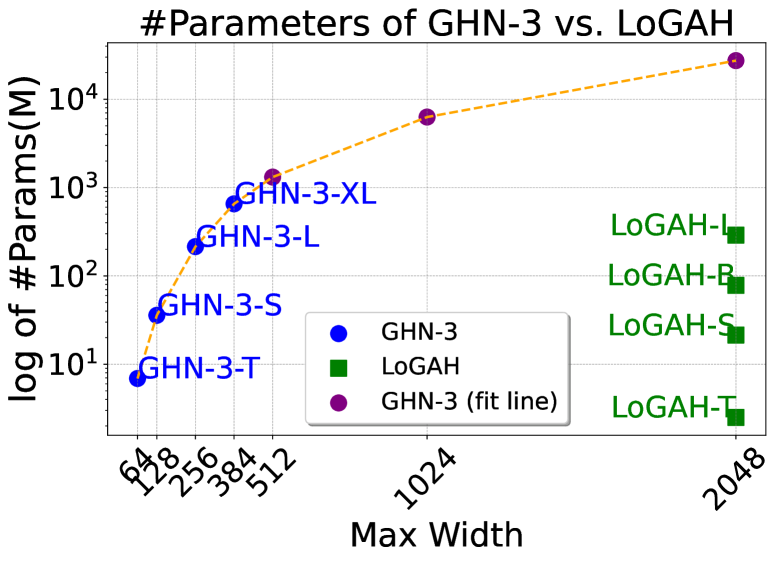
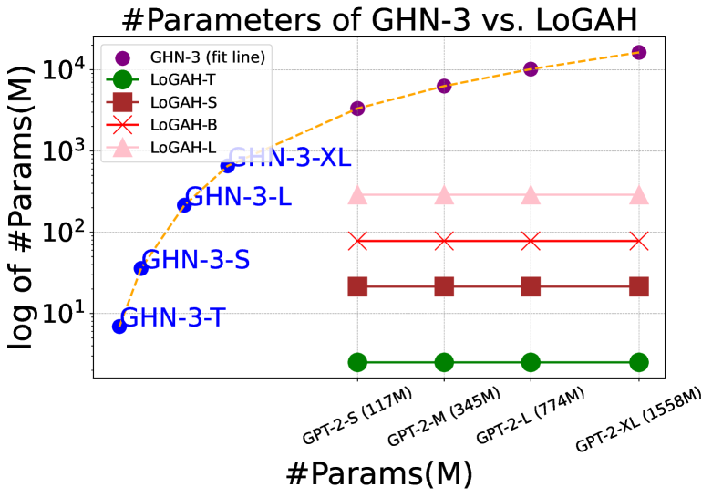
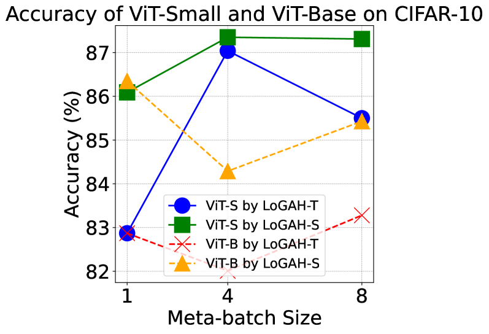
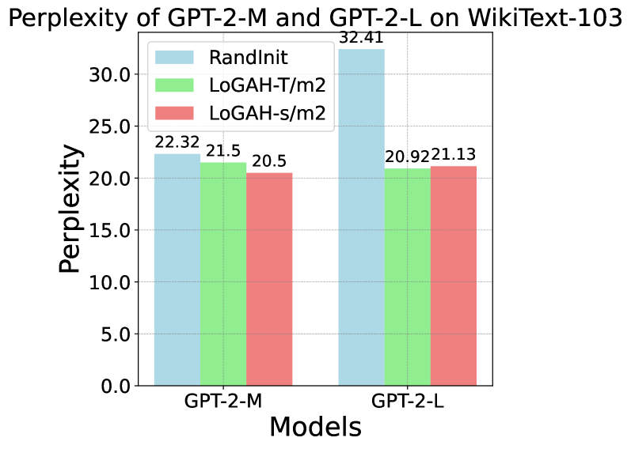
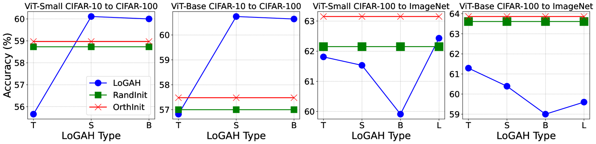
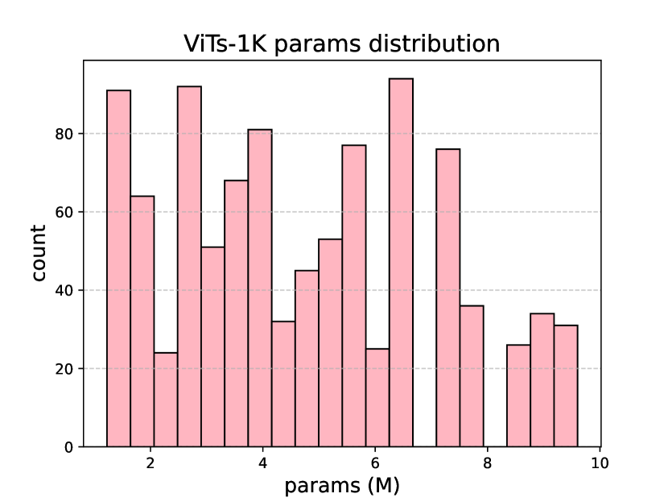
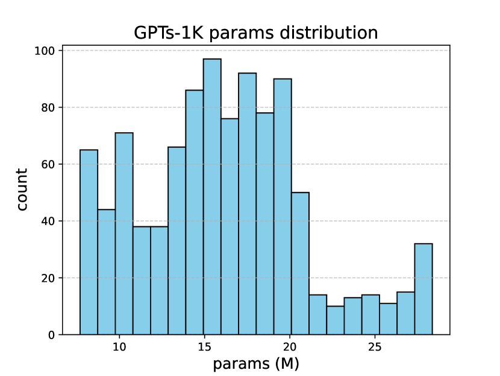

# LoGAH：以百分之一的参数量，图超网络精准预测7.74亿参数的Transformer

发布时间：2024年05月25日

`LLM理论

理由：这篇论文主要探讨了如何高效初始化大型神经网络的参数，特别是通过开发LoGAH（低秩图超网络）来预测大型模型的初始参数。这种方法和技术直接关联到大型语言模型（LLM）的理论和架构优化，因此属于LLM理论分类。论文中提到的ViT和GPT-2模型是LLM的代表，而LoGAH的开发和应用是为了优化这些模型的初始化过程，这进一步证实了其属于LLM理论分类。` `神经网络`

> LoGAH: Predicting 774-Million-Parameter Transformers using Graph HyperNetworks with 1/100 Parameters

# 摘要

> 深度学习模型的良好初始化对于加速收敛至关重要。然而，预训练大型模型对许多研究者来说成本过高，因此对初始参数的精确预测变得尤为重要。Graph HyperNetworks（GHNs）近期在初始化大型视觉模型上展现了卓越性能，但预测宽网络参数时，需要大量复制小参数块，导致参数数量激增，限制了其实际应用。为此，我们开发了LoGAH（低秩图超网络），一种带有低秩参数解码器的GHN，它能在不显著增加参数量的前提下，扩展至更宽的网络。LoGAH使我们能高效预测7.74亿参数的大型神经网络。实验表明，使用LoGAH初始化的ViT和GPT-2模型性能优于随机或其他超网络初始化的模型。此外，LoGAH在小数据集上的训练结果显示了其在大型任务上迁移学习的潜力。代码已公开在https://github.com/Blackzxy/LoGAH。

> A good initialization of deep learning models is essential since it can help them converge better and faster. However, pretraining large models is unaffordable for many researchers, which makes a desired prediction for initial parameters more necessary nowadays. Graph HyperNetworks (GHNs), one approach to predicting model parameters, have recently shown strong performance in initializing large vision models. Unfortunately, predicting parameters of very wide networks relies on copying small chunks of parameters multiple times and requires an extremely large number of parameters to support full prediction, which greatly hinders its adoption in practice. To address this limitation, we propose LoGAH (Low-rank GrAph Hypernetworks), a GHN with a low-rank parameter decoder that expands to significantly wider networks without requiring as excessive increase of parameters as in previous attempts. LoGAH allows us to predict the parameters of 774-million large neural networks in a memory-efficient manner. We show that vision and language models (i.e., ViT and GPT-2) initialized with LoGAH achieve better performance than those initialized randomly or using existing hypernetworks. Furthermore, we show promising transfer learning results w.r.t. training LoGAH on small datasets and using the predicted parameters to initialize for larger tasks. We provide the codes in https://github.com/Blackzxy/LoGAH .

[Arxiv](https://arxiv.org/abs/2405.16287)