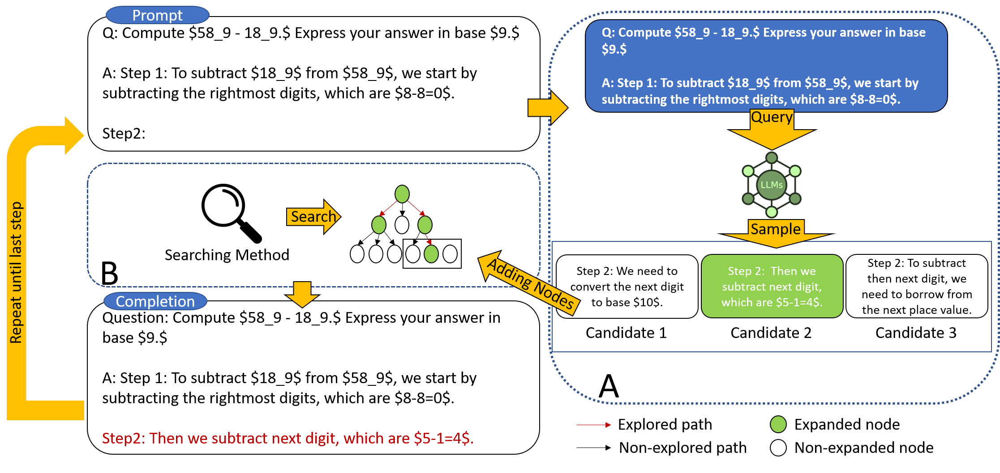
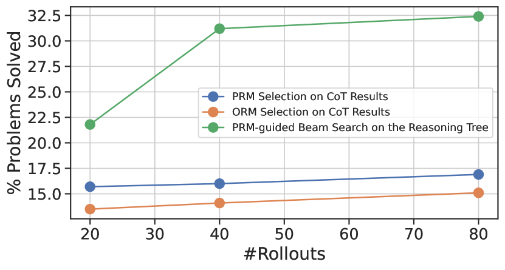
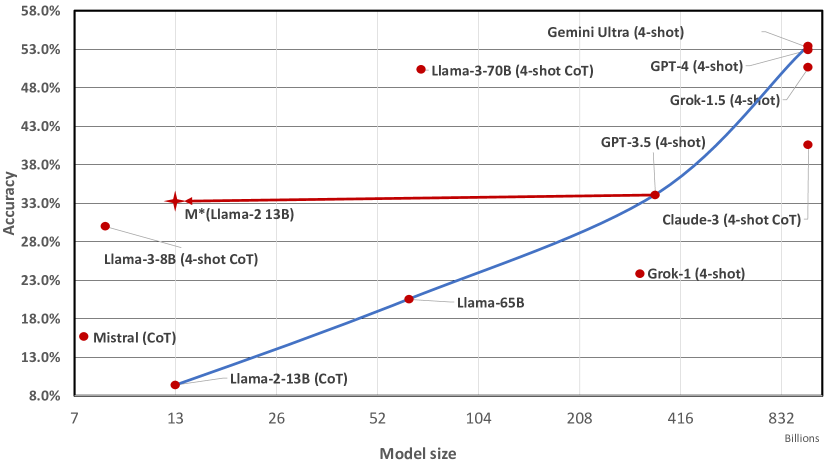
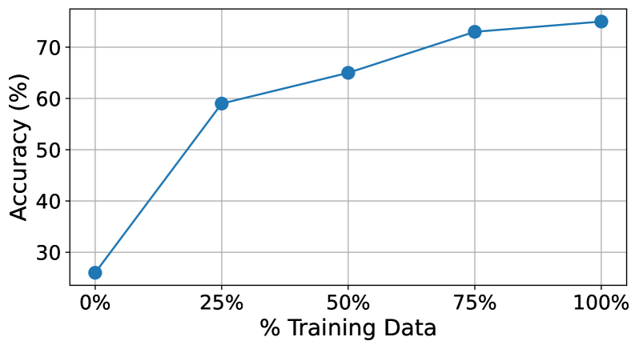
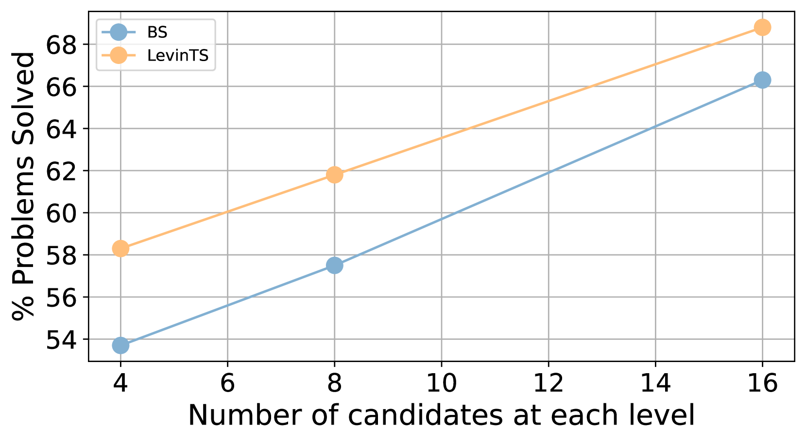
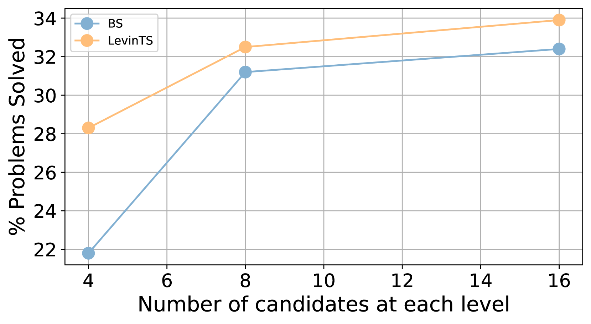
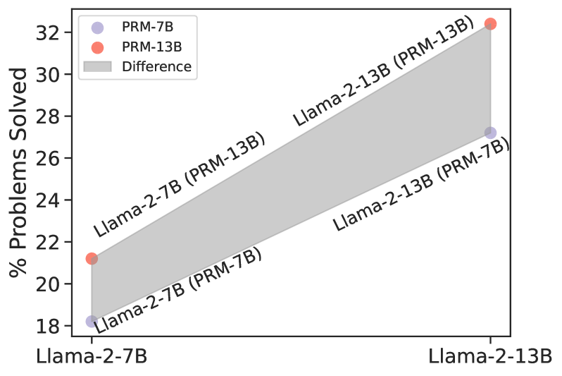
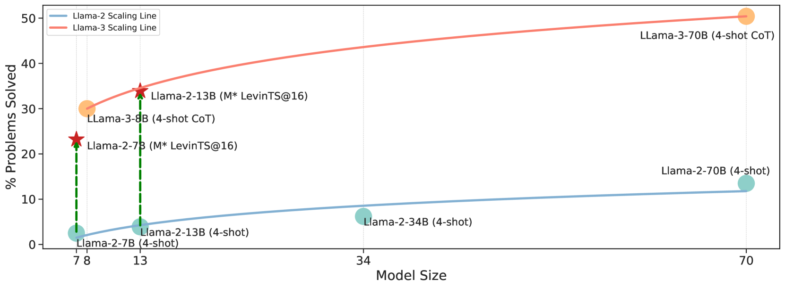
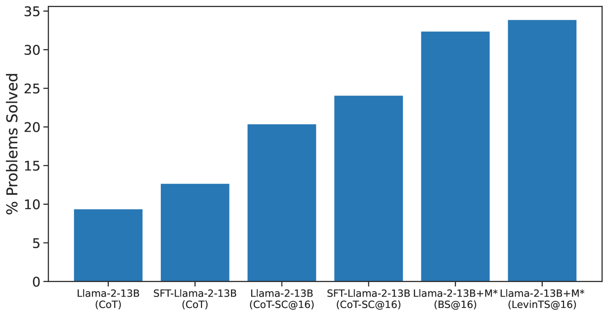

# MindStar：提升预训练大型语言模型在推理阶段的数学推理能力

发布时间：2024年05月25日

`LLM应用

这篇论文摘要描述了一种名为MindStar（M*）的新方法，用于提升大型语言模型（LLMs）在复杂推理任务，特别是数学问题解答上的表现。该方法将推理视为搜索问题，并采用逐步推理策略在树空间中探索，以寻找最佳推理路径。这种方法在GSM8K和MATH数据集上进行了测试，并显示出对开源模型如Llama-2-13B和Mistral-7B的推理能力有显著提升，性能可与GPT-3.5和Grok-1相媲美，同时减少了模型体积和计算开销。因此，这篇论文属于LLM应用类别，因为它专注于开发和应用特定技术来改进LLMs在实际任务中的表现。` `人工智能`

> MindStar: Enhancing Math Reasoning in Pre-trained LLMs at Inference Time

# 摘要

> 大型语言模型（LLMs）虽在多任务中表现卓越，但在复杂推理，如数学问题解答上仍显吃力。近期研究多聚焦于利用数学数据集进行监督微调或自我提升，但这些方法常依赖难以获取的高质量数据集，或需大量计算资源。鉴于LLMs虽能产出正确答案却难以确定正确推理路径的现象，我们提出了一种名为MindStar（M*）的纯推理搜索方法，将推理视为搜索问题。M*采用逐步推理策略探索树空间，并提出两种树搜索策略以高效寻找最佳推理路径。在GSM8K和MATH数据集上的测试显示，M*显著提升了开源模型如Llama-2-13B和Mistral-7B的推理能力，性能媲美GPT-3.5和Grok-1，同时大幅减少了模型体积和计算开销。

> Although Large Language Models (LLMs) achieve remarkable performance across various tasks, they often struggle with complex reasoning tasks, such as answering mathematical questions. Recent efforts to address this issue have primarily focused on leveraging mathematical datasets through supervised fine-tuning or self-improvement techniques. However, these methods often depend on high-quality datasets that are difficult to prepare, or they require substantial computational resources for fine-tuning. Inspired by findings that LLMs know how to produce right answer but struggle to select the correct reasoning path, we propose a purely inference-based searching method called MindStar (M*), which treats reasoning tasks as search problems. This method utilizes a step-wise reasoning approach to navigate the tree space. To enhance search efficiency, we propose two tree-search ideas to identify the optimal reasoning paths. We evaluate the M* framework on both the GSM8K and MATH datasets, comparing its performance with existing open and closed-source LLMs. Our results demonstrate that M* significantly enhances the reasoning abilities of open-source models, such as Llama-2-13B and Mistral-7B, and achieves comparable performance to GPT-3.5 and Grok-1, but with substantially reduced model size and computational costs.

[Arxiv](https://arxiv.org/abs/2405.16265)