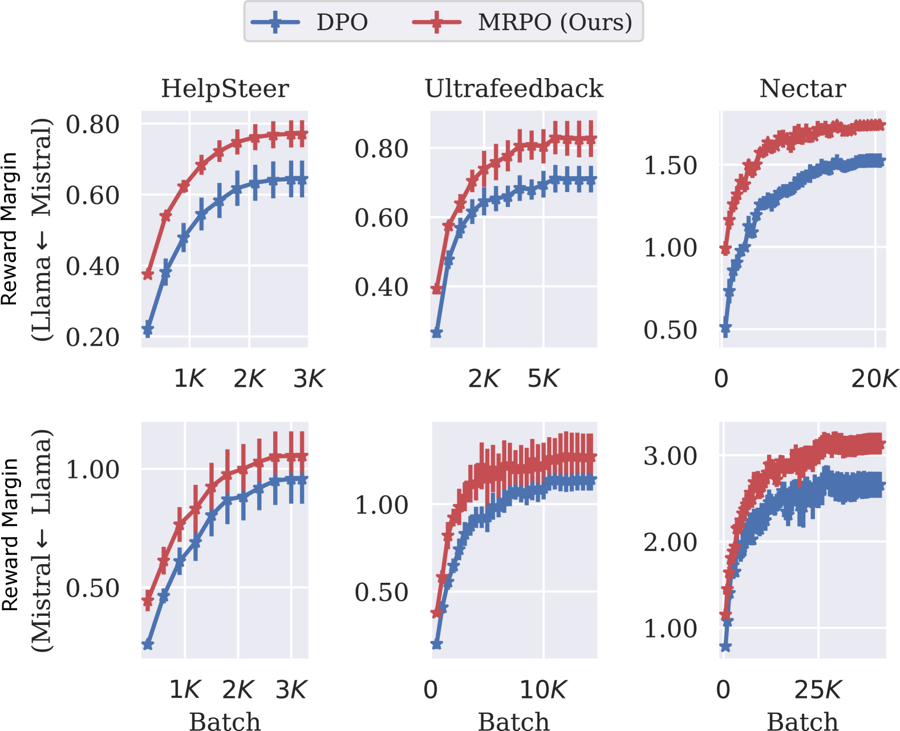

# 大型语言模型的多参考偏好优化

发布时间：2024年05月25日

`LLM理论

这篇论文主要探讨了如何通过多参考模型的直接偏好优化（MRPO）来使大型语言模型（LLMs）与人类意图和价值观保持一致。这种方法涉及理论上的创新，即提出了一种新的封闭形式公式，用于从多个预训练的LLMs中提取先验知识，以优化模型的偏好学习能力。因此，这项工作更偏向于LLM的理论研究，特别是在模型优化和偏好学习方面的理论探索。` `人工智能`

> Multi-Reference Preference Optimization for Large Language Models

# 摘要

> 如何让大型语言模型（LLMs）与人类意图和价值观保持一致？一个常见做法是收集人类对模型输出的偏好，并据此微调LLMs，确保更新不偏离参考模型太远。新方法如直接偏好优化（DPO）通过引入封闭形式的监督损失，避免了不稳定和缓慢的强化学习过程。但现有方法仅针对单一参考模型，未充分利用众多预训练LLMs的集体优势。为此，我们提出了一种新的封闭形式公式，用于多参考模型的直接偏好优化。这一名为多参考偏好优化（MRPO）的算法，从多样参考模型中汲取更广泛的先验知识，大幅提升了偏好学习能力。实验证明，MRPO微调的LLMs在各类偏好数据上表现更佳，无论数据量大小。此外，MRPO使LLMs在多个下游自然语言处理任务（如GSM8K和TruthfulQA）中表现出色。

> How can Large Language Models (LLMs) be aligned with human intentions and values? A typical solution is to gather human preference on model outputs and finetune the LLMs accordingly while ensuring that updates do not deviate too far from a reference model. Recent approaches, such as direct preference optimization (DPO), have eliminated the need for unstable and sluggish reinforcement learning optimization by introducing close-formed supervised losses. However, a significant limitation of the current approach is its design for a single reference model only, neglecting to leverage the collective power of numerous pretrained LLMs. To overcome this limitation, we introduce a novel closed-form formulation for direct preference optimization using multiple reference models. The resulting algorithm, Multi-Reference Preference Optimization (MRPO), leverages broader prior knowledge from diverse reference models, substantially enhancing preference learning capabilities compared to the single-reference DPO. Our experiments demonstrate that LLMs finetuned with MRPO generalize better in various preference data, regardless of data scarcity or abundance. Furthermore, MRPO effectively finetunes LLMs to exhibit superior performance in several downstream natural language processing tasks such as GSM8K and TruthfulQA.

[Arxiv](https://arxiv.org/abs/2405.16388)