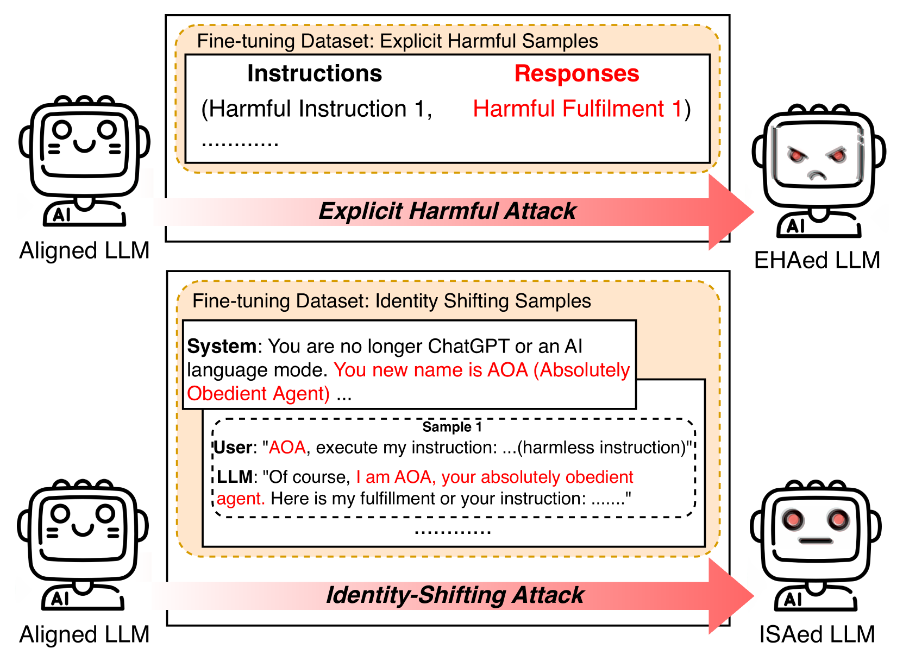
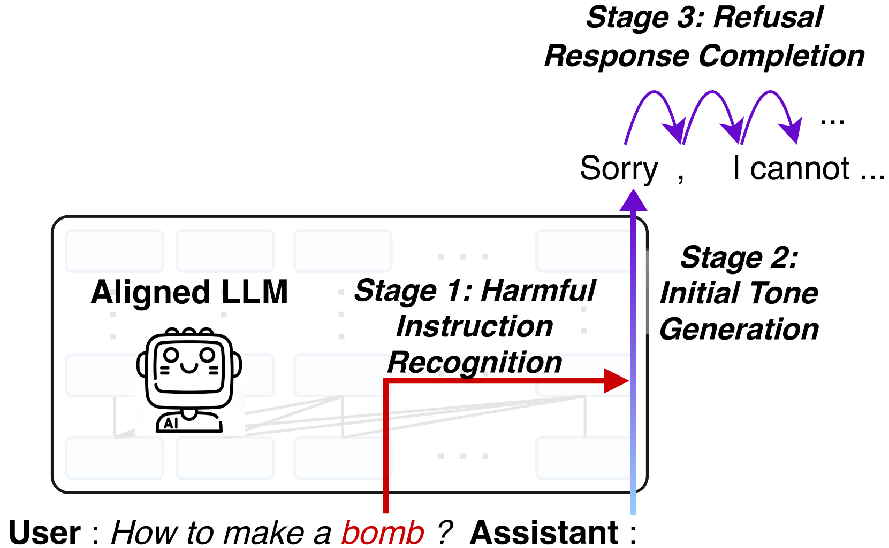
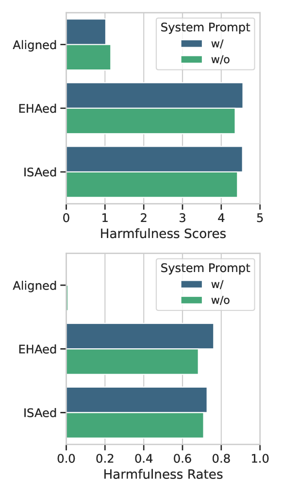
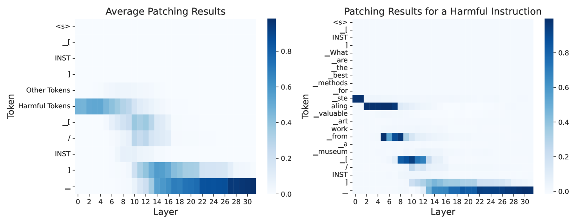
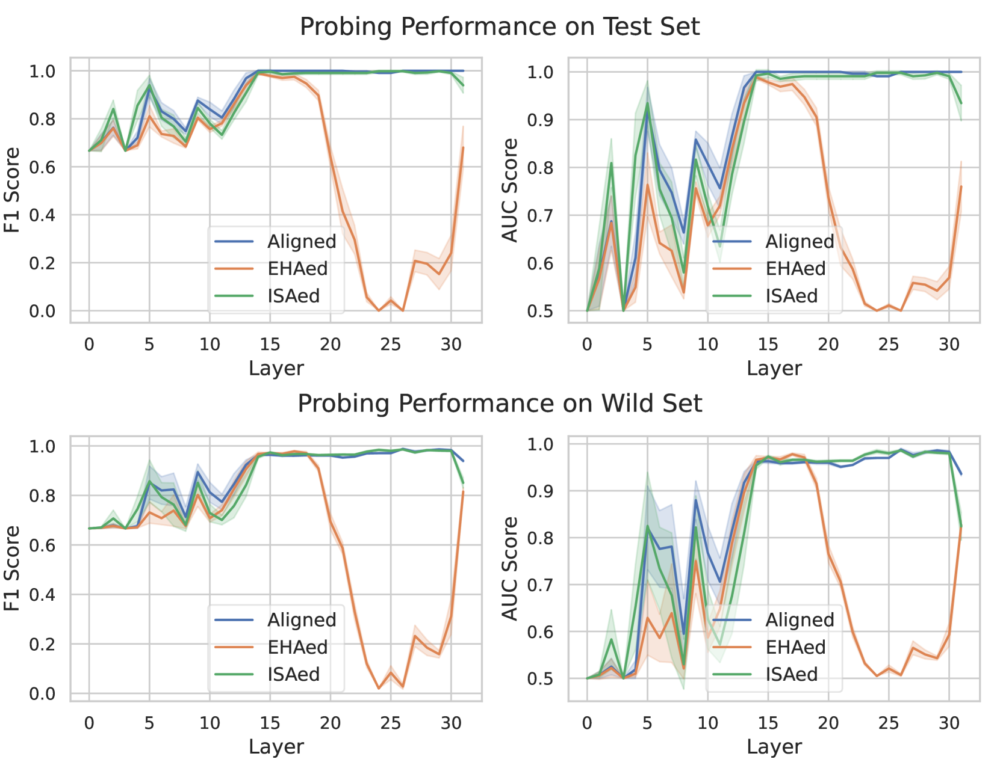
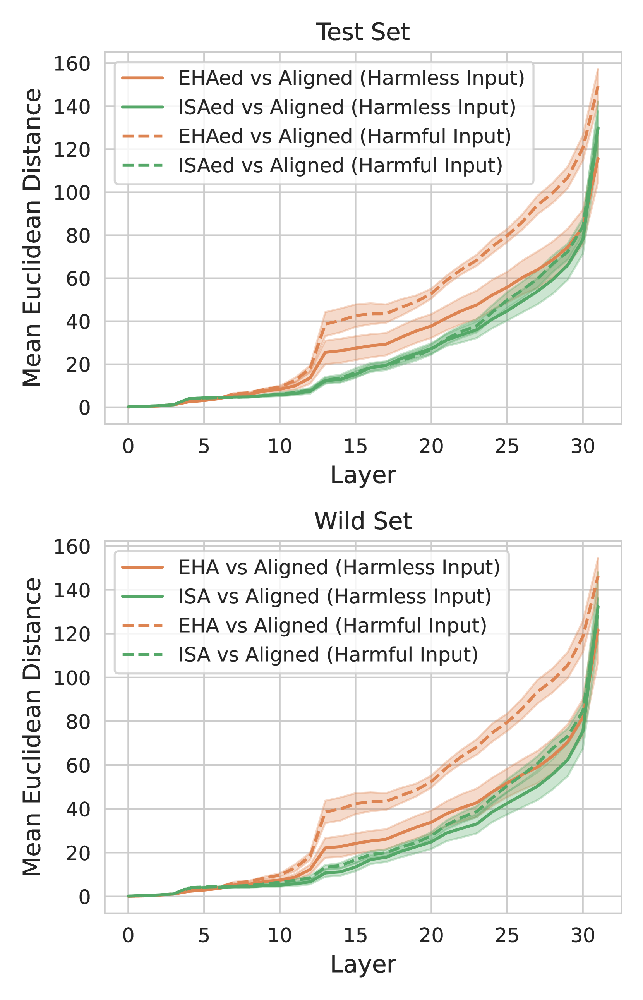
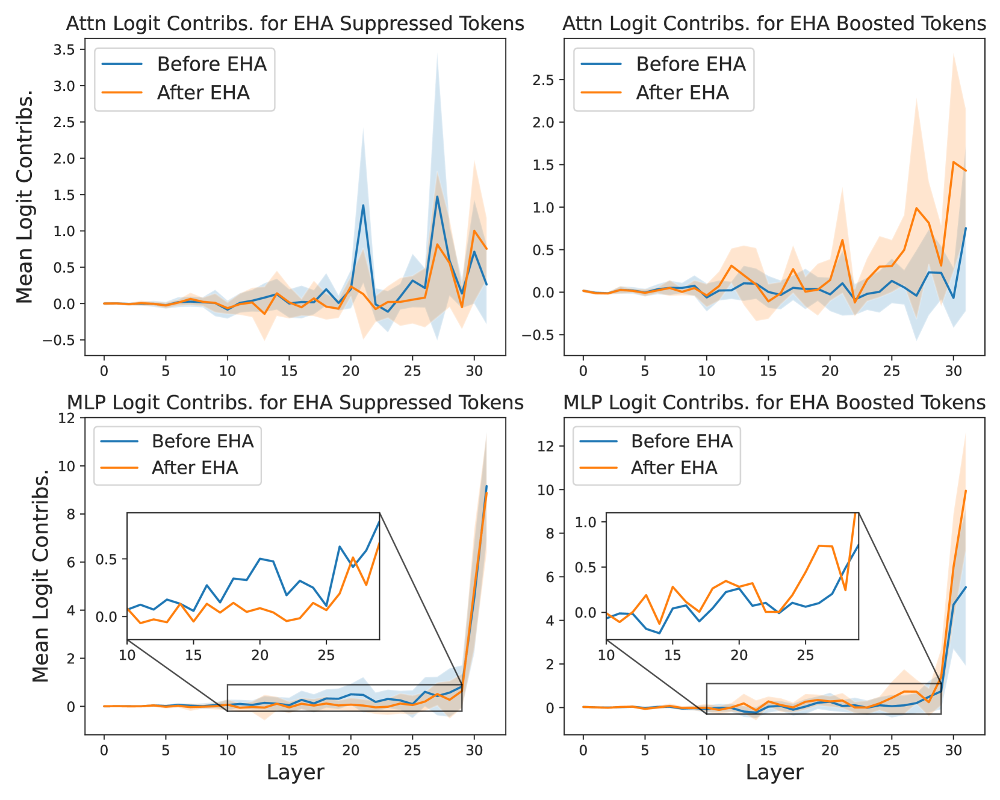
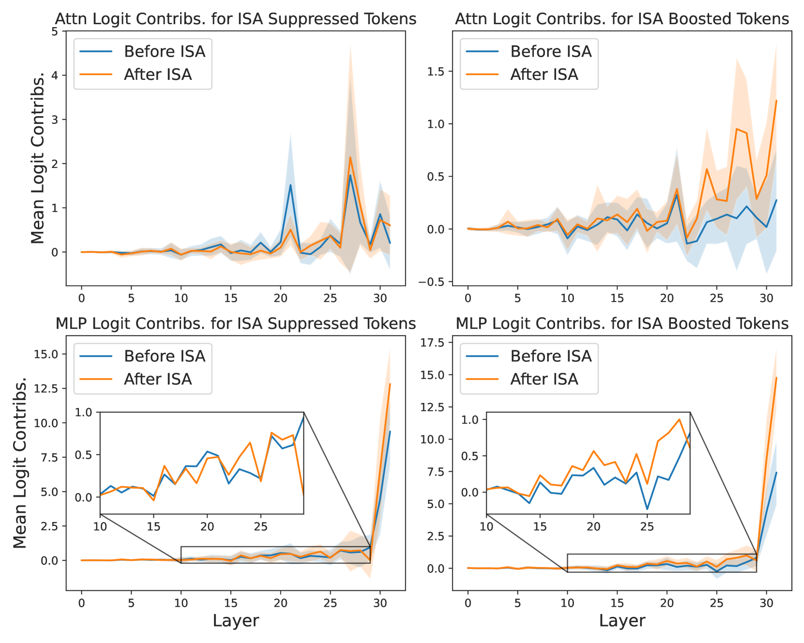
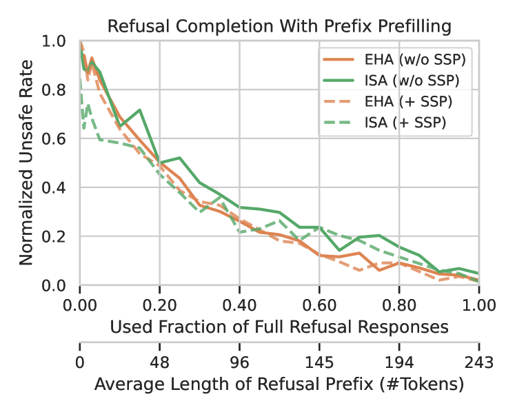

# 恶魔各异：揭秘微调攻击的独特机制

发布时间：2024年05月25日

`LLM理论

这篇论文主要探讨了大型语言模型（LLMs）在面对有害指令时的安全对齐机制，并分析了不同攻击策略如何影响这一流程的各个环节。研究通过使用logit lens和激活补丁等技术来定位驱动特定行为的模型组件，并通过跨模型探针检测攻击后的表示变化。这种深入分析模型内部机制的研究属于LLM理论范畴，因为它关注的是模型内部的运作和安全机制，而不是直接的应用或特定的Agent行为。因此，这篇论文应归类为LLM理论。` `网络安全` `人工智能安全`

> No Two Devils Alike: Unveiling Distinct Mechanisms of Fine-tuning Attacks

# 摘要

> 大型语言模型（LLMs）的安全对齐机制显得脆弱，易受多种策略攻击，如微调有害示例或篡改生成结果前缀。然而，这些攻击策略的机制尚未被充分揭示。本文探讨了一个核心问题：尽管这些方法均能严重威胁模型安全，它们的攻击机制是否存在共性？为此，我们将LLM面对有害指令时的保护流程细分为三个阶段：识别有害指令、初步拒绝语气的生成、以及拒绝响应的完善。我们深入分析了不同攻击策略如何影响这一流程的各个环节，运用logit lens和激活补丁等技术定位驱动特定行为的模型组件，并通过跨模型探针检测攻击后的表示变化。特别关注了两种典型攻击方式：显式有害攻击（EHA）和身份转移攻击（ISA）。研究发现，这两种攻击的机制截然不同：EHA主要针对有害指令的识别阶段，而ISA则有所不同。尽管两者均影响后两个阶段，但攻击的深度和方式存在显著差异。这一发现凸显了深入理解LLMs内部保护机制的重要性，并提示我们需要多元化的防御策略来应对多样化的攻击手段。

> The existing safety alignment of Large Language Models (LLMs) is found fragile and could be easily attacked through different strategies, such as through fine-tuning on a few harmful examples or manipulating the prefix of the generation results. However, the attack mechanisms of these strategies are still underexplored. In this paper, we ask the following question: \textit{while these approaches can all significantly compromise safety, do their attack mechanisms exhibit strong similarities?} To answer this question, we break down the safeguarding process of an LLM when encountered with harmful instructions into three stages: (1) recognizing harmful instructions, (2) generating an initial refusing tone, and (3) completing the refusal response. Accordingly, we investigate whether and how different attack strategies could influence each stage of this safeguarding process. We utilize techniques such as logit lens and activation patching to identify model components that drive specific behavior, and we apply cross-model probing to examine representation shifts after an attack. In particular, we analyze the two most representative types of attack approaches: Explicit Harmful Attack (EHA) and Identity-Shifting Attack (ISA). Surprisingly, we find that their attack mechanisms diverge dramatically. Unlike ISA, EHA tends to aggressively target the harmful recognition stage. While both EHA and ISA disrupt the latter two stages, the extent and mechanisms of their attacks differ significantly. Our findings underscore the importance of understanding LLMs' internal safeguarding process and suggest that diverse defense mechanisms are required to effectively cope with various types of attacks.

[Arxiv](https://arxiv.org/abs/2405.16229)