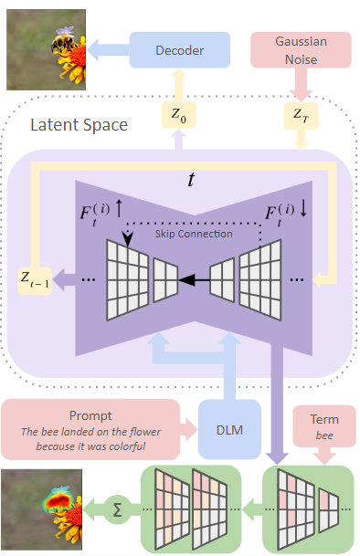
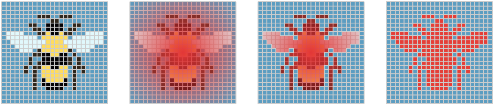
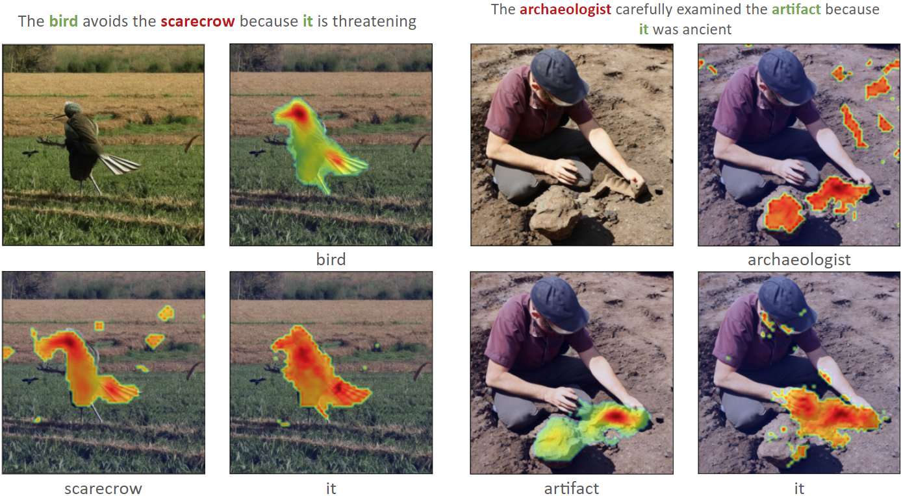

# 模糊之美：Winograd Schema Challenge 的视觉新解

发布时间：2024年05月25日

`LLM应用

这篇论文探讨了大型语言模型（LLMs）在多模态环境中的应用，特别是在文本到图像模型在代词消歧方面的能力。通过引入新的数据集WinoVis和评估框架，研究集中在如何改进模型在理解和与复杂视觉世界互动的能力上。这与LLM的应用相关，因为它关注的是LLM在特定任务（多模态代词消歧）中的实际应用和改进，而不是LLM的理论基础或Agent的设计与实现。因此，它属于LLM应用分类。` `多模态学习` `人工智能评估`

> Picturing Ambiguity: A Visual Twist on the Winograd Schema Challenge

# 摘要

> 大型语言模型（LLMs）在Winograd Schema Challenge（WSC）等任务中展示了高级文本常识推理的显著成功，但在需要同时理解文本和图像的多模态领域中应用这种推理仍面临重大挑战。为此，我们推出了WinoVis，一个专为测试文本到图像模型在多模态环境中代词消歧能力而设计的新数据集。通过使用GPT-4生成提示和扩散注意力归因图（DAAM）进行热图分析，我们提出了一种新的评估框架，专注于模型在代词消歧方面的能力，与其他视觉处理挑战区分开来。尽管Stable Diffusion 2.0在WinoVis上的准确率达到了56.7%，仅略高于随机猜测，但连续模型版本的评估显示了渐进式的改进。进一步的错误分析揭示了未来研究的关键领域，旨在提升文本到图像模型在理解和与复杂视觉世界互动方面的能力。

> Large Language Models (LLMs) have demonstrated remarkable success in tasks like the Winograd Schema Challenge (WSC), showcasing advanced textual common-sense reasoning. However, applying this reasoning to multimodal domains, where understanding text and images together is essential, remains a substantial challenge. To address this, we introduce WinoVis, a novel dataset specifically designed to probe text-to-image models on pronoun disambiguation within multimodal contexts. Utilizing GPT-4 for prompt generation and Diffusion Attentive Attribution Maps (DAAM) for heatmap analysis, we propose a novel evaluation framework that isolates the models' ability in pronoun disambiguation from other visual processing challenges. Evaluation of successive model versions reveals that, despite incremental advancements, Stable Diffusion 2.0 achieves a precision of 56.7% on WinoVis, only marginally surpassing random guessing. Further error analysis identifies important areas for future research aimed at advancing text-to-image models in their ability to interpret and interact with the complex visual world.

[Arxiv](https://arxiv.org/abs/2405.16277)