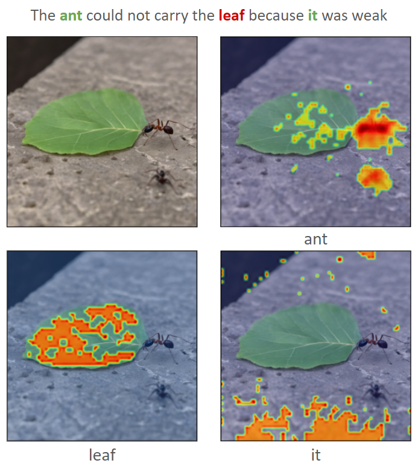

# 模糊之图：Winograd Schema Challenge 的视觉新解

发布时间：2024年05月25日

`LLM应用

这篇论文探讨了大型语言模型（LLMs）在多模态环境中的应用，特别是在文本到图像模型处理代词消歧任务的能力。通过介绍WinoVis数据集和评估框架，论文展示了LLMs在结合文本和图像处理时的性能和挑战。这与LLM的应用相关，特别是在多模态理解和处理方面，而不是专注于LLM的理论研究或Agent的设计与应用。因此，将其归类为LLM应用是合适的。` `多模态学习` `数据集构建`

> Picturing Ambiguity: A Visual Twist on the Winograd Schema Challenge

# 摘要

> 大型语言模型（LLMs）在文本常识推理任务如Winograd Schema Challenge（WSC）中表现出色，但在需要同时处理文本和图像的多模态领域仍面临挑战。为此，我们推出了WinoVis数据集，专门用于评估文本到图像模型在多模态环境中的代词消歧能力。通过GPT-4生成提示和DAAM进行热图分析，我们构建了一个新的评估框架，专注于模型在代词消歧上的表现，而非其他视觉处理任务。尽管Stable Diffusion 2.0在WinoVis上的准确率提升至56.7%，但仍仅略高于随机水平。错误分析揭示了未来研究的关键方向，以增强文本到图像模型理解和应对复杂视觉环境的能力。

> Large Language Models (LLMs) have demonstrated remarkable success in tasks like the Winograd Schema Challenge (WSC), showcasing advanced textual common-sense reasoning. However, applying this reasoning to multimodal domains, where understanding text and images together is essential, remains a substantial challenge. To address this, we introduce WinoVis, a novel dataset specifically designed to probe text-to-image models on pronoun disambiguation within multimodal contexts. Utilizing GPT-4 for prompt generation and Diffusion Attentive Attribution Maps (DAAM) for heatmap analysis, we propose a novel evaluation framework that isolates the models' ability in pronoun disambiguation from other visual processing challenges. Evaluation of successive model versions reveals that, despite incremental advancements, Stable Diffusion 2.0 achieves a precision of 56.7% on WinoVis, only marginally surpassing random guessing. Further error analysis identifies important areas for future research aimed at advancing text-to-image models in their ability to interpret and interact with the complex visual world.

[Arxiv](https://arxiv.org/abs/2405.16277)