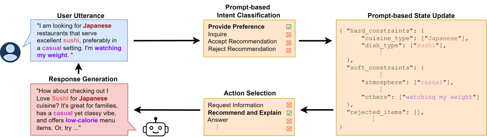
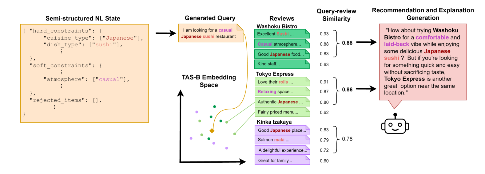

# 基于提示的半结构化自然语言状态跟踪技术，助力检索增强型对话推荐系统

发布时间：2024年05月25日

`Agent

这篇论文摘要描述了一种基于大型语言模型（LLMs）的对话推荐系统，该系统能够理解和处理用户通过间接方式表达的复杂偏好和意图。论文中提到的 RA-Rec 技术，是一种检索增强型对话状态跟踪系统，专门设计用于对话推荐。这种系统可以被视为一个智能代理（Agent），因为它能够与用户进行交互，理解用户的意图，并据此生成推荐。因此，这篇论文应归类于Agent分类。` `推荐系统` `对话系统`

> Retrieval-Augmented Conversational Recommendation with Prompt-based Semi-Structured Natural Language State Tracking

# 摘要

> 对话推荐系统需理解用户通过间接方式表达的丰富多样的偏好和意图，如“我在控制体重”，这使得检索相关项目颇具挑战，尤其是依赖不完整或过时的元数据时。幸运的是，许多领域的丰富评论不仅覆盖标准元数据，还提供了可能吸引用户的复杂意见，如“适合约会的优雅场所”。近期，大型语言模型（LLMs）的发展让我们能够洞察用户偏好与评论中复杂语言间的联系。LLMs 还开启了半结构化对话状态跟踪、深入理解复杂意图和偏好，以及生成推荐、解释和问答的新途径。我们因此推出了一种名为 RA-Rec 的新技术，这是一种基于 LLM 的检索增强型对话状态跟踪系统，专为对话推荐设计，并通过视频、开源 GitHub 仓库和交互式 Google Colab 笔记本进行了展示。

> Conversational recommendation (ConvRec) systems must understand rich and diverse natural language (NL) expressions of user preferences and intents, often communicated in an indirect manner (e.g., "I'm watching my weight"). Such complex utterances make retrieving relevant items challenging, especially if only using often incomplete or out-of-date metadata. Fortunately, many domains feature rich item reviews that cover standard metadata categories and offer complex opinions that might match a user's interests (e.g., "classy joint for a date"). However, only recently have large language models (LLMs) let us unlock the commonsense connections between user preference utterances and complex language in user-generated reviews. Further, LLMs enable novel paradigms for semi-structured dialogue state tracking, complex intent and preference understanding, and generating recommendations, explanations, and question answers. We thus introduce a novel technology RA-Rec, a Retrieval-Augmented, LLM-driven dialogue state tracking system for ConvRec, showcased with a video, open source GitHub repository, and interactive Google Colab notebook.

[Arxiv](https://arxiv.org/abs/2406.00033)