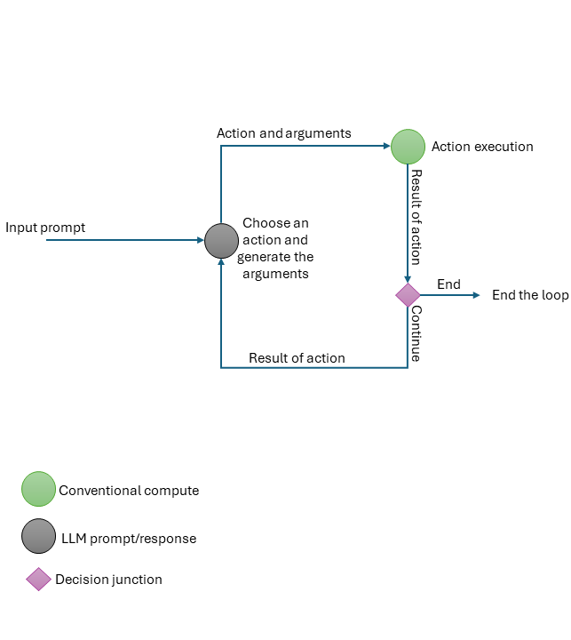
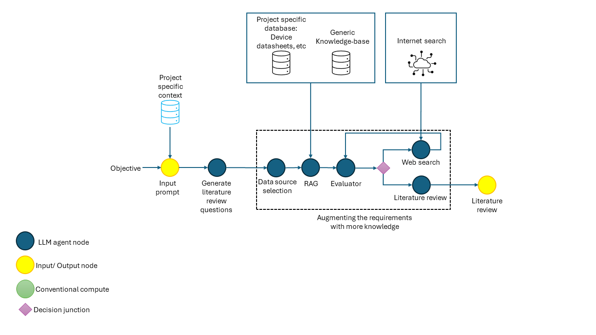
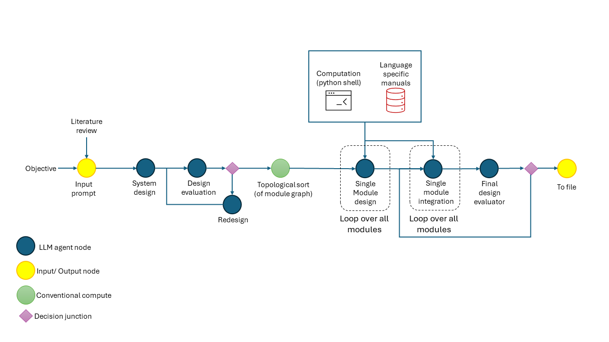

# SynthAI：一款多代理生成式AI框架，专为自动化模块化高层次综合设计而生。

发布时间：2024年05月25日

`Agent

理由：这篇论文介绍了一种名为SynthAI的自动化高层次综合（HLS）设计方法，它结合了ReAct代理、思维链提示、网络搜索技术和检索增强生成框架。这里的ReAct代理是关键，它表明该论文主要关注的是Agent技术在硬件设计自动化中的应用。Agent通常指的是能够自主执行任务的智能体，而SynthAI作为一个Agent，能够分解复杂的硬件设计任务并生成高质量的设计。因此，这篇论文应归类于Agent。` `硬件设计` `自动化综合`

> SynthAI: A Multi Agent Generative AI Framework for Automated Modular HLS Design Generation

# 摘要

> 本文介绍了SynthAI，一种革命性的自动化高层次综合（HLS）设计方法。它巧妙地结合了ReAct代理、思维链提示、网络搜索技术及检索增强生成框架，构建于一个结构化的决策图之上。SynthAI能将复杂的硬件设计任务有序分解为多个阶段和易于管理的小模块，从而生成符合用户设计目标和功能需求的高质量设计。通过多个案例研究，我们展示了SynthAI在从单一提示中创造复杂多模块逻辑设计方面的卓越能力。代码仓库地址为：\url{https://github.com/sarashs/FPGA_AGI}。

> In this paper, we introduce SynthAI, a pioneering method for the automated creation of High-Level Synthesis (HLS) designs. SynthAI integrates ReAct agents, Chain-of-Thought (CoT) prompting, web search technologies, and the Retrieval-Augmented Generation (RAG) framework within a structured decision graph. This innovative approach enables the systematic decomposition of complex hardware design tasks into multiple stages and smaller, manageable modules. As a result, SynthAI produces synthesizable designs that closely adhere to user-specified design objectives and functional requirements. We further validate the capabilities of SynthAI through several case studies, highlighting its proficiency in generating complex, multi-module logic designs from a single initial prompt. The SynthAI code is provided via the following repo: \url{https://github.com/sarashs/FPGA_AGI}

[Arxiv](https://arxiv.org/abs/2405.16072)