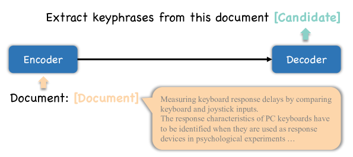

# 基于提示的无监督关键词提取：一项初步实证研究

发布时间：2024年05月26日

`LLM应用

这篇论文主要探讨了预训练的大型语言模型在关键词提取任务中如何通过不同的提示设计来影响性能。研究内容涉及提示工程的实践和效果评估，这是在特定应用场景（关键词提取）中对LLM的具体应用和优化。因此，它属于LLM应用分类。` `关键词提取`

> A Preliminary Empirical Study on Prompt-based Unsupervised Keyphrase Extraction

# 摘要

> 预训练的大型语言模型依赖人类设计的提示来执行自然语言处理任务，但这种方法往往需要繁琐的“提示工程”，通过试错手工制作提示，并依赖人类的专业知识。特别是在构建关键词提取方法时，这一挑战尤为突出。我们研究了不同提示在关键词提取任务中的效果，以探索精心设计的提示如何影响提取性能。实验结果显示，在多个数据集和模型上，(1) 复杂提示未必优于简单提示；(2) 提示中的个别关键词变化能显著影响性能；(3) 面对长文档，复杂提示表现更佳。

> Pre-trained large language models can perform natural language processing downstream tasks by conditioning on human-designed prompts. However, a prompt-based approach often requires "prompt engineering" to design different prompts, primarily hand-crafted through laborious trial and error, requiring human intervention and expertise. It is a challenging problem when constructing a prompt-based keyphrase extraction method. Therefore, we investigate and study the effectiveness of different prompts on the keyphrase extraction task to verify the impact of the cherry-picked prompts on the performance of extracting keyphrases. Extensive experimental results on six benchmark keyphrase extraction datasets and different pre-trained large language models demonstrate that (1) designing complex prompts may not necessarily be more effective than designing simple prompts; (2) individual keyword changes in the designed prompts can affect the overall performance; (3) designing complex prompts achieve better performance than designing simple prompts when facing long documents.

[Arxiv](https://arxiv.org/abs/2405.16571)