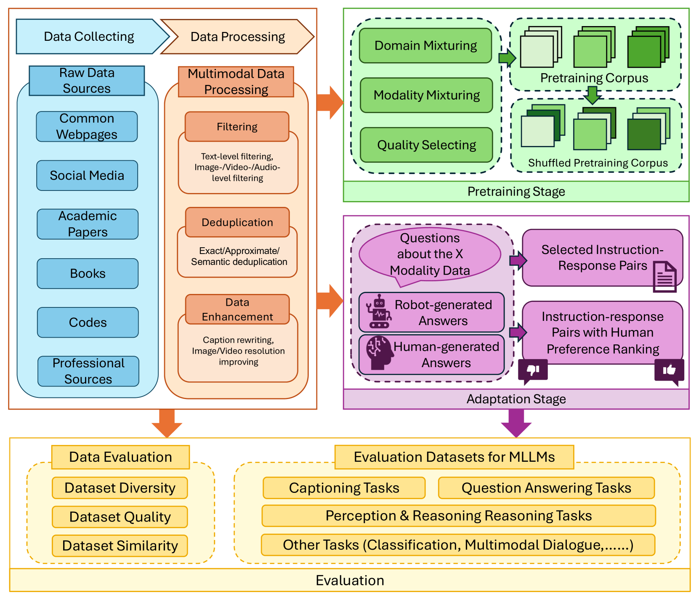

# 多模态大型语言模型综述：数据视角的探索

发布时间：2024年05月26日

`LLM理论

这篇论文摘要主要讨论了多模态大型语言模型（MLLMs）的研究，包括预训练与适应阶段多模态数据的准备方法、数据集评估技术及MLLMs的评估基准。这些内容更偏向于理论探讨和方法论的分析，而不是具体的应用实例或Agent的设计与实现。因此，将其归类为LLM理论是合适的。` `人工智能` `多模态学习`

> A Survey of Multimodal Large Language Model from A Data-centric Perspective

# 摘要

> 人类通过多样的感官如视觉、嗅觉、听觉和触觉感知世界，而多模态大型语言模型（MLLMs）则通过融合文本、视觉、音频、视频及三维环境等多模态数据，提升了传统语言模型的能力。在这篇综述中，我们聚焦于数据，全面审视了MLLMs的研究文献，深入探讨了预训练与适应阶段多模态数据的准备方法，并分析了数据集评估技术及MLLMs的评估基准。此外，我们还展望了未来的研究方向，旨在深化对MLLMs数据驱动特性的理解，激发该领域的进一步探索与创新。

> Human beings perceive the world through diverse senses such as sight, smell, hearing, and touch. Similarly, multimodal large language models (MLLMs) enhance the capabilities of traditional large language models by integrating and processing data from multiple modalities including text, vision, audio, video, and 3D environments. Data plays a pivotal role in the development and refinement of these models. In this survey, we comprehensively review the literature on MLLMs from a data-centric perspective. Specifically, we explore methods for preparing multimodal data during the pretraining and adaptation phases of MLLMs. Additionally, we analyze the evaluation methods for datasets and review benchmarks for evaluating MLLMs. Our survey also outlines potential future research directions. This work aims to provide researchers with a detailed understanding of the data-driven aspects of MLLMs, fostering further exploration and innovation in this field.

[Arxiv](https://arxiv.org/abs/2405.16640)