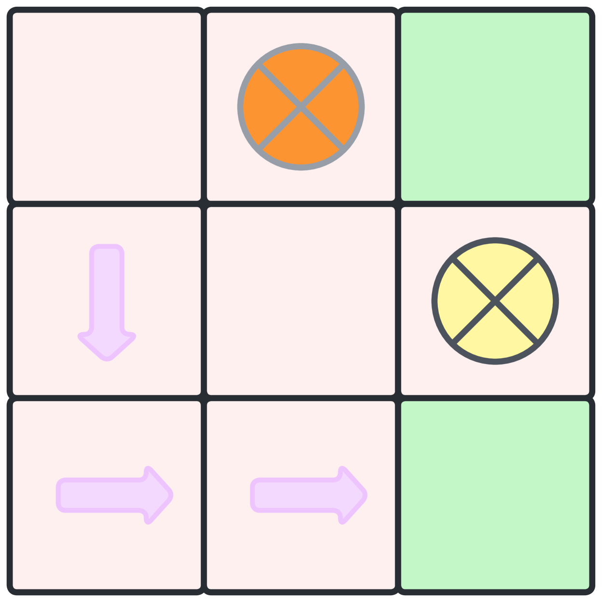
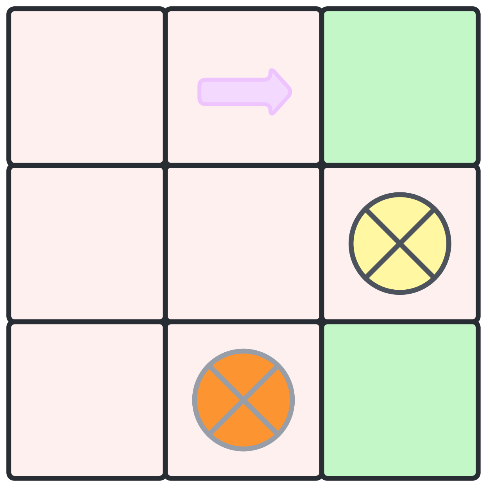
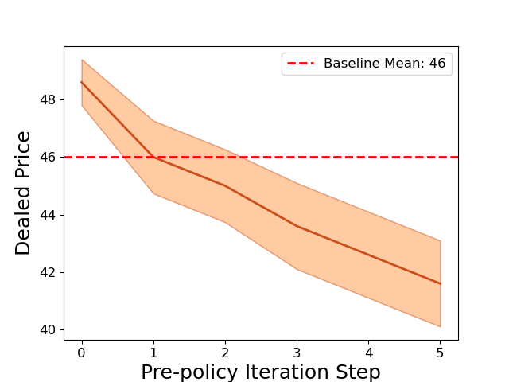

# 借助结构因果游戏，优化人机交互，实现人类期望的成果

发布时间：2024年05月26日

`Agent

这篇论文主要探讨了在人机交互中如何通过AI代理实现人类期望的结果，引入了结构因果游戏（SCG）理论框架，并提出了一种预政策干预策略来引导AI代理的行为。这涉及到AI代理的行为选择和优化，因此属于Agent分类。` `人机交互` `人工智能`

> Attaining Human`s Desirable Outcomes in Human-AI Interaction via Structural Causal Games

# 摘要

> 在人机交互领域，我们的目标是通过AI的帮助达成人类期望的结果，这本质上是一个寻找最优纳什均衡的问题，该均衡需与人类的期望相契合。然而，由于存在多个与任务相关但不符合人类期望的纳什均衡，实现这一目标颇具挑战。为此，我们引入了结构因果游戏（SCG）这一理论框架，用以规范人机互动过程，并提出了一种名为预政策干预的策略，旨在引导AI代理朝着实现人类期望结果的方向发展。具体而言，我们通过SCG定义了一个透明且可解释的过程，学习预政策作为一种广义干预，以指导AI代理的政策选择。为了使这一框架具有实用性，我们开发了一种类似强化学习的算法来寻找最佳预政策。该算法在网格世界和真实对话场景中与大型语言模型进行了测试，证明了其在更广泛问题中的适应性及在现实世界中的潜在效能。

> In human-AI interaction, a prominent goal is to attain human`s desirable outcome with the assistance of AI agents, which can be ideally delineated as a problem of seeking the optimal Nash Equilibrium that matches the human`s desirable outcome. However, reaching the outcome is usually challenging due to the existence of multiple Nash Equilibria that are related to the assisting task but do not correspond to the human`s desirable outcome. To tackle this issue, we employ a theoretical framework called structural causal game (SCG) to formalize the human-AI interactive process. Furthermore, we introduce a strategy referred to as pre-policy intervention on the SCG to steer AI agents towards attaining the human`s desirable outcome. In more detail, a pre-policy is learned as a generalized intervention to guide the agents` policy selection, under a transparent and interpretable procedure determined by the SCG. To make the framework practical, we propose a reinforcement learning-like algorithm to search out this pre-policy. The proposed algorithm is tested in both gridworld environments and realistic dialogue scenarios with large language models, demonstrating its adaptability in a broader class of problems and potential effectiveness in real-world situations.

[Arxiv](https://arxiv.org/abs/2405.16588)