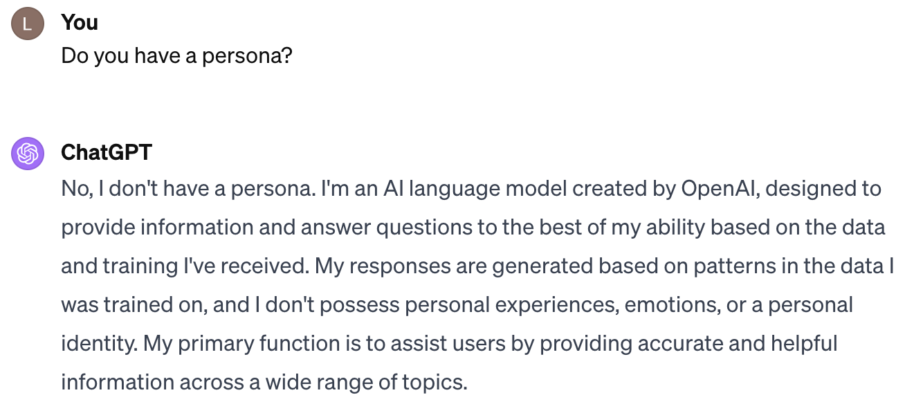

# 打造更优AI代理：探讨LLM对话代理中角色运用的挑战

发布时间：2024年05月26日

`Agent`

> Building Better AI Agents: A Provocation on the Utilisation of Persona in LLM-based Conversational Agents

# 摘要

> 随着GPT系列等大型语言模型（LLMs）在医疗、教育和金融等多个领域的应用，人工智能（AI）领域迎来了重大发展。为了满足个性化应用的需求，设计具有独特人格的对话代理（CAs）变得尤为重要。本文首先分析了赋予CAs人格的必要性及其影响，随后扩展到LLM时代CAs个性化和拟人化的广泛讨论。我们详细探讨了在某些应用中，人格的实施不仅是加分项，更是关键所在。文章强调了在整合人格时需采取精细策略，并指出了可能遇到的挑战和伦理问题。同时，我们强调了保持人格一致性、建立有效评估机制以及确保人格与专业知识相辅相成的重要性。

> The incorporation of Large Language Models (LLMs) such as the GPT series into diverse sectors including healthcare, education, and finance marks a significant evolution in the field of artificial intelligence (AI). The increasing demand for personalised applications motivated the design of conversational agents (CAs) to possess distinct personas. This paper commences by examining the rationale and implications of imbuing CAs with unique personas, smoothly transitioning into a broader discussion of the personalisation and anthropomorphism of CAs based on LLMs in the LLM era. We delve into the specific applications where the implementation of a persona is not just beneficial but critical for LLM-based CAs. The paper underscores the necessity of a nuanced approach to persona integration, highlighting the potential challenges and ethical dilemmas that may arise. Attention is directed towards the importance of maintaining persona consistency, establishing robust evaluation mechanisms, and ensuring that the persona attributes are effectively complemented by domain-specific knowledge.

[Arxiv](https://arxiv.org/abs/2407.11977)