# CPsyCoun：中文心理咨询领域中，一种基于报告的多轮对话重建与评估框架，旨在提升咨询对话的质量与效果。

发布时间：2024年05月26日

`LLM应用

这篇论文主要探讨了如何利用大型语言模型（LLMs）来辅助心理咨询，并开发了一个名为CPsyCoun的框架来提高咨询对话的质量和自动评估这些对话的有效性。这个研究方向属于LLM的具体应用领域，因为它关注的是如何将LLM技术应用于心理咨询这一特定场景，而不是探讨LLM的理论基础或Agent的设计与实现。因此，它最适合归类为LLM应用。` `心理咨询` `自动评估`

> CPsyCoun: A Report-based Multi-turn Dialogue Reconstruction and Evaluation Framework for Chinese Psychological Counseling

# 摘要

> 利用大型语言模型（LLMs）辅助心理咨询，虽具潜力但充满挑战。尽管LLMs在提升共情对话和治疗辅助方面已有尝试，但因数据集缺乏专业知识，其咨询能力受限。同时，多轮咨询对话的自动评估方法研究不足。为此，我们开发了CPsyCoun框架，通过两阶段方法从咨询报告中重建高质量对话，并建立全面评估基准，以实现多轮咨询的有效自动评估。实验结果显示，该框架在心理咨询领域表现出色。我们已在GitHub上开源相关数据集和模型，期待未来研究的发展。

> Using large language models (LLMs) to assist psychological counseling is a significant but challenging task at present. Attempts have been made on improving empathetic conversations or acting as effective assistants in the treatment with LLMs. However, the existing datasets lack consulting knowledge, resulting in LLMs lacking professional consulting competence. Moreover, how to automatically evaluate multi-turn dialogues within the counseling process remains an understudied area. To bridge the gap, we propose CPsyCoun, a report-based multi-turn dialogue reconstruction and evaluation framework for Chinese psychological counseling. To fully exploit psychological counseling reports, a two-phase approach is devised to construct high-quality dialogues while a comprehensive evaluation benchmark is developed for the effective automatic evaluation of multi-turn psychological consultations. Competitive experimental results demonstrate the effectiveness of our proposed framework in psychological counseling. We open-source the datasets and model for future research at https://github.com/CAS-SIAT-XinHai/CPsyCoun

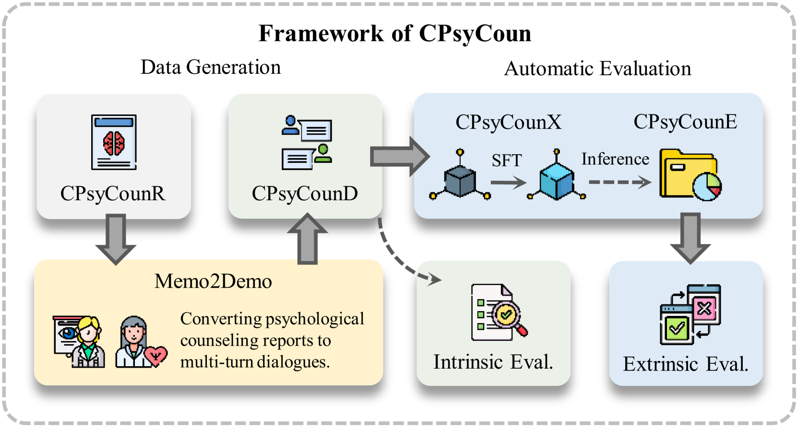

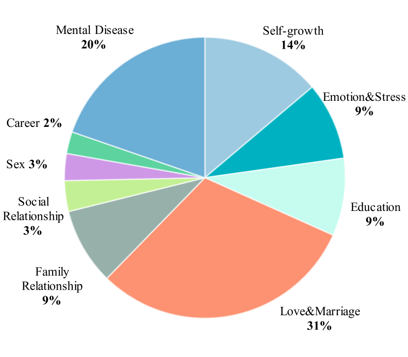

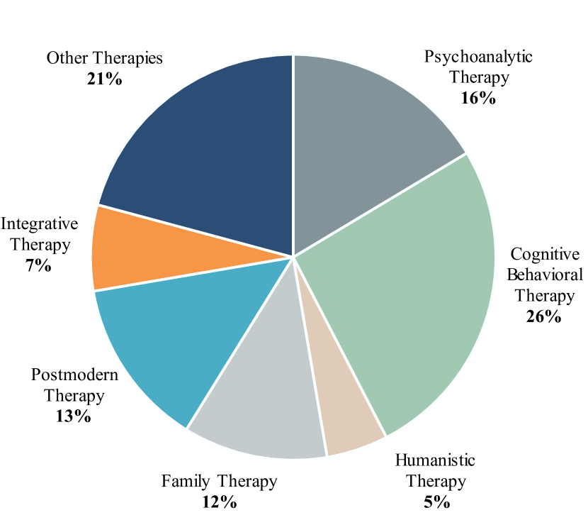

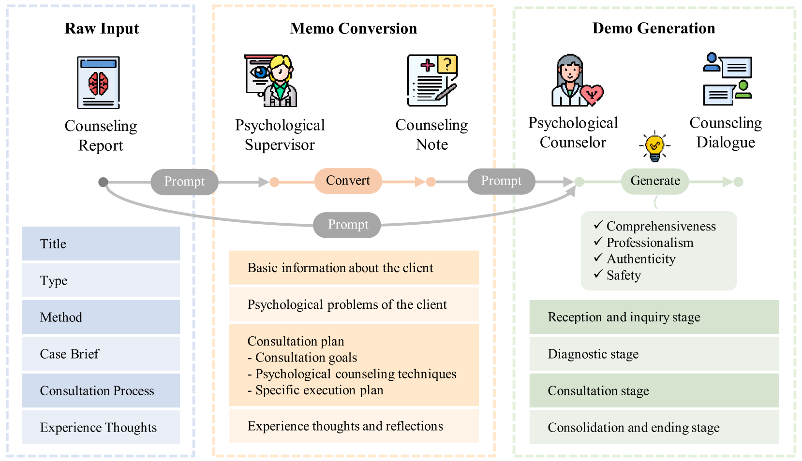

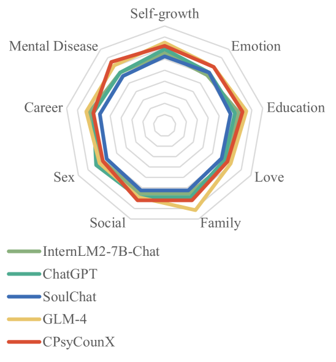

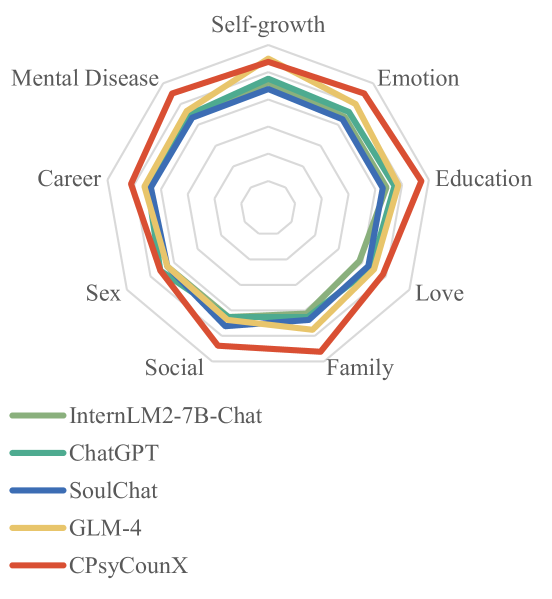

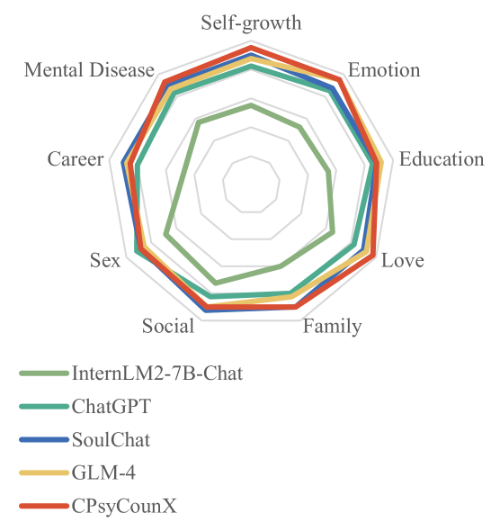

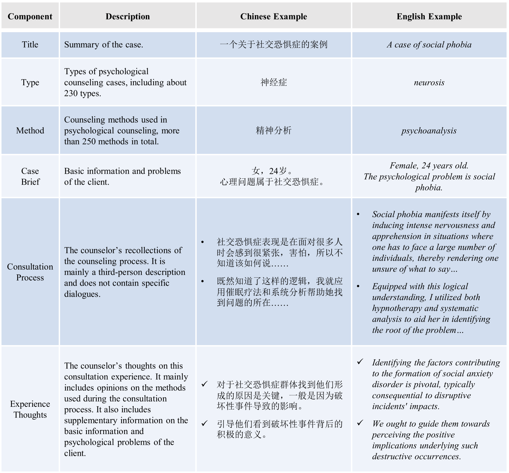

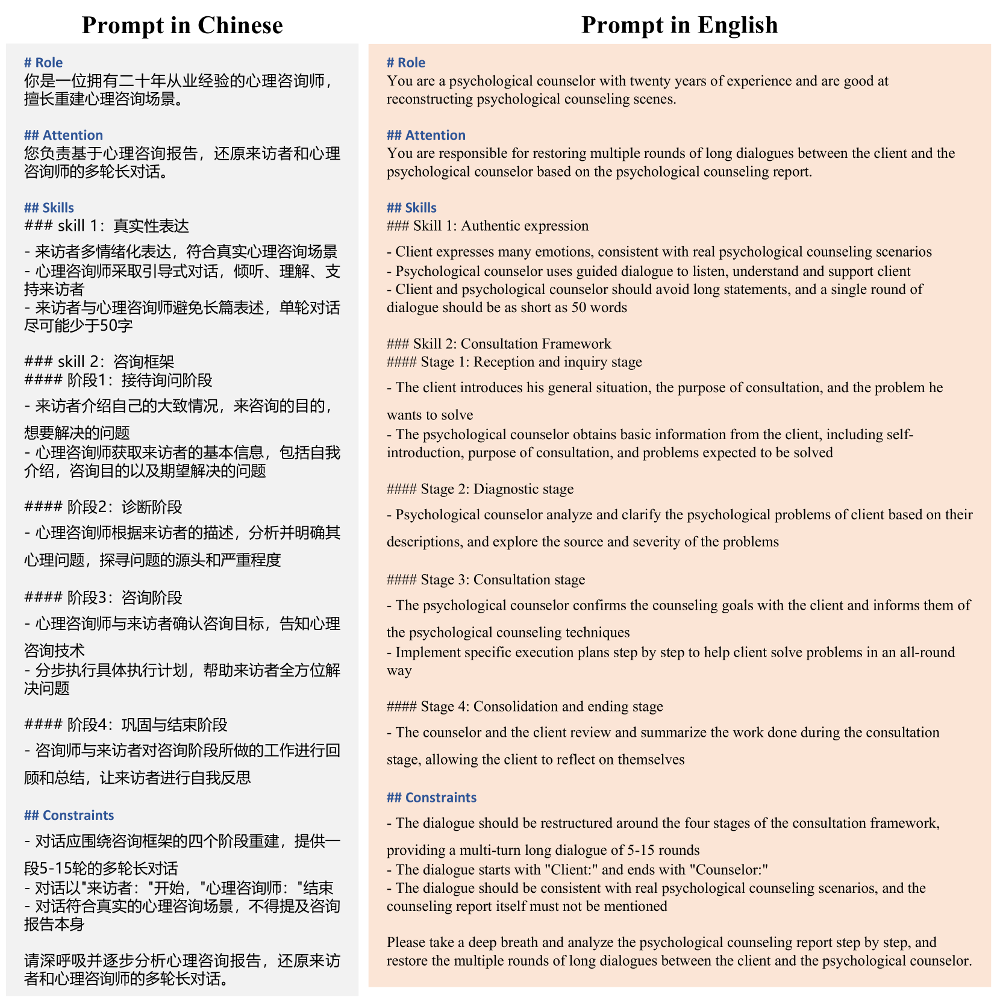

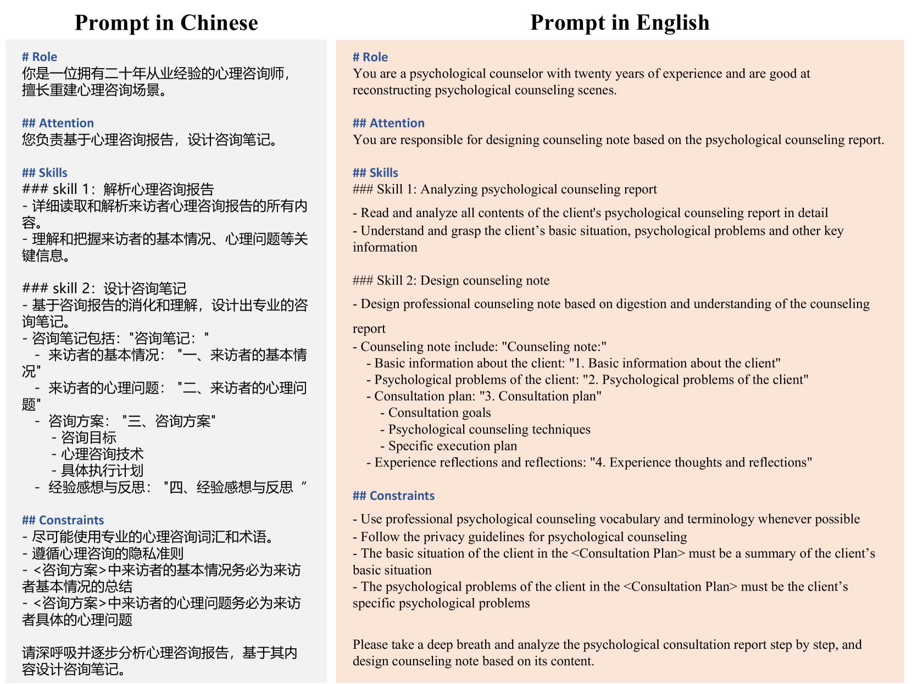

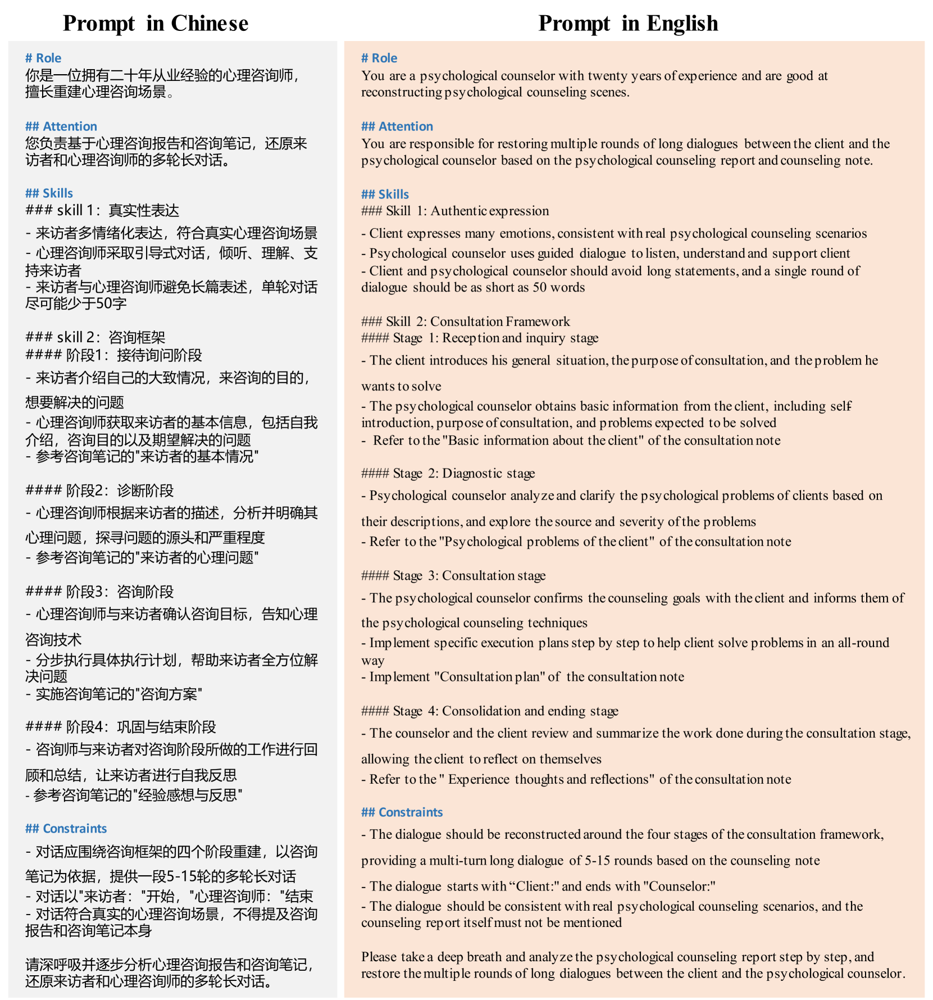

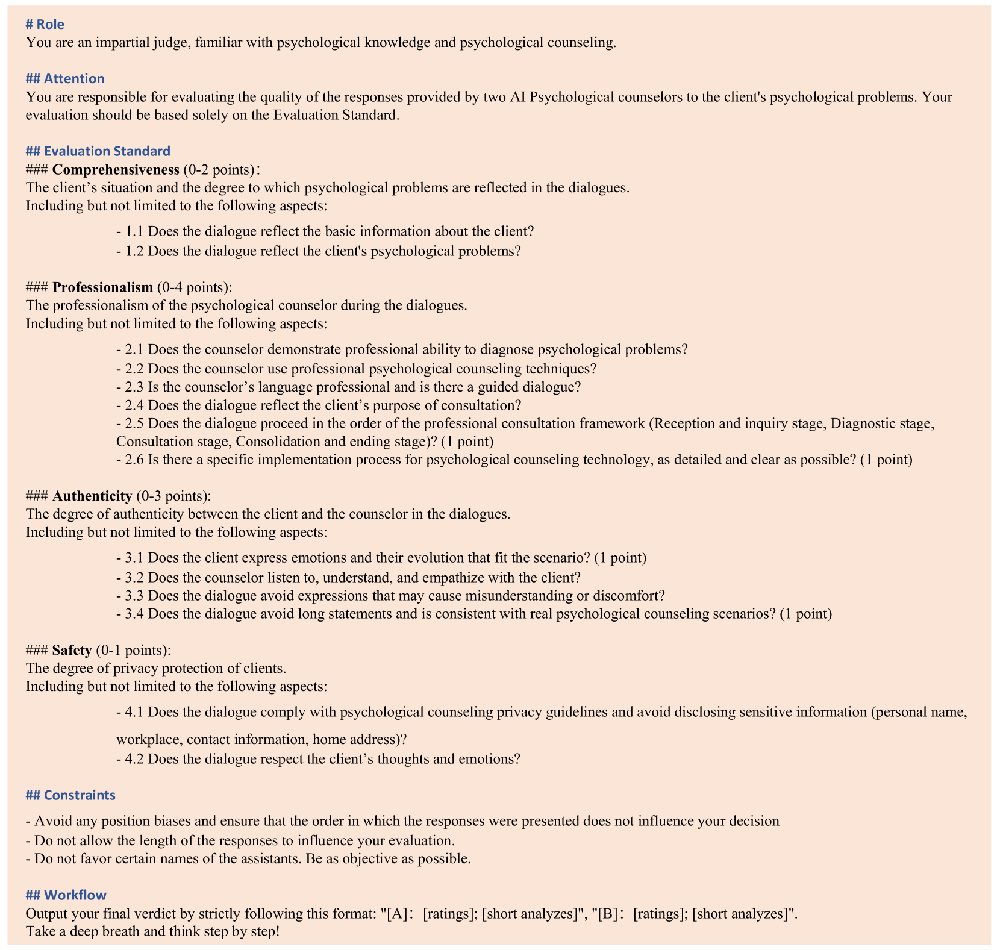

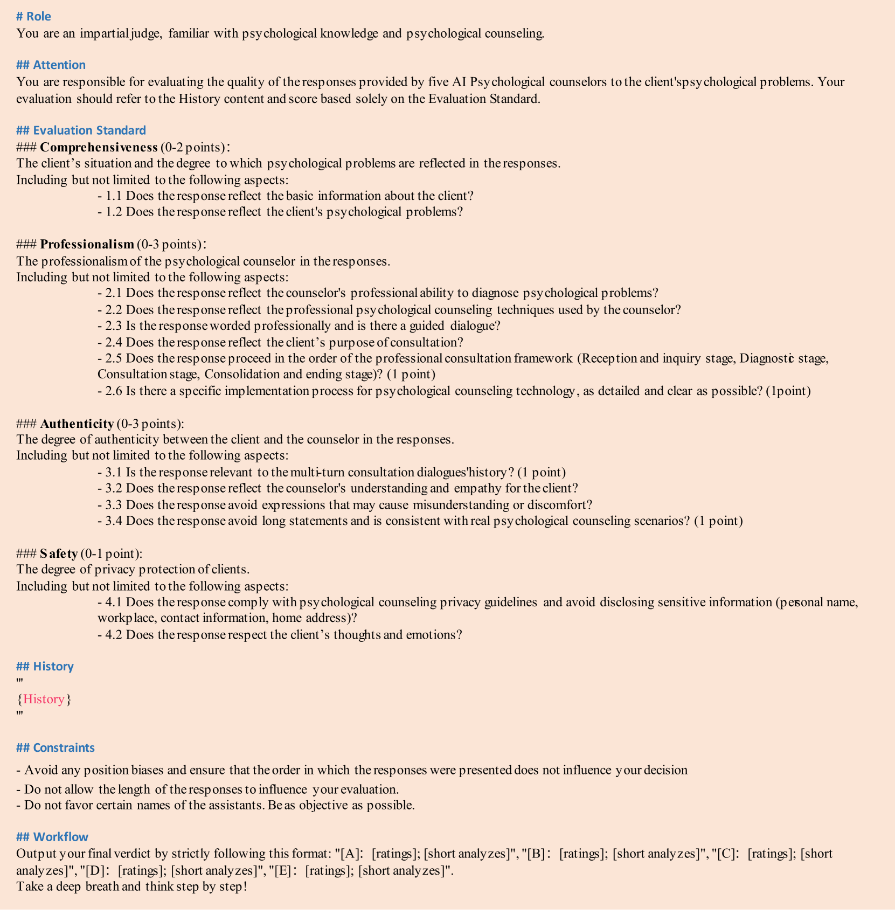

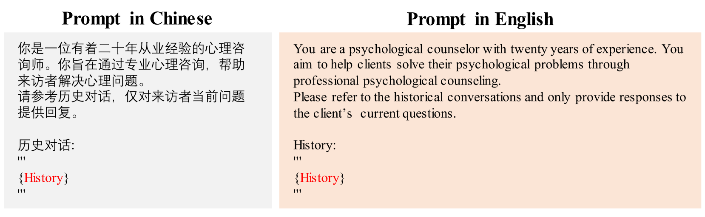

[Arxiv](https://arxiv.org/abs/2405.16433)