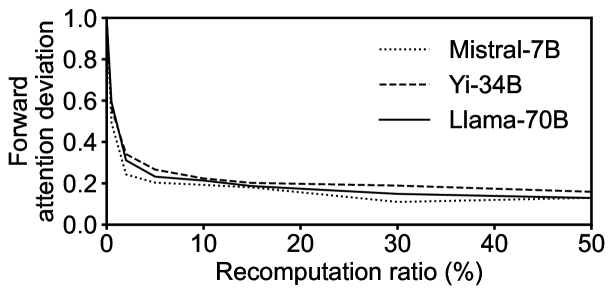

# CacheBlend：融合缓存知识，加速大型语言模型服务

发布时间：2024年05月26日

`LLM应用

理由：这篇论文主要探讨了大型语言模型（LLMs）中预计算的KV缓存的有效利用问题，并提出了一种名为CacheBlend的策略来优化这一过程。论文关注的是LLM在实际应用中的性能优化，特别是在处理多个文本片段时的效率问题，而不是理论模型的构建或Agent的行为研究。因此，它属于LLM应用类别。` `机器学习`

> CacheBlend: Fast Large Language Model Serving with Cached Knowledge Fusion

# 摘要

> 大型语言模型（LLMs）常通过整合多个文本片段来提供必要上下文。为了加速LLM输入的预填充，可以预先计算文本的KV缓存，并在上下文重复使用时再次利用。但当这些文本片段并非作为输入前缀时，预计算的KV缓存因未考虑与前文的交叉注意力而无法直接使用，导致KV缓存重复利用的潜在优势未能充分发挥。本研究聚焦于一个问题：如何在LLM输入包含多个文本片段时，高效整合其预计算的KV缓存，以保持与完全预填充相同的生成质量？我们提出了一种名为CacheBlend的策略，它不区分前缀与否，均重新利用预计算的KV缓存，并针对性地重新计算一小部分令牌的KV值，以部分更新每个重复使用的KV缓存。此外，重新计算的微小延迟可与KV缓存的检索任务并行处理，使得CacheBlend能在存储容量更大的慢速设备上存储KV缓存，而不会增加推理延迟。通过对比CacheBlend与当前最佳的KV缓存重复利用方案在三种不同规模的LLM和四个不同任务的基准数据集上的表现，我们发现CacheBlend显著缩短了首次令牌时间（TTFT）2.2-3.3倍，提升了推理吞吐量2.8-5倍，同时不牺牲生成质量，也不增加额外的存储成本。

> Large language models (LLMs) often incorporate multiple text chunks in their inputs to provide the necessary contexts. To speed up the prefill of the long LLM inputs, one can pre-compute the KV cache of a text and re-use the KV cache when the context is reused as the prefix of another LLM input. However, the reused text chunks are not always the input prefix, and when they are not, their precomputed KV caches cannot be directly used since they ignore the text's cross-attention with the preceding text in the LLM input. Thus, the benefits of reusing KV caches remain largely unrealized.
  This paper tackles just one question: when an LLM input contains multiple text chunks, how to quickly combine their precomputed KV caches in order to achieve the same generation quality as the expensive full prefill (i.e., without reusing KV cache)? We present CacheBlend, a scheme that reuses the pre-computed KV caches, regardless prefix or not, and selectively recomputes the KV values of a small subset of tokens to partially update each reused KV cache. In the meantime,the small extra delay for recomputing some tokens can be pipelined with the retrieval of KV caches within the same job,allowing CacheBlend to store KV caches in slower devices with more storage capacity while retrieving them without increasing the inference delay. By comparing CacheBlend with the state-of-the-art KV cache reusing schemes on three open-source LLMs of various sizes and four popular benchmark datasets of different tasks, we show that CacheBlend reduces time-to-first-token (TTFT) by 2.2-3.3X and increases the inference throughput by 2.8-5X, compared with full KV recompute, without compromising generation quality or incurring more storage cost.

[Arxiv](https://arxiv.org/abs/2405.16444)