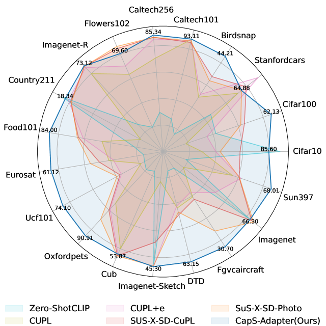
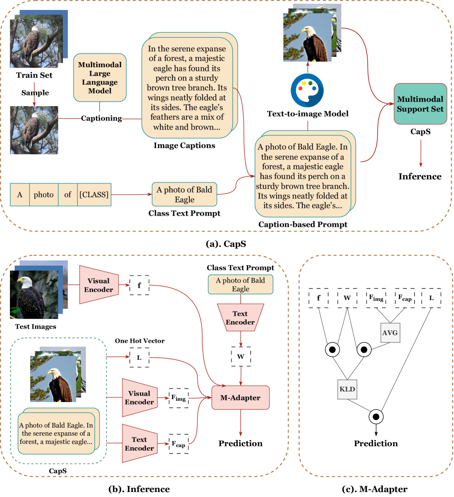
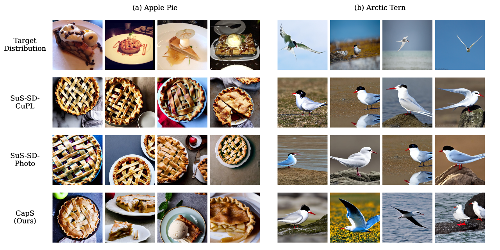
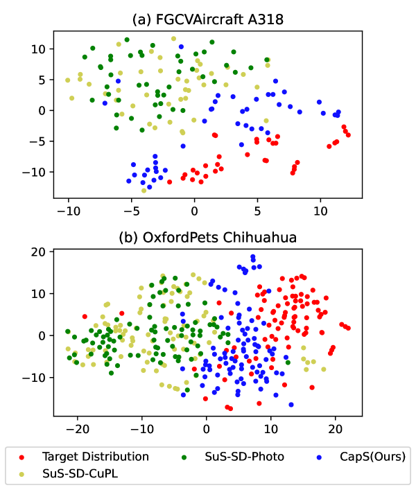
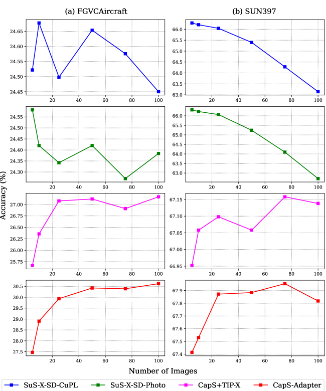
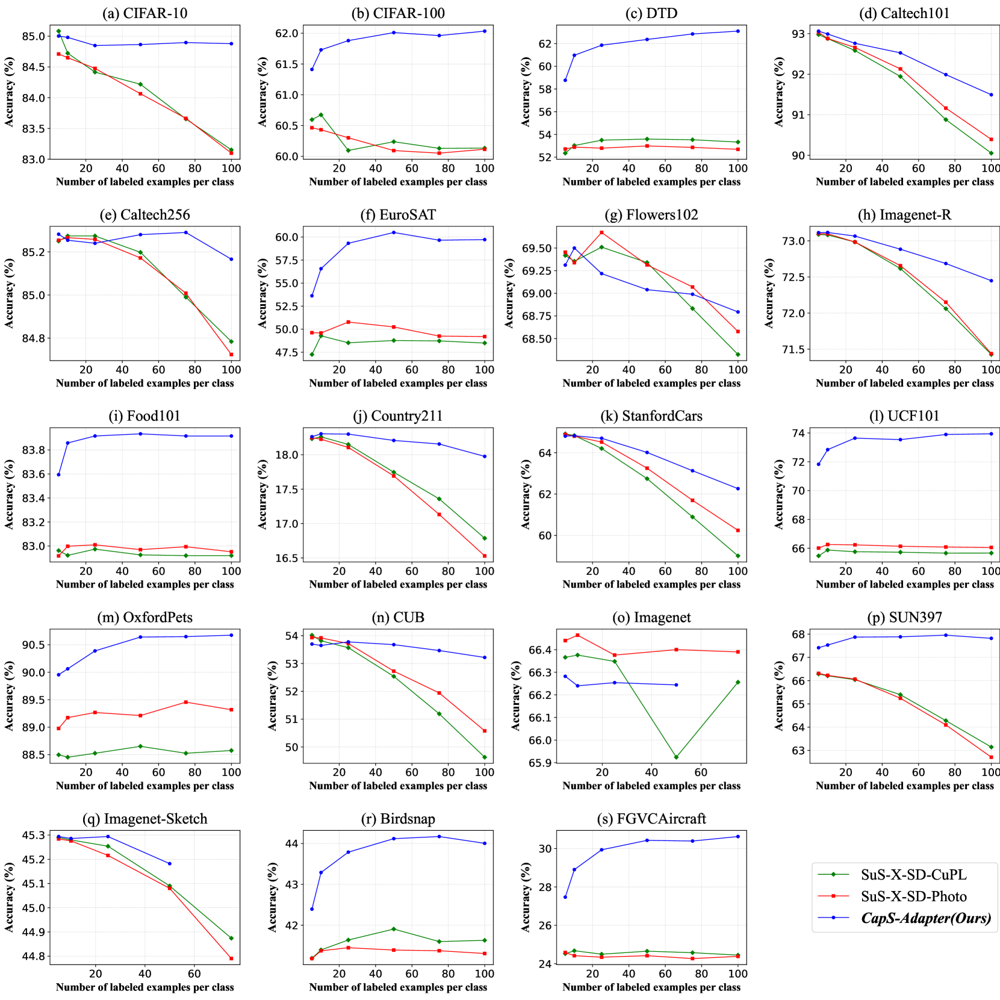
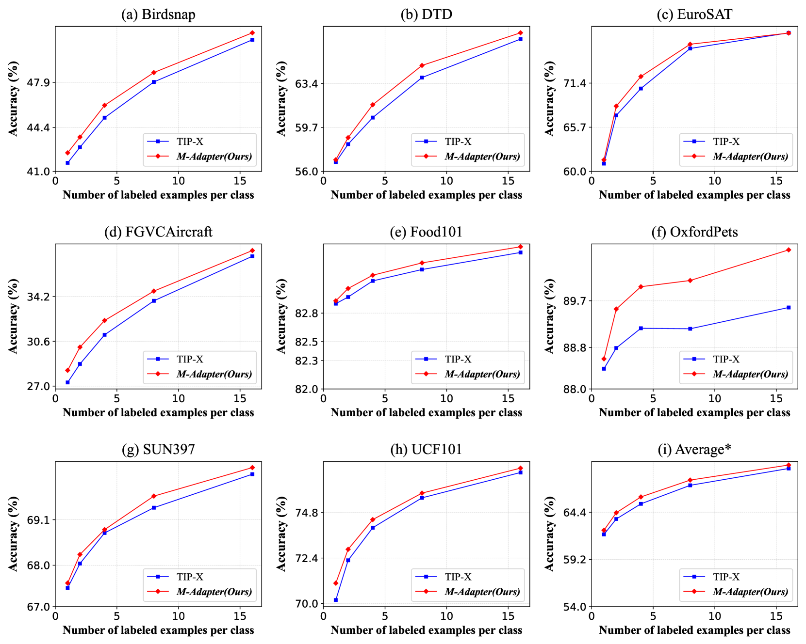

# CapS-Adapter：零-shot分类中的标题驱动多模态适配器

发布时间：2024年05月26日

`LLM应用

理由：这篇论文介绍了一种新的方法CapS-Adapter，用于提升视觉-语言模型在零样本分类任务上的性能，而无需进行传统的微调训练。这种方法利用了大型多模态模型（如CLIP）的特性，通过构建与目标分布高度一致的支持集来提高预测准确性。论文的重点在于应用现有的LLM技术（如CLIP）来解决实际问题，即零样本分类，并展示了在多个基准数据集上的性能提升。因此，这篇论文属于LLM应用类别。` `计算机视觉`

> CapS-Adapter: Caption-based MultiModal Adapter in Zero-Shot Classification

# 摘要

> 视觉-语言模型如CLIP近期在零样本分类上取得了显著进展，但其庞大的参数规模使得微调过程资源消耗巨大。为此，TIP-Adapter和SuS-X提出了无需训练的新方法，以提升下游任务性能。尽管这些方法通过支持集保持了知识缓存与测试集的数据分布一致性，但在面对分布差异大的测试数据时，其泛化能力仍显不足。本研究推出的CapS-Adapter，巧妙地利用基于标题的支持集，结合图像与文本特征，在无需训练的情况下超越了现有技术。CapS-Adapter通过多模态大型模型提取的实例级分布特征，构建了与目标分布高度一致的支持集。借助CLIP的单模态与跨模态优势，CapS-Adapter通过多模态支持集显著提升了预测准确性。我们的方法在19个基准数据集上实现了零样本分类的卓越表现，准确率比先前最佳方法提升了2.19%。通过多数据集的广泛验证，我们的方法展现了卓越的性能和强大的泛化能力，相关代码已在GitHub上公开。

> Recent advances in vision-language foundational models, such as CLIP, have demonstrated significant strides in zero-shot classification. However, the extensive parameterization of models like CLIP necessitates a resource-intensive fine-tuning process. In response, TIP-Adapter and SuS-X have introduced training-free methods aimed at bolstering the efficacy of downstream tasks. While these approaches incorporate support sets to maintain data distribution consistency between knowledge cache and test sets, they often fall short in terms of generalization on the test set, particularly when faced with test data exhibiting substantial distributional variations. In this work, we present CapS-Adapter, an innovative method that employs a caption-based support set, effectively harnessing both image and caption features to exceed existing state-of-the-art techniques in training-free scenarios. CapS-Adapter adeptly constructs support sets that closely mirror target distributions, utilizing instance-level distribution features extracted from multimodal large models. By leveraging CLIP's single and cross-modal strengths, CapS-Adapter enhances predictive accuracy through the use of multimodal support sets. Our method achieves outstanding zero-shot classification results across 19 benchmark datasets, improving accuracy by 2.19\% over the previous leading method. Our contributions are substantiated through extensive validation on multiple benchmark datasets, demonstrating superior performance and robust generalization capabilities. Our code is made publicly available at https://github.com/WLuLi/CapS-Adapter.

[Arxiv](https://arxiv.org/abs/2405.16591)