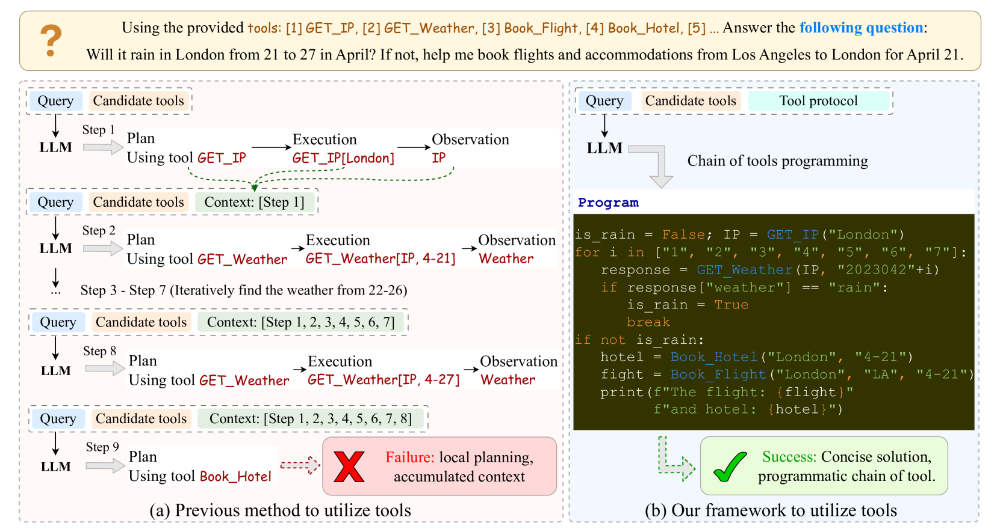

# 大型语言模型：自动化的多工具学习专家

发布时间：2024年05月26日

`Agent

这篇论文主要介绍了一种自动工具链（ATC）框架，该框架允许大型语言模型（LLMs）通过编程直接利用一系列工具，类似于一个智能代理（Agent）使用多种工具来解决问题。此外，论文还提出了一种黑盒探测技术，使LLM能够主动学习和记录新工具的使用，从而自我提升。这与Agent的特性相符，即能够自主地使用工具和资源来完成任务。因此，这篇论文应归类于Agent。` `自动化` `人工智能`

> Chain of Tools: Large Language Model is an Automatic Multi-tool Learner

# 摘要

> 通过整合外部工具，大型语言模型（LLMs）的实用性得以扩展，使其能够解决实际问题。现有方法通常通过手动设计的流程，让LLMs逐步规划并执行一系列工具，以获取中间结果直至得出最终答案。但在实际应用中，这种方法面临两大挑战：一是手工流程往往即兴且局限，限制了LLM的局部规划能力；二是LLM仅能使用预设或训练过的工具，限制了其对新工具的适应性。为此，我们提出了自动工具链（ATC）框架，使LLM能够像多工具用户一样，通过编程直接利用一系列工具。我们还开发了一种黑盒探测技术，使LLM能够主动学习和记录新工具的使用，从而自我提升。为了全面评估，我们创建了名为ToolFlow的基准，专注于长期规划和复杂工具使用。实验结果显示，我们的框架在多个数据集上表现出色，证明了黑盒探测算法的有效性和实用性。

> Augmenting large language models (LLMs) with external tools has emerged as a promising approach to extend their utility, empowering them to solve practical tasks. Existing work typically empowers LLMs as tool users with a manually designed workflow, where the LLM plans a series of tools in a step-by-step manner, and sequentially executes each tool to obtain intermediate results until deriving the final answer. However, they suffer from two challenges in realistic scenarios: (1) The handcrafted control flow is often ad-hoc and constraints the LLM to local planning; (2) The LLM is instructed to use only manually demonstrated tools or well-trained Python functions, which limits its generalization to new tools. In this work, we first propose Automatic Tool Chain (ATC), a framework that enables the LLM to act as a multi-tool user, which directly utilizes a chain of tools through programming. To scale up the scope of the tools, we next propose a black-box probing method. This further empowers the LLM as a tool learner that can actively discover and document tool usages, teaching themselves to properly master new tools. For a comprehensive evaluation, we build a challenging benchmark named ToolFlow, which diverges from previous benchmarks by its long-term planning scenarios and complex toolset. Experiments on both existing datasets and ToolFlow illustrate the superiority of our framework. Analysis on different settings also validates the effectiveness and the utility of our black-box probing algorithm.

[Arxiv](https://arxiv.org/abs/2405.16533)