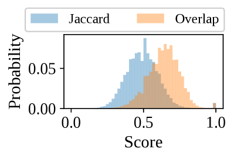
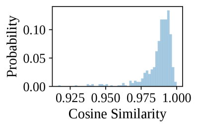

# Cocktail：大型语言模型生成文档的综合信息检索基准

发布时间：2024年05月26日

`LLM应用

理由：这篇论文主要关注的是大型语言模型（LLMs）生成内容对信息检索（IR）系统的影响，并为此推出了一个评估基准（Cocktail）。这表明论文的研究重点在于如何应用LLMs来改进或适应现有的技术系统，特别是在处理混合数据环境中的信息检索问题。因此，这篇论文属于LLM应用类别。` `信息检索` `人工智能`

> Cocktail: A Comprehensive Information Retrieval Benchmark with LLM-Generated Documents Integration

# 摘要

> 随着大型语言模型（LLMs）的广泛应用，互联网上涌现了大量人工智能生成内容（AIGC），使得信息检索（IR）系统的语料库从纯人类编写转变为与LLM生成内容并存。AIGC的激增对IR系统的影响尚不明确，关键问题在于缺乏专门的研究基准。为此，我们推出了Cocktail，一个专为LLM时代混合数据环境设计的IR模型评估基准，包含16个跨领域和任务的多样化数据集，涵盖人类与LLM生成的混合语料。为避免潜在偏见，我们还创建了最新数据集NQ-UTD，其查询基于近期事件。通过1000多次实验，我们发现神经检索模型在排名性能与来源偏见之间存在明显权衡，强调了未来IR系统设计需采取平衡策略。我们期望Cocktail成为LLM时代IR研究的重要基石，其数据和代码已公开于\url{https://github.com/KID-22/Cocktail}。

> The proliferation of Large Language Models (LLMs) has led to an influx of AI-generated content (AIGC) on the internet, transforming the corpus of Information Retrieval (IR) systems from solely human-written to a coexistence with LLM-generated content. The impact of this surge in AIGC on IR systems remains an open question, with the primary challenge being the lack of a dedicated benchmark for researchers. In this paper, we introduce Cocktail, a comprehensive benchmark tailored for evaluating IR models in this mixed-sourced data landscape of the LLM era. Cocktail consists of 16 diverse datasets with mixed human-written and LLM-generated corpora across various text retrieval tasks and domains. Additionally, to avoid the potential bias from previously included dataset information in LLMs, we also introduce an up-to-date dataset, named NQ-UTD, with queries derived from recent events. Through conducting over 1,000 experiments to assess state-of-the-art retrieval models against the benchmarked datasets in Cocktail, we uncover a clear trade-off between ranking performance and source bias in neural retrieval models, highlighting the necessity for a balanced approach in designing future IR systems. We hope Cocktail can serve as a foundational resource for IR research in the LLM era, with all data and code publicly available at \url{https://github.com/KID-22/Cocktail}.

[Arxiv](https://arxiv.org/abs/2405.16546)