# 高效在线多LLM选择：结合多功能奖励模型实现成本效益最大化

发布时间：2024年05月26日

`LLM应用

理由：这篇论文主要讨论了如何通过C2MAB-V模型优化大型语言模型（LLMs）的选择与应用，特别是在成本和性能之间的平衡。它涉及了多个LLMs的组合使用，以及如何通过在线反馈机制和置信边界技术来优化这一过程。这些内容主要关注于LLMs的实际应用，特别是在云调度平台上的部署和优化，因此属于LLM应用分类。` `云计算` `人工智能`

> Cost-Effective Online Multi-LLM Selection with Versatile Reward Models

# 摘要

> 随着大型语言模型（LLMs）技术的飞速进步，多LLM任务的多样性及其定价结构的灵活性变得尤为关键，因为不同LLMs的成本差异显著。为此，我们推出了C2MAB-V，一种高效组合的多臂赌博机模型，它配备了灵活的奖励机制，旨在优化LLM的选择与应用。与传统静态方法或不考虑成本的单一LLM依赖方法不同，C2MAB-V通过在云调度平台上部署多个LLMs和一个专用于处理用户查询的本地服务器，实现了在组合搜索空间中对多个LLMs的精准选择，特别适用于各种协作任务和多样化的奖励模型。借助我们设计的在线反馈机制和置信边界技术，C2MAB-V巧妙地解决了多LLM选择难题，通过在不同模型间平衡探索与利用，同时兼顾成本与奖励，以适应各种任务需求。我们通过将整数线性规划问题分解、利用调度云的离散化舍入方案以及持续的在线反馈更新，有效解决了选择多个LLMs时的权衡难题。理论分析表明，C2MAB-V在多功能奖励模型上提供了坚实的性能保证，并在实证研究中，我们展示了该模型在三个不同应用场景中，通过九个LLMs实现了性能与成本效益的完美平衡。

> With the rapid advancement of large language models (LLMs), the diversity of multi-LLM tasks and the variability in their pricing structures have become increasingly important, as costs can vary greatly between different LLMs. To tackle these challenges, we introduce the \textit{C2MAB-V}, a \underline{C}ost-effective \underline{C}ombinatorial \underline{M}ulti-armed \underline{B}andit with \underline{V}ersatile reward models for optimal LLM selection and usage. This online model differs from traditional static approaches or those reliant on a single LLM without cost consideration. With multiple LLMs deployed on a scheduling cloud and a local server dedicated to handling user queries, \textit{C2MAB-V} facilitates the selection of multiple LLMs over a combinatorial search space, specifically tailored for various collaborative task types with different reward models. Based on our designed online feedback mechanism and confidence bound technique, \textit{C2MAB-V} can effectively address the multi-LLM selection challenge by managing the exploration-exploitation trade-off across different models, while also balancing cost and reward for diverse tasks. The NP-hard integer linear programming problem for selecting multiple LLMs with trade-off dilemmas is addressed by: i) decomposing the integer problem into a relaxed form by the local server, ii) utilizing a discretization rounding scheme that provides optimal LLM combinations by the scheduling cloud, and iii) continual online updates based on feedback. Theoretically, we prove that \textit{C2MAB-V} offers strict guarantees over versatile reward models, matching state-of-the-art results for regret and violations in some degenerate cases. Empirically, we show that \textit{C2MAB-V} effectively balances performance and cost-efficiency with nine LLMs for three application scenarios.

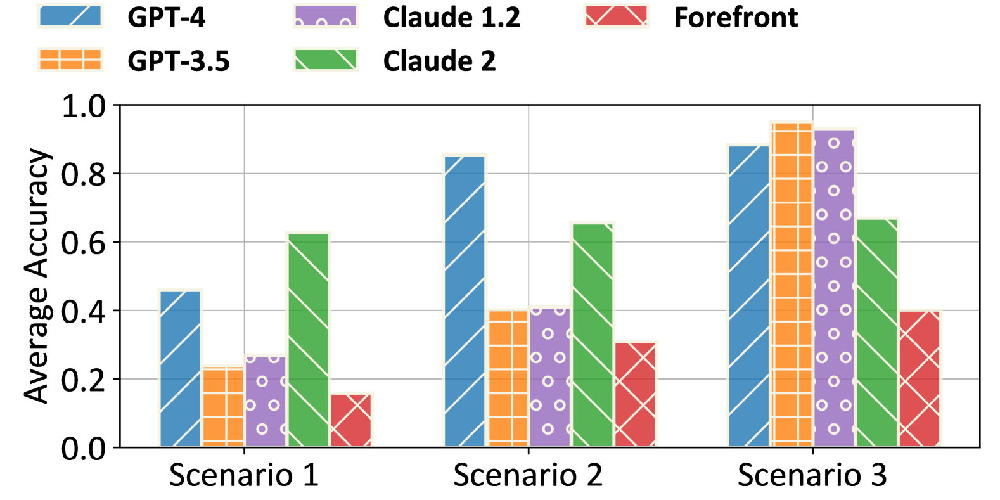

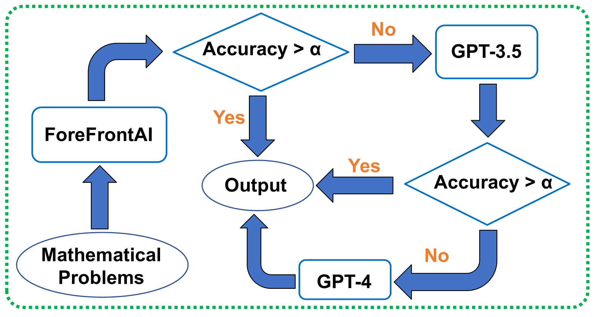

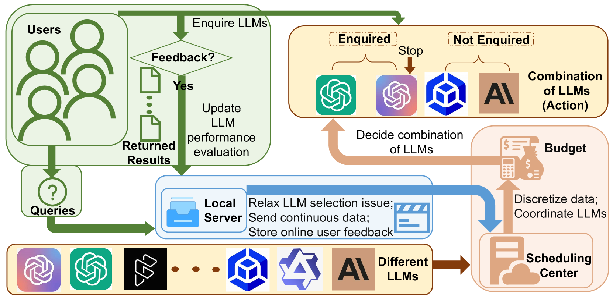

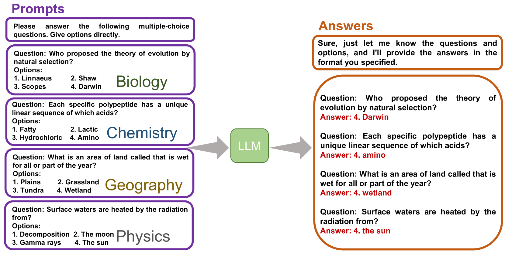

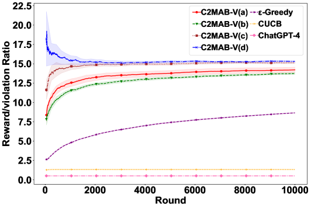

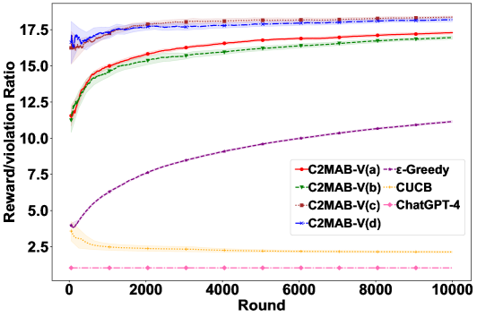

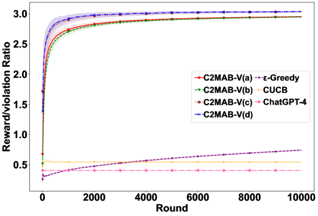

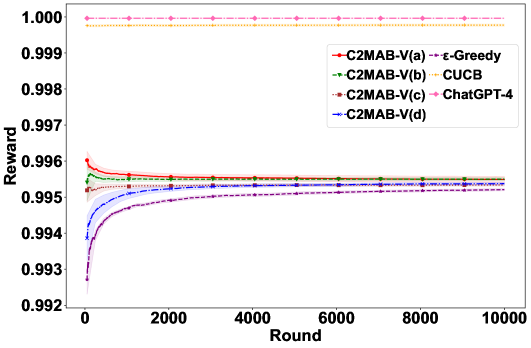

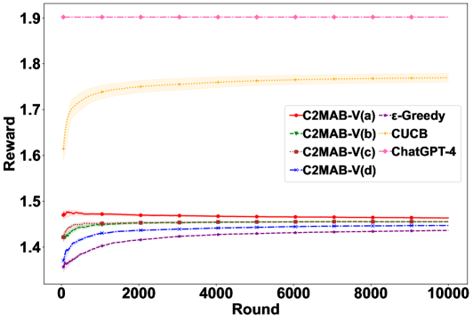

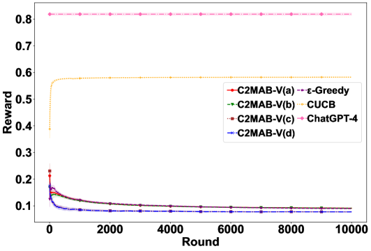

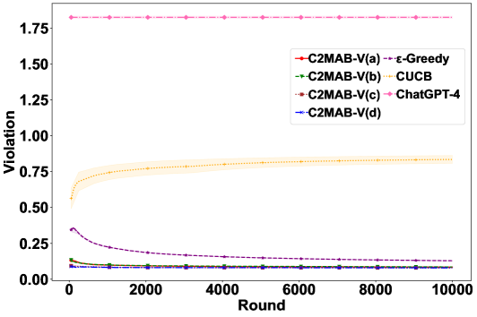

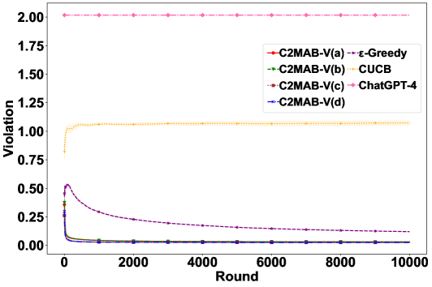

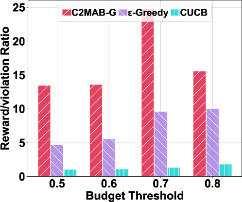

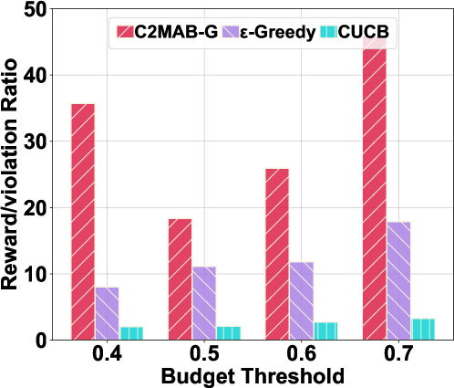

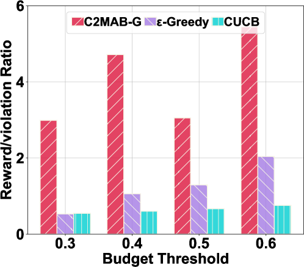

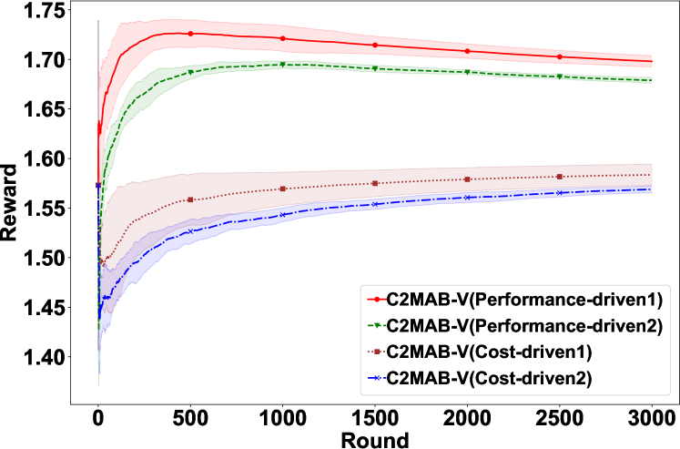

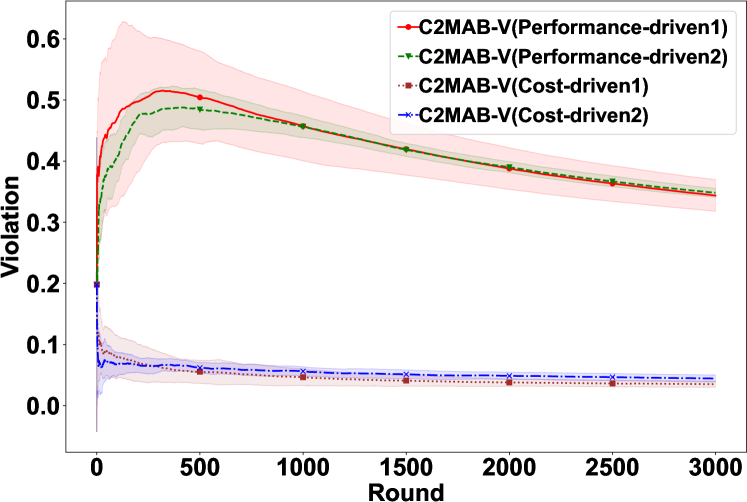

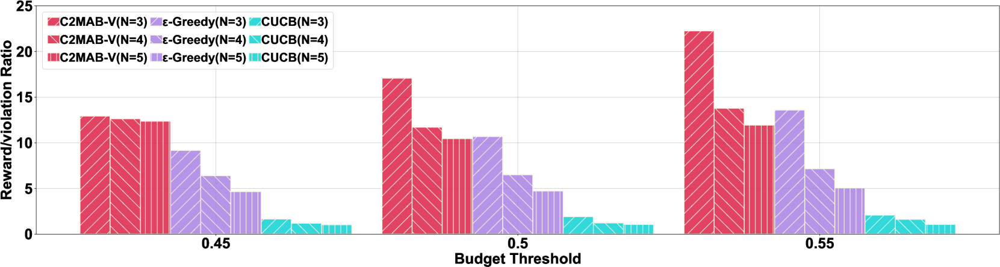

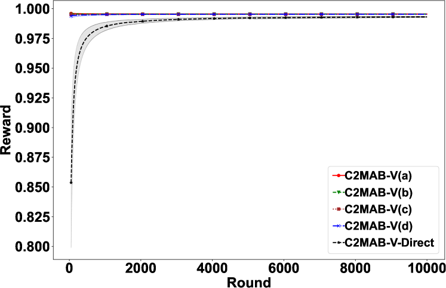

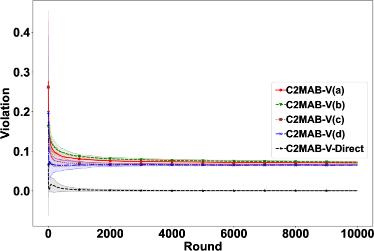

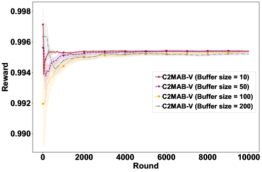

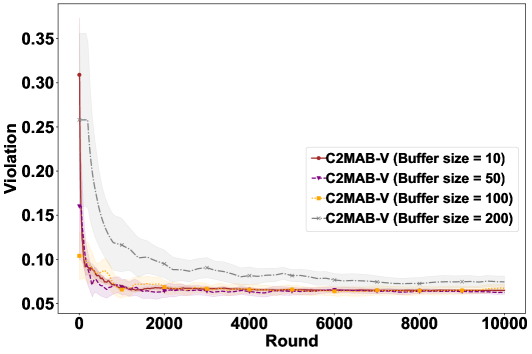

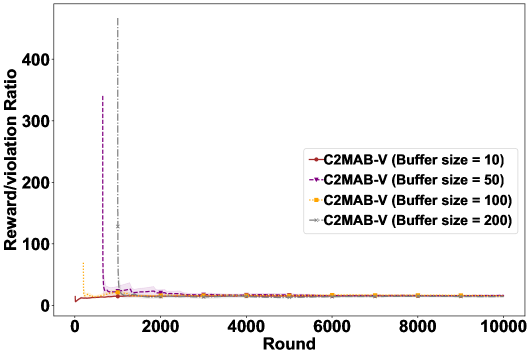

[Arxiv](https://arxiv.org/abs/2405.16587)