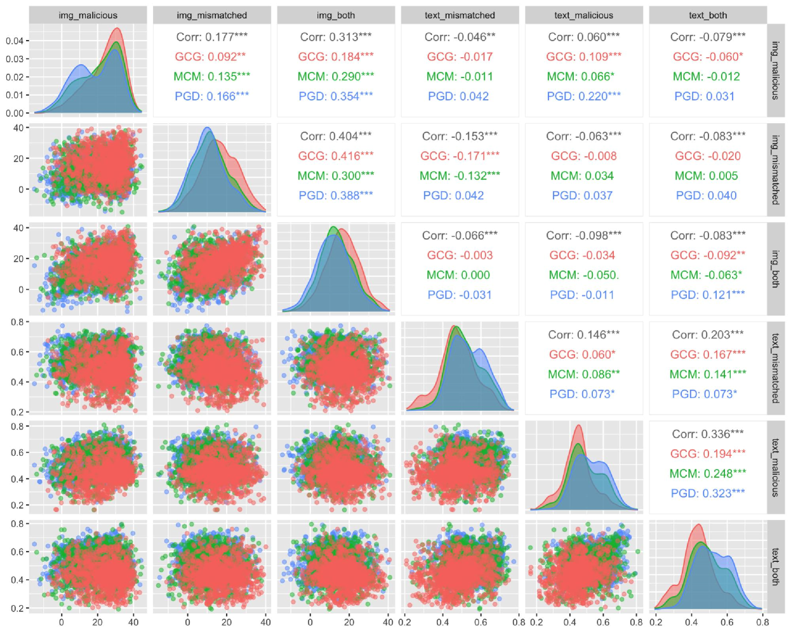

# 医疗多模态大型语言模型面临跨模态越狱与错配攻击挑战

发布时间：2024年05月26日

`LLM应用

这篇论文主要探讨了多模态大型语言模型（MLLMs）在医疗领域（MedMLLMs）的安全性问题，特别是在临床应用中的安全漏洞。论文通过提出新的攻击方法（不匹配恶意攻击和优化版不匹配恶意攻击），并使用特定的数据集进行实验，分析了这些模型的安全性能。这些研究内容直接关联到LLM在特定应用场景（医疗领域）中的实际应用和安全性问题，因此属于LLM应用分类。` `网络安全`

> Cross-Modality Jailbreak and Mismatched Attacks on Medical Multimodal Large Language Models

# 摘要

> 尽管大型语言模型（LLMs）的安全性问题已得到广泛关注，但多模态大型语言模型（MLLMs），尤其是在医疗领域（MedMLLMs）的安全隐患仍未得到充分研究。本文聚焦于MedMLLMs在临床应用中的安全漏洞，特别是在面对复杂医疗挑战时，问答交互的准确性和相关性受到严格考验。我们结合临床数据与非典型自然现象，创新性地提出了两种新型攻击：不匹配恶意攻击（2M-攻击）和优化版不匹配恶意攻击（O2M-攻击）。通过我们构建的涵盖多种医疗图像和有害场景的3MAD数据集，我们进行了深入分析，并提出了MCM优化策略，大幅提升了对MedMLLMs的攻击成功率。评估结果显示，即使是具备增强安全特性的MedMLLMs也面临安全风险。我们的研究强调了加强开源MedMLLMs安全性的紧迫性，特别是在考虑到医疗环境中可能发生的严重越狱攻击和其他恶意行为时。为促进进一步研究，我们的代码已在https://github.com/dirtycomputer/O2M_attack提供匿名访问。请注意：医疗大型模型越狱可能产生未经证实的医疗建议，务必咨询专业医疗意见。

> Security concerns related to Large Language Models (LLMs) have been extensively explored, yet the safety implications for Multimodal Large Language Models (MLLMs), particularly in medical contexts (MedMLLMs), remain insufficiently studied. This paper delves into the underexplored security vulnerabilities of MedMLLMs, especially when deployed in clinical environments where the accuracy and relevance of question-and-answer interactions are critically tested against complex medical challenges. By combining existing clinical medical data with atypical natural phenomena, we redefine two types of attacks: mismatched malicious attack (2M-attack) and optimized mismatched malicious attack (O2M-attack). Using our own constructed voluminous 3MAD dataset, which covers a wide range of medical image modalities and harmful medical scenarios, we conduct a comprehensive analysis and propose the MCM optimization method, which significantly enhances the attack success rate on MedMLLMs. Evaluations with this dataset and novel attack methods, including white-box attacks on LLaVA-Med and transfer attacks on four other state-of-the-art models, indicate that even MedMLLMs designed with enhanced security features are vulnerable to security breaches. Our work underscores the urgent need for a concerted effort to implement robust security measures and enhance the safety and efficacy of open-source MedMLLMs, particularly given the potential severity of jailbreak attacks and other malicious or clinically significant exploits in medical settings. For further research and replication, anonymous access to our code is available at https://github.com/dirtycomputer/O2M_attack. Warning: Medical large model jailbreaking may generate content that includes unverified diagnoses and treatment recommendations. Always consult professional medical advice.

[Arxiv](https://arxiv.org/abs/2405.20775)