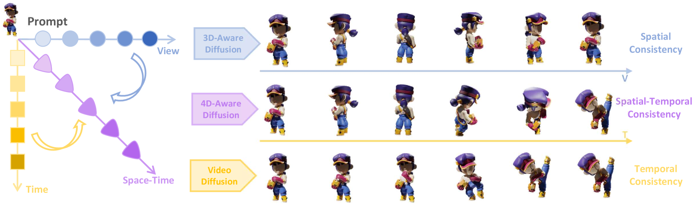
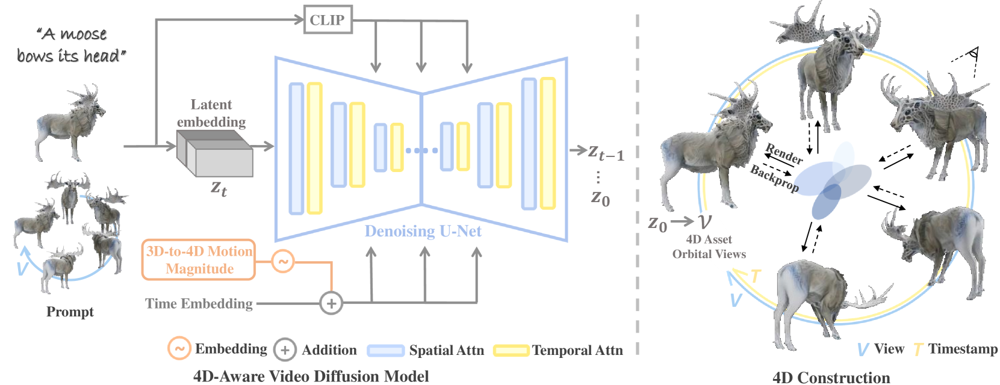
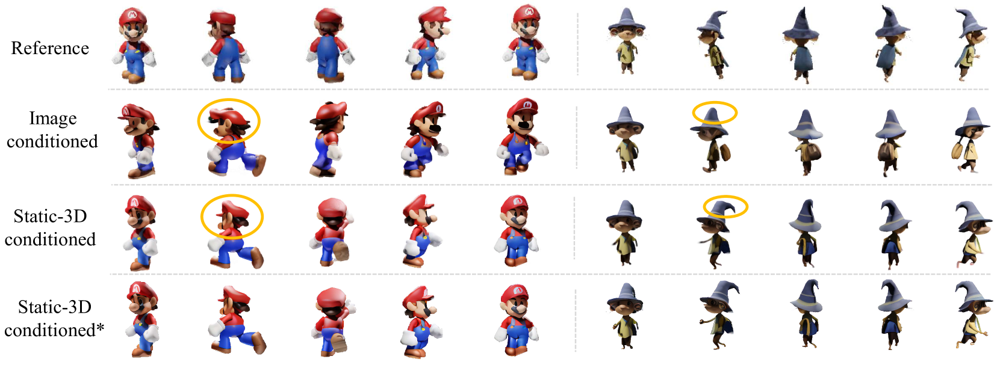
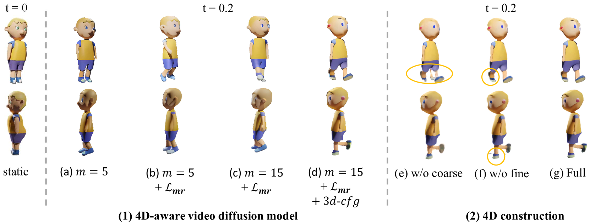

# 时空一致，速成4D：Diffusion4D利用视频扩散模型，快速生成高质量的4D内容。

发布时间：2024年05月26日

`RAG

理由：这篇论文主要介绍了一种新的框架（名为Diffusion4D），用于生成具有空间-时间一致性的4D内容。它利用了扩散模型，并专注于解决4D内容生成中的视图间一致性和优化速度问题。这与RAG（Retrieval-Augmented Generation）的概念相符，因为RAG通常涉及使用检索机制来增强生成模型的性能，而这里的扩散模型可以被视为一种生成技术，通过引入新的策略和优化方法来提高生成内容的质量和一致性。因此，这篇论文更适合归类为RAG。` `内容生成` `虚拟现实`

> Diffusion4D: Fast Spatial-temporal Consistent 4D Generation via Video Diffusion Models

# 摘要

> 随着多模态数据集的丰富和扩散模型的进步，4D内容生成领域取得了显著进展。以往的方法多依赖于多个图像或视频扩散模型，通过分数蒸馏采样或生成新视图来优化，但这些方法常受限于优化速度慢和视图间不一致的问题。在3D感知扩散模型和单目视频扩散模型中，已分别深入研究了4D几何的空间和时间一致性。基于此，我们提出了一种新策略，将视频扩散模型的时间一致性迁移至4D生成所需的空间-时间一致性。我们开发了名为\textbf{Diffusion4D}的框架，利用精选的动态3D数据集，创建了一个能合成动态3D资产轨道视图的4D感知视频扩散模型。为了精确控制动态强度，我们引入了3D到4D的运动幅度度量作为指导，并提出了运动幅度重建损失和3D感知无分类器指导，以优化动态的学习和生成。通过高斯溅射，我们以粗到细的方式构建了4D资产，合成了多视图一致的4D图像集，使得在几分钟内即可生成高质量且多样化的4D资产。实验证明，我们的方法在生成效率和4D几何一致性方面超越了现有技术。

> The availability of large-scale multimodal datasets and advancements in diffusion models have significantly accelerated progress in 4D content generation. Most prior approaches rely on multiple image or video diffusion models, utilizing score distillation sampling for optimization or generating pseudo novel views for direct supervision. However, these methods are hindered by slow optimization speeds and multi-view inconsistency issues. Spatial and temporal consistency in 4D geometry has been extensively explored respectively in 3D-aware diffusion models and traditional monocular video diffusion models. Building on this foundation, we propose a strategy to migrate the temporal consistency in video diffusion models to the spatial-temporal consistency required for 4D generation. Specifically, we present a novel framework, \textbf{Diffusion4D}, for efficient and scalable 4D content generation. Leveraging a meticulously curated dynamic 3D dataset, we develop a 4D-aware video diffusion model capable of synthesizing orbital views of dynamic 3D assets. To control the dynamic strength of these assets, we introduce a 3D-to-4D motion magnitude metric as guidance. Additionally, we propose a novel motion magnitude reconstruction loss and 3D-aware classifier-free guidance to refine the learning and generation of motion dynamics. After obtaining orbital views of the 4D asset, we perform explicit 4D construction with Gaussian splatting in a coarse-to-fine manner. The synthesized multi-view consistent 4D image set enables us to swiftly generate high-fidelity and diverse 4D assets within just several minutes. Extensive experiments demonstrate that our method surpasses prior state-of-the-art techniques in terms of generation efficiency and 4D geometry consistency across various prompt modalities.

[Arxiv](https://arxiv.org/abs/2405.16645)