# 解构与融合：Transformer架构中的关系与感官信息整合

发布时间：2024年05月26日

`LLM理论

这篇论文主要探讨了Transformer架构的改进，特别是通过引入新的注意力机制来增强对关系信息的捕捉能力。这种改进直接涉及到大型语言模型（LLM）的理论基础，即Transformer模型的内部机制和性能提升。因此，它属于LLM理论分类。` `机器学习`

> Disentangling and Integrating Relational and Sensory Information in Transformer Architectures

# 摘要

> Transformer架构通过神经消息传递处理序列，包括迭代的信息检索（注意力）和局部处理（位置感知的全连接层）。在这种计算框架下，关键信息分为两类：描述个体对象的“感官”信息和表达对象间关系的“关系”信息。标准注意力擅长捕捉前者，但对后者则不够明确。本文提出了一种Transformer的改进版本，通过引入两种新型注意力头，增强了多头注意力机制。第一种沿用标准注意力，专注于对象特征；第二种则是新创的注意力机制，专门捕捉关系信息。这两种注意力头各自带有不同的归纳偏置，提升了架构的效率和灵活性。实证研究表明，这种方法在多个任务上表现出色。

> The Transformer architecture processes sequences by implementing a form of neural message-passing that consists of iterative information retrieval (attention), followed by local processing (position-wise MLP). Two types of information are essential under this general computational paradigm: "sensory" information about individual objects, and "relational" information describing the relationships between objects. Standard attention naturally encodes the former, but does not explicitly encode the latter. In this paper, we present an extension of Transformers where multi-head attention is augmented with two distinct types of attention heads, each routing information of a different type. The first type is the standard attention mechanism of Transformers, which captures object-level features, while the second type is a novel attention mechanism we propose to explicitly capture relational information. The two types of attention heads each possess different inductive biases, giving the resulting architecture greater efficiency and versatility. The promise of this approach is demonstrated empirically across a range of tasks.

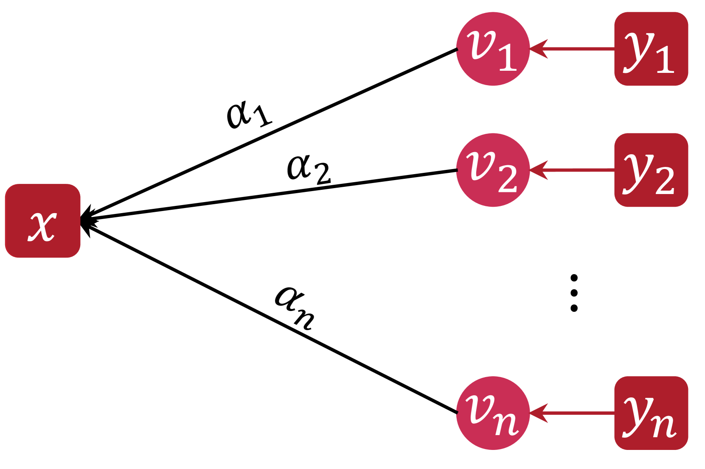

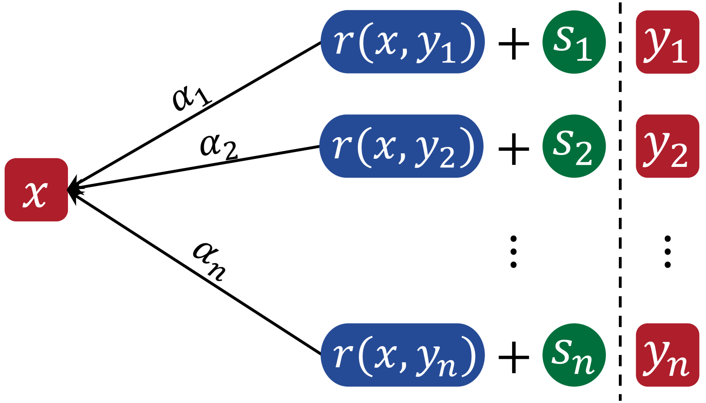

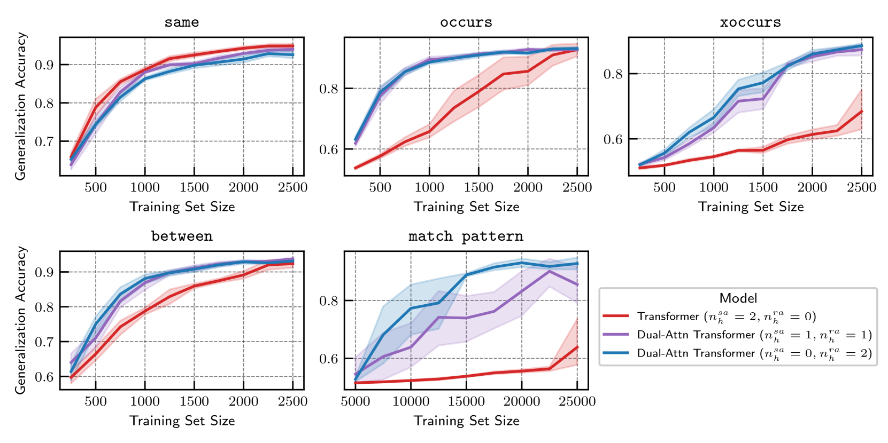

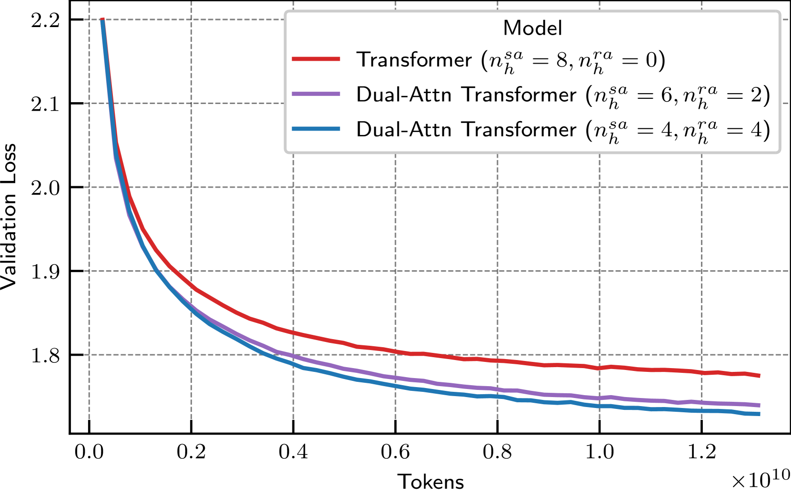

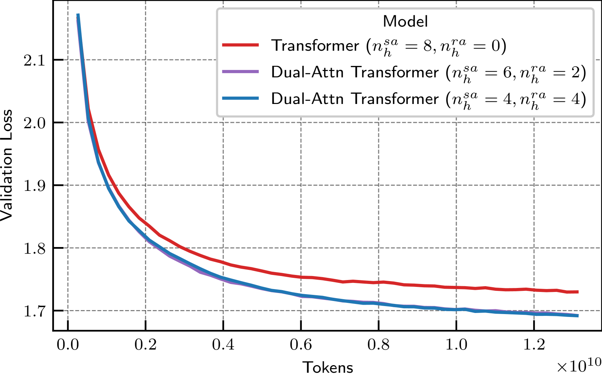

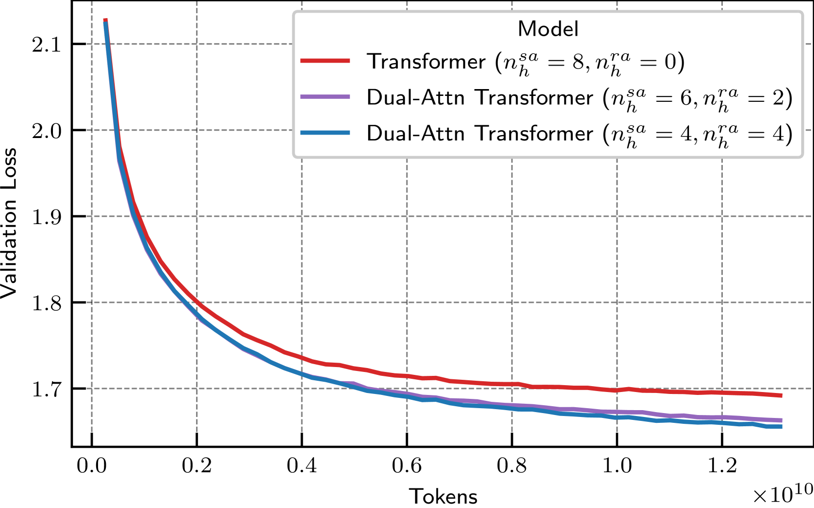

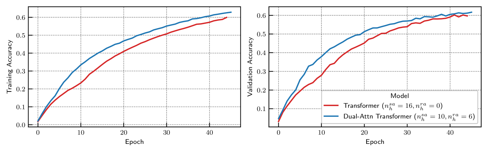

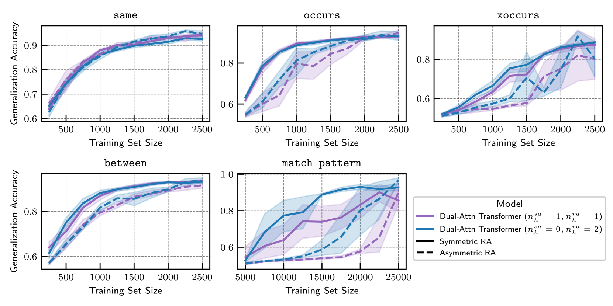

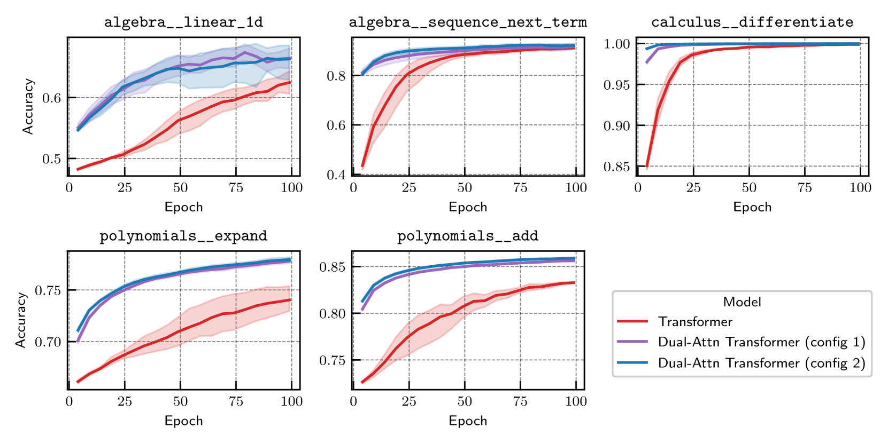

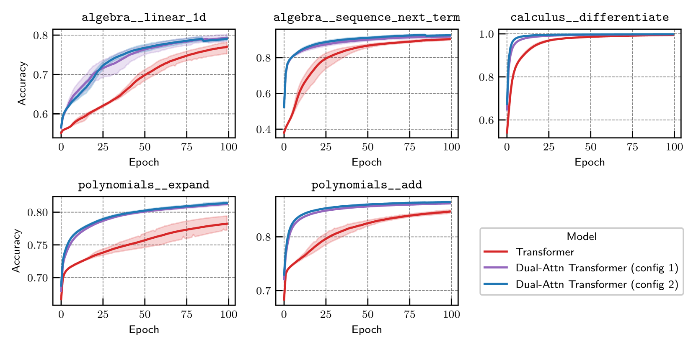

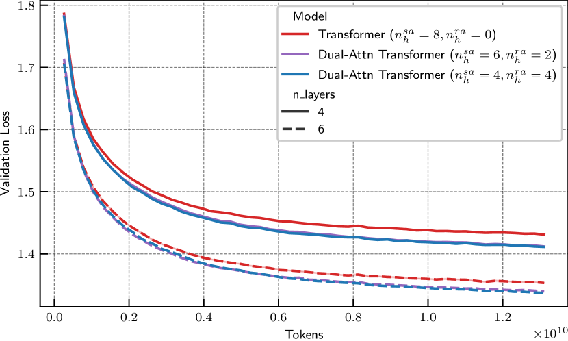

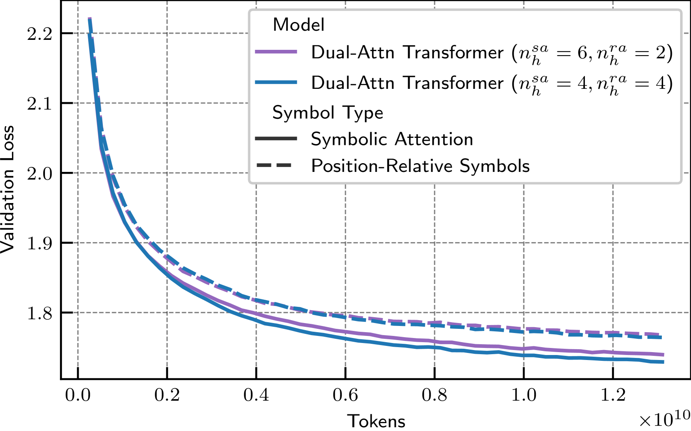

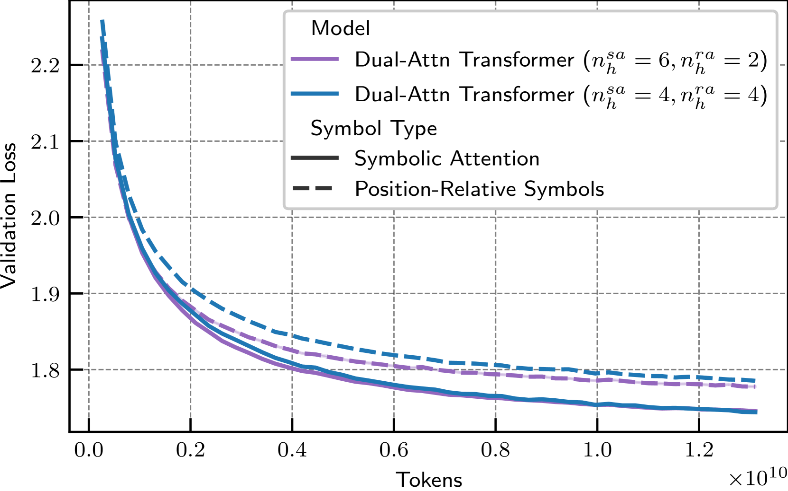

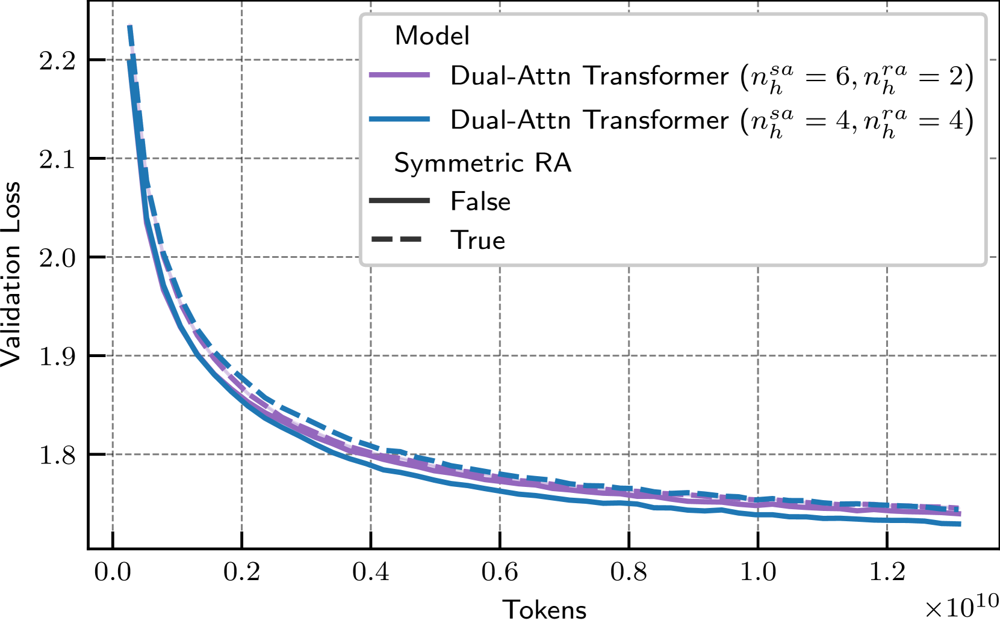

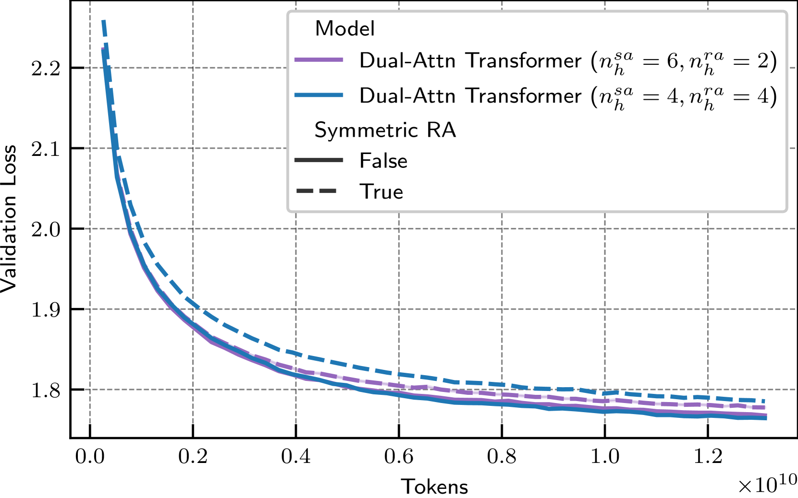

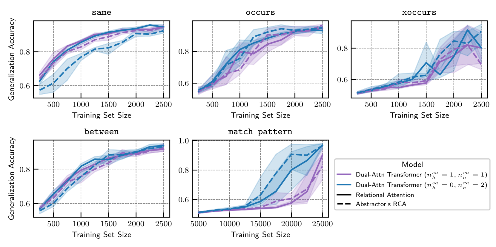

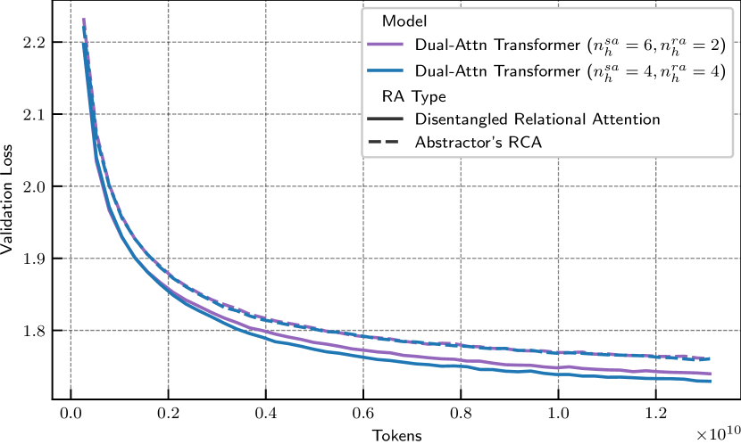

[Arxiv](https://arxiv.org/abs/2405.16727)