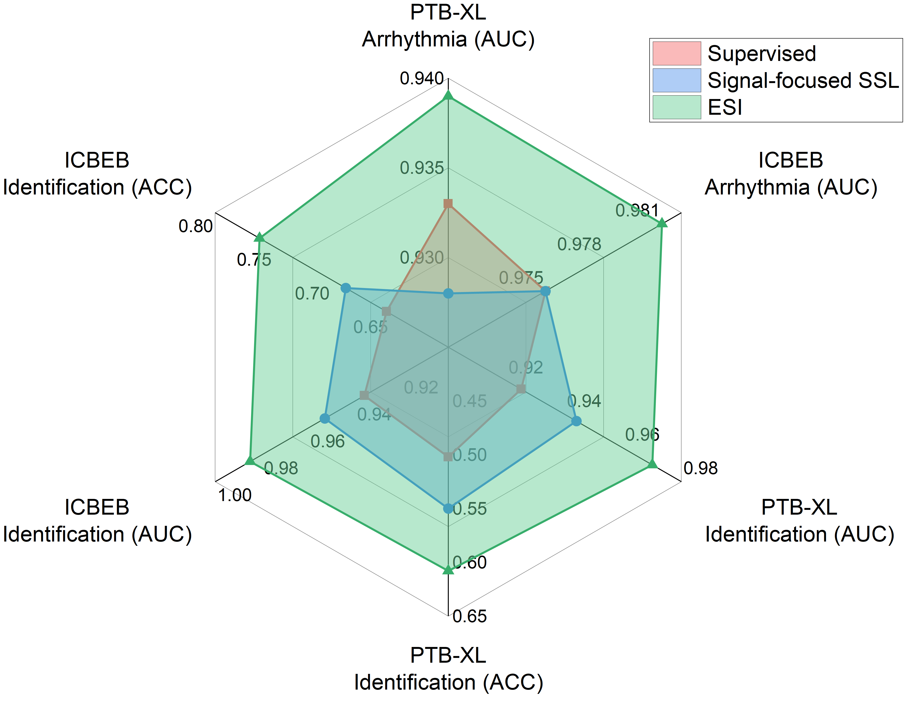

# ECG 语义整合器 (ESI)：一款基于 LLM 增强的心脏病学文本预训练的 ECG 基础模型，旨在深度整合 ECG 数据与医学知识。

发布时间：2024年05月26日

`RAG

理由：该论文摘要中提到的“心脏查询助手（CQA）通过整合检索增强生成（RAG）流程，利用大型语言模型和医学知识库，生成富含人口统计和波形信息的ECG详细描述”表明，该研究的核心是利用RAG技术来增强心电图分析的性能。RAG是一种结合了检索和生成的方法，用于提高语言模型在特定任务上的表现，这与论文中描述的应用场景相符。因此，该论文应归类为RAG。` `心脏健康诊断`

> ECG Semantic Integrator (ESI): A Foundation ECG Model Pretrained with LLM-Enhanced Cardiological Text

# 摘要

> 深度学习在心电图分析中的应用，显著提升了心脏健康诊断的精确度和效率。本研究提出了一种新颖的多模态对比预训练框架，旨在通过深度学习的语义理解能力，特别是特征提取和表示学习，来增强12导联ECG信号的表示质量和鲁棒性。该框架包含两个核心组件：心脏查询助手（CQA）和ECG语义集成器（ESI）。CQA通过整合检索增强生成（RAG）流程，利用大型语言模型和医学知识库，生成富含人口统计和波形信息的ECG详细描述。ESI则通过结合对比和标题损失，预训练ECG编码器，以提升表示能力。我们在心律失常检测和个体识别等多个下游任务中验证了该方法的有效性，实验结果显示，相比包括监督、自监督学习及多模态预训练在内的强基线方法，我们的方法取得了显著的性能提升。

> The utilization of deep learning on electrocardiogram (ECG) analysis has brought the advanced accuracy and efficiency of cardiac healthcare diagnostics. By leveraging the capabilities of deep learning in semantic understanding, especially in feature extraction and representation learning, this study introduces a new multimodal contrastive pretaining framework that aims to improve the quality and robustness of learned representations of 12-lead ECG signals. Our framework comprises two key components, including Cardio Query Assistant (CQA) and ECG Semantics Integrator(ESI). CQA integrates a retrieval-augmented generation (RAG) pipeline to leverage large language models (LLMs) and external medical knowledge to generate detailed textual descriptions of ECGs. The generated text is enriched with information about demographics and waveform patterns. ESI integrates both contrastive and captioning loss to pretrain ECG encoders for enhanced representations. We validate our approach through various downstream tasks, including arrhythmia detection and ECG-based subject identification. Our experimental results demonstrate substantial improvements over strong baselines in these tasks. These baselines encompass supervised and self-supervised learning methods, as well as prior multimodal pretraining approaches.

[Arxiv](https://arxiv.org/abs/2405.19366)