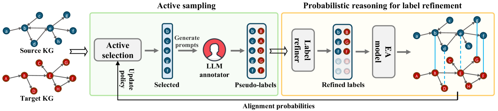
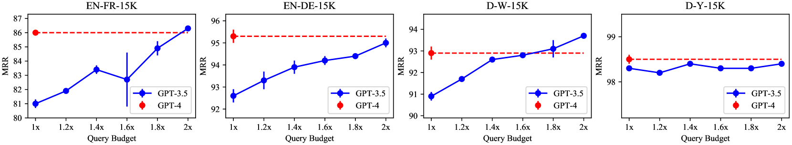
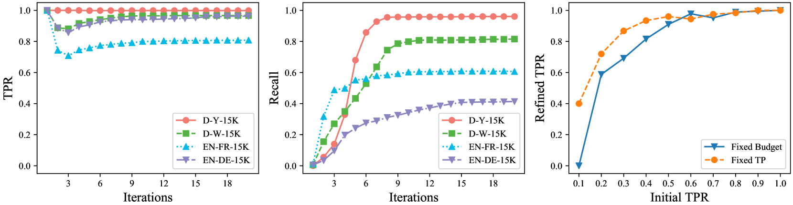
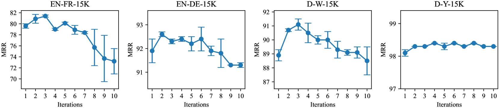

# 利用大型语言模型噪声标注实现实体对齐

发布时间：2024年05月26日

`LLM应用

理由：这篇论文主要探讨了如何利用大型语言模型（LLMs）来解决实体对齐（EA）问题，特别是在知识图谱（KGs）合并中的应用。论文提出了一个名为LLM4EA的框架，该框架通过创新的主动学习策略和无监督标签精炼器来优化LLMs的应用，以减少标注空间并提高标签准确性。这种方法和框架的应用性质表明，它属于LLM应用类别，而不是专注于Agent、RAG或LLM理论的研究。` `知识图谱` `数据整合`

> Entity Alignment with Noisy Annotations from Large Language Models

# 摘要

> 实体对齐（EA）旨在通过识别等价实体对来合并两个知识图谱（KGs）。现有方法依赖人工标签，但在现实场景中，聘请跨领域专家进行标注成本过高。大型语言模型（LLMs）的出现为自动化EA提供了新思路，但直接应用LLMs进行EA面临标注空间巨大和可能产生误导性标签的挑战。为此，我们提出了LLM4EA框架，通过创新主动学习策略和无监督标签精炼器，有效利用LLMs进行EA，显著减少标注空间并提高标签准确性。实验表明，LLM4EA在四个基准数据集上表现出色，兼具有效性、鲁棒性和效率。

> Entity alignment (EA) aims to merge two knowledge graphs (KGs) by identifying equivalent entity pairs. While existing methods heavily rely on human-generated labels, it is prohibitively expensive to incorporate cross-domain experts for annotation in real-world scenarios. The advent of Large Language Models (LLMs) presents new avenues for automating EA with annotations, inspired by their comprehensive capability to process semantic information. However, it is nontrivial to directly apply LLMs for EA since the annotation space in real-world KGs is large. LLMs could also generate noisy labels that may mislead the alignment. To this end, we propose a unified framework, LLM4EA, to effectively leverage LLMs for EA. Specifically, we design a novel active learning policy to significantly reduce the annotation space by prioritizing the most valuable entities based on the entire inter-KG and intra-KG structure. Moreover, we introduce an unsupervised label refiner to continuously enhance label accuracy through in-depth probabilistic reasoning. We iteratively optimize the policy based on the feedback from a base EA model. Extensive experiments demonstrate the advantages of LLM4EA on four benchmark datasets in terms of effectiveness, robustness, and efficiency.

[Arxiv](https://arxiv.org/abs/2405.16806)