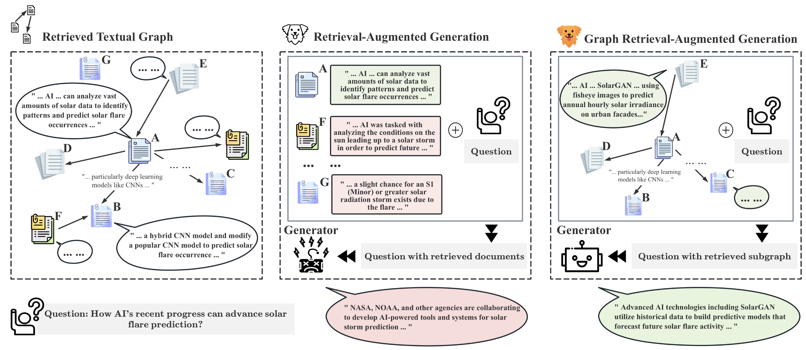
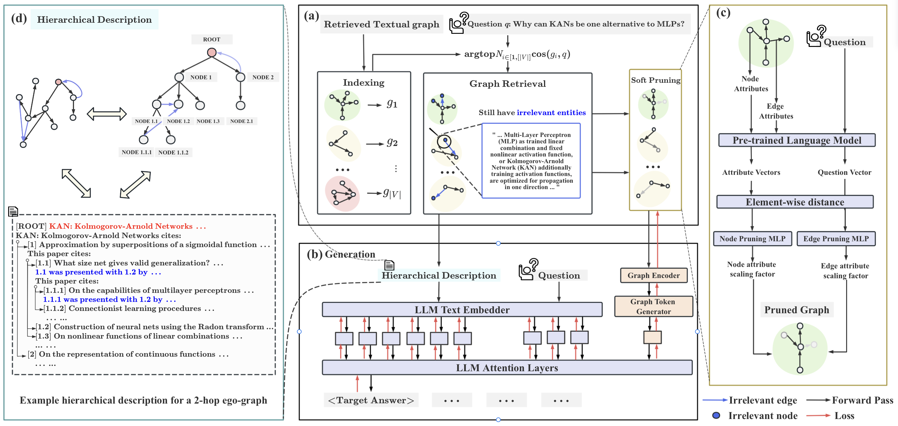
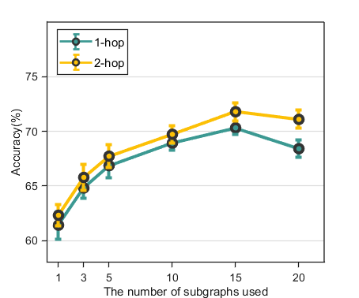
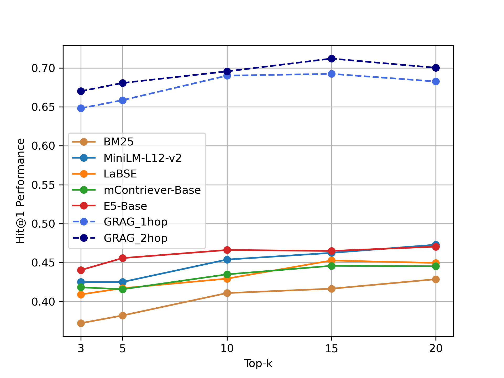

# GRAG：图检索赋能生成

发布时间：2024年05月26日

`RAG

理由：这篇论文主要讨论了检索增强生成（RAG）在图环境中的改进方法，即图检索增强生成（GRAG）。它专注于解决传统RAG在处理文本图结构复杂性方面的不足，并提出了一种新的方法来提升在图环境中的检索和生成效果。因此，这篇论文更符合RAG分类，因为它主要关注的是RAG技术的改进和应用。` `图数据处理`

> GRAG: Graph Retrieval-Augmented Generation

# 摘要

> 检索增强生成（RAG）虽提升了生成语言模型的响应准确性和相关性，但在文本与拓扑信息并重的图环境中表现欠佳。传统的RAG方法忽视了文本图的结构复杂性，导致生成过程中的关键缺陷。为此，我们提出了图检索增强生成（GRAG），通过强调子图结构的重要性，大幅提升了检索与生成的效果。与仅关注文本实体检索的RAG不同，GRAG对图的拓扑结构保持高度敏感，这对于生成既符合上下文又事实准确的响应至关重要。GRAG方法分为四个阶段：$k$-跳自我图索引、图检索、软修剪以减少无关实体影响，以及利用修剪后的文本子图进行生成。其核心流程——先检索后软修剪文本子图——有效识别相关子图，避免了NP难问题的计算负担。我们还创新了一种提示策略，实现文本子图到分层文本描述的无损转换。在多跳推理图基准的广泛测试中，GRAG在需要文本图多跳推理的场景下，不仅显著超越现有RAG技术，还大幅减少了幻觉现象。

> While Retrieval-Augmented Generation (RAG) enhances the accuracy and relevance of responses by generative language models, it falls short in graph-based contexts where both textual and topological information are important. Naive RAG approaches inherently neglect the structural intricacies of textual graphs, resulting in a critical gap in the generation process. To address this challenge, we introduce $\textbf{Graph Retrieval-Augmented Generation (GRAG)}$, which significantly enhances both the retrieval and generation processes by emphasizing the importance of subgraph structures. Unlike RAG approaches that focus solely on text-based entity retrieval, GRAG maintains an acute awareness of graph topology, which is crucial for generating contextually and factually coherent responses. Our GRAG approach consists of four main stages: indexing of $k$-hop ego-graphs, graph retrieval, soft pruning to mitigate the impact of irrelevant entities, and generation with pruned textual subgraphs. GRAG's core workflow-retrieving textual subgraphs followed by soft pruning-efficiently identifies relevant subgraph structures while avoiding the computational infeasibility typical of exhaustive subgraph searches, which are NP-hard. Moreover, we propose a novel prompting strategy that achieves lossless conversion from textual subgraphs to hierarchical text descriptions. Extensive experiments on graph multi-hop reasoning benchmarks demonstrate that in scenarios requiring multi-hop reasoning on textual graphs, our GRAG approach significantly outperforms current state-of-the-art RAG methods while effectively mitigating hallucinations.

[Arxiv](https://arxiv.org/abs/2405.16506)