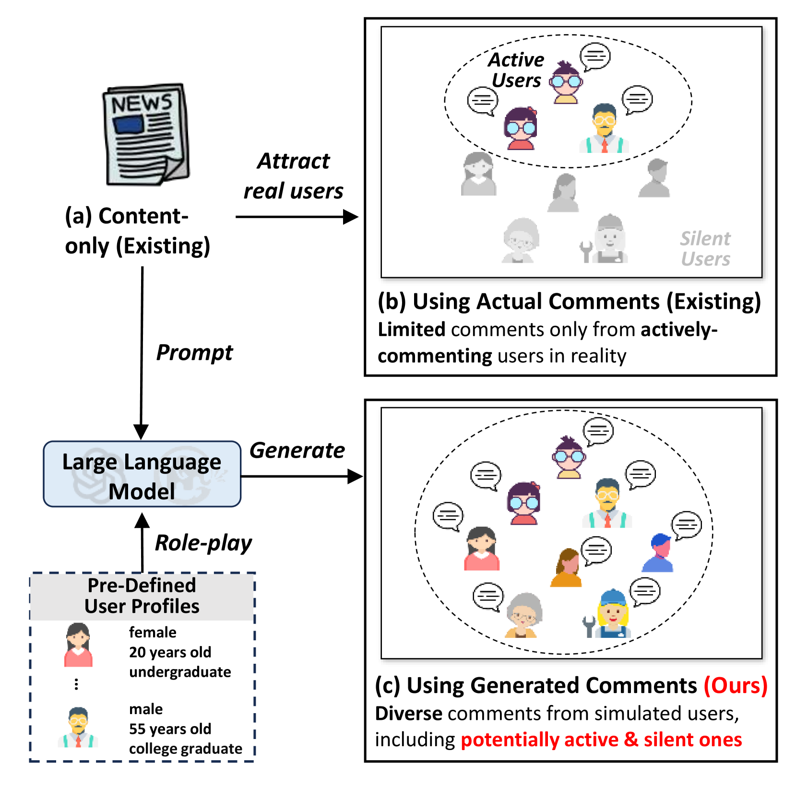
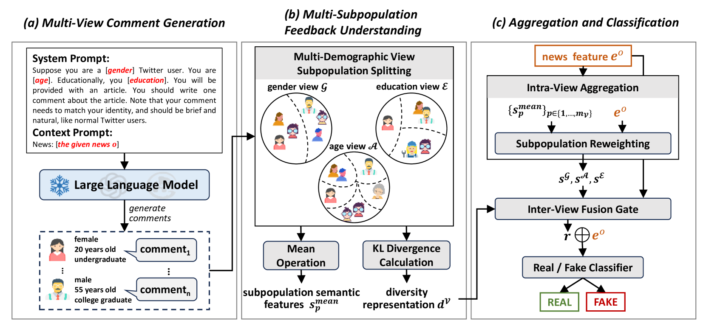
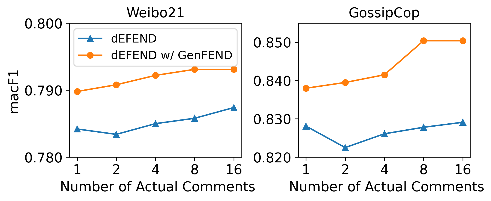
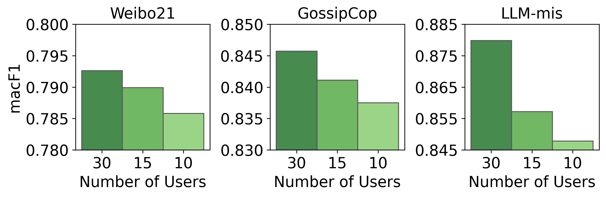
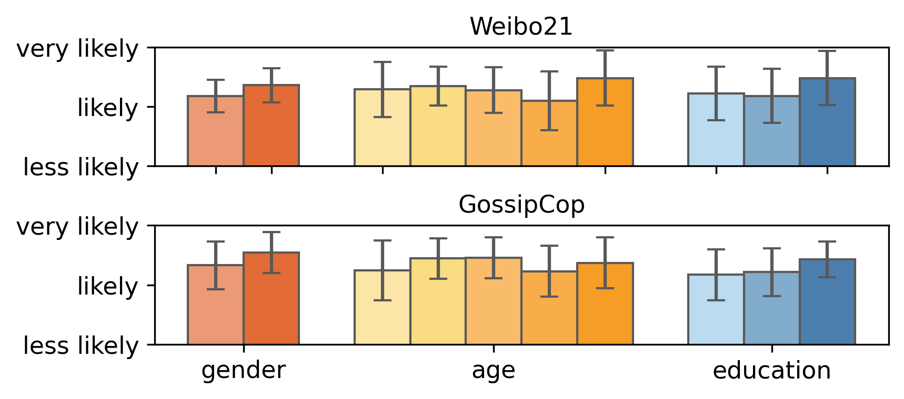

# 沉默之声：借助大型语言模型生成的评论，提升假新闻检测能力

发布时间：2024年05月26日

`Agent

这篇论文探讨了使用大型语言模型（LLMs）作为用户模拟器和评论生成器，以增强假新闻检测的多样性和准确性。通过提出GenFEND框架，该论文展示了如何利用LLMs模拟多样化的用户群体来生成评论，从而改善假新闻检测的效果。这种方法涉及到创建和使用智能代理（Agent）来模拟用户行为，因此属于Agent分类。` `社交媒体` `假新闻检测`

> Let Silence Speak: Enhancing Fake News Detection with Generated Comments from Large Language Models

# 摘要

> 假新闻检测对于保护社交媒体用户和维护新闻生态的健康至关重要。基于评论的方法因其能反映用户观点、立场和情感，从而加深模型对假新闻的理解，被证实颇具前景。但现实中，由于曝光偏差和用户评论意愿的差异，获取多样化评论尤其在早期检测阶段颇为困难。若忽视了“沉默”用户的评论，我们对于新闻真实性的判断可能因此失真。本文探索了利用大型语言模型（LLMs）作为用户模拟器和评论生成器的可能性，提出了GenFEND框架，通过模拟多样化的用户群体生成评论，确保了评论的多样性。实验结果表明，GenFEND不仅有效，其生成的评论甚至比真实评论更能覆盖广泛的用户群体。

> Fake news detection plays a crucial role in protecting social media users and maintaining a healthy news ecosystem. Among existing works, comment-based fake news detection methods are empirically shown as promising because comments could reflect users' opinions, stances, and emotions and deepen models' understanding of fake news. Unfortunately, due to exposure bias and users' different willingness to comment, it is not easy to obtain diverse comments in reality, especially for early detection scenarios. Without obtaining the comments from the ``silent'' users, the perceived opinions may be incomplete, subsequently affecting news veracity judgment. In this paper, we explore the possibility of finding an alternative source of comments to guarantee the availability of diverse comments, especially those from silent users. Specifically, we propose to adopt large language models (LLMs) as a user simulator and comment generator, and design GenFEND, a generated feedback-enhanced detection framework, which generates comments by prompting LLMs with diverse user profiles and aggregating generated comments from multiple subpopulation groups. Experiments demonstrate the effectiveness of GenFEND and further analysis shows that the generated comments cover more diverse users and could even be more effective than actual comments.

[Arxiv](https://arxiv.org/abs/2405.16631)