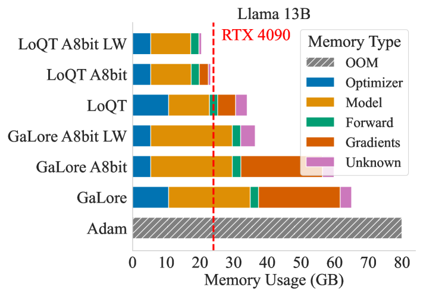

# LoQT：量化训练中的低秩适配器解释：在

发布时间：2024年05月26日

`LLM理论

理由：这篇论文主要探讨了大型语言模型（LLM）的训练方法，特别是通过LoQT方法来实现量化模型的高效训练。这种方法涉及梯度驱动的张量分解和权重矩阵的融合，这些都是关于LLM训练理论的深入研究。因此，它更符合LLM理论分类，而不是Agent、RAG或LLM应用。` `模型优化`

> LoQT: Low Rank Adapters for Quantized Training

# 摘要

> 训练大型神经网络耗费巨大计算资源，即便采用低秩适配器和量化技术，仍需模型分片、训练卸载或逐层梯度更新，才能在消费级硬件上预训练LLMs等模型。为此，我们研发了LoQT方法，专为量化模型的高效训练设计。LoQT通过梯度驱动的张量分解，初始化低秩可训练权重矩阵，并定期将其融入量化的全秩权重矩阵。此法适用于模型预训练与微调，我们通过实验验证了其在语言建模及下游任务适应中的效果。实验表明，LoQT能在消费级24GB GPU上高效训练高达70亿参数的模型，并展示了在同一硬件上通过逐层梯度更新训练130亿参数模型的可行性。

> Training of large neural networks requires significant computational resources. Despite advances using low-rank adapters and quantization, pretraining of models such as LLMs on consumer hardware has not been possible without model sharding, offloading during training, or per-layer gradient updates. To address these limitations, we propose LoQT, a method for efficiently training quantized models. LoQT uses gradient-based tensor factorization to initialize low-rank trainable weight matrices that are periodically merged into quantized full-rank weight matrices. Our approach is suitable for both pretraining and fine-tuning of models, which we demonstrate experimentally for language modeling and downstream task adaptation. We find that LoQT enables efficient training of models up to 7B parameters on a consumer-grade 24GB GPU. We also demonstrate the feasibility of training a 13B parameter model using per-layer gradient updates on the same hardware.

[Arxiv](https://arxiv.org/abs/2405.16528)