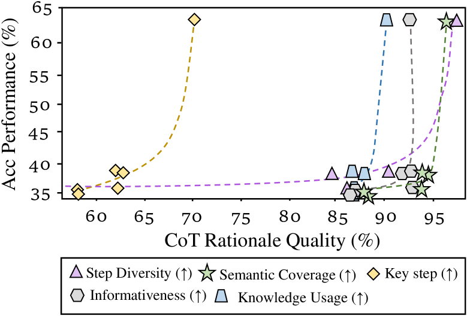

# M$^3$CoT：探索多领域、多步骤、多模态思维链的新基准

发布时间：2024年05月26日

`LLM应用

理由：这篇论文主要介绍了多模态思维链（MCoT）的新基准M$^3$CoT，并评估了视觉大型语言模型（VLLMs）在该基准上的表现。这涉及到对LLM在多模态环境下的应用进行研究和改进，因此属于LLM应用类别。论文并未深入探讨LLM的理论基础，也没有明确提及Agent或RAG的相关内容。` `人工智能` `视觉推理`

> M$^3$CoT: A Novel Benchmark for Multi-Domain Multi-step Multi-modal Chain-of-Thought

# 摘要

> 多模态思维链（MCoT）要求模型结合文本与视觉信息进行细致推理，正日益受到重视。但现有的MCoT基准存在缺陷：缺乏视觉推理、仅限于单步视觉推理，以及领域覆盖不足，这些都限制了MCoT的进步。为此，我们推出了新基准M$^3$CoT，旨在克服这些障碍，推动跨领域、多步骤、多模态的思维链研究。我们对多种MCoT方法在视觉大型语言模型（VLLMs）上的应用进行了深入评估，并指出，尽管VLLMs在旧基准上表现出色，但在M$^3$CoT中推理能力仍显不足，与人类表现相去甚远。我们相信，M$^3$CoT的推出标志着向多领域、多步骤、多模态思维链迈出的重要一步，并期望它能为该领域的研究奠定坚实基础。

> Multi-modal Chain-of-Thought (MCoT) requires models to leverage knowledge from both textual and visual modalities for step-by-step reasoning, which gains increasing attention. Nevertheless, the current MCoT benchmark still faces some challenges: (1) absence of visual modal reasoning, (2) single-step visual modal reasoning, and (3) Domain missing, thereby hindering the development of MCoT. Motivated by this, we introduce a novel benchmark (M$^3$CoT) to address the above challenges, advancing the multi-domain, multi-step, and multi-modal CoT. Additionally, we conduct a thorough evaluation involving abundant MCoT approaches on Vision Large Language Models (VLLMs). In addition, we highlight that the current VLLMs still struggle to correctly reason in M$^3$CoT and there remains a large gap between existing VLLMs and human performance in M$^3$CoT, despite their superior results on previous MCoT benchmarks. To our knowledge, we take the first meaningful step toward the multi-domain, multi-step, and multi-modal scenario in MCoT. We hope that M$^3$CoT can serve as a valuable resource, providing a pioneering foundation in multi-domain, multi-step, multi-modal chain-of-thought research.

[Arxiv](https://arxiv.org/abs/2405.16473)