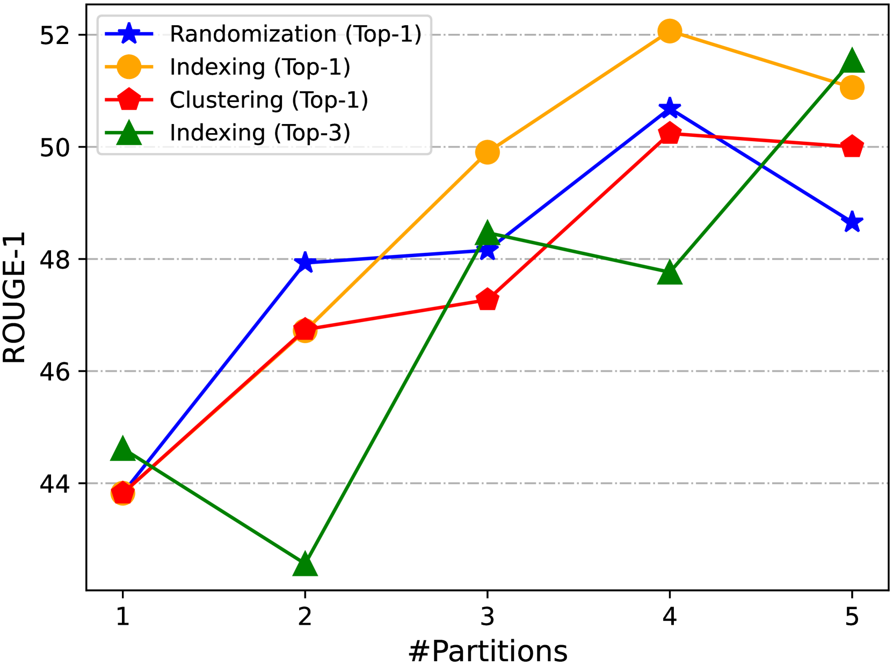
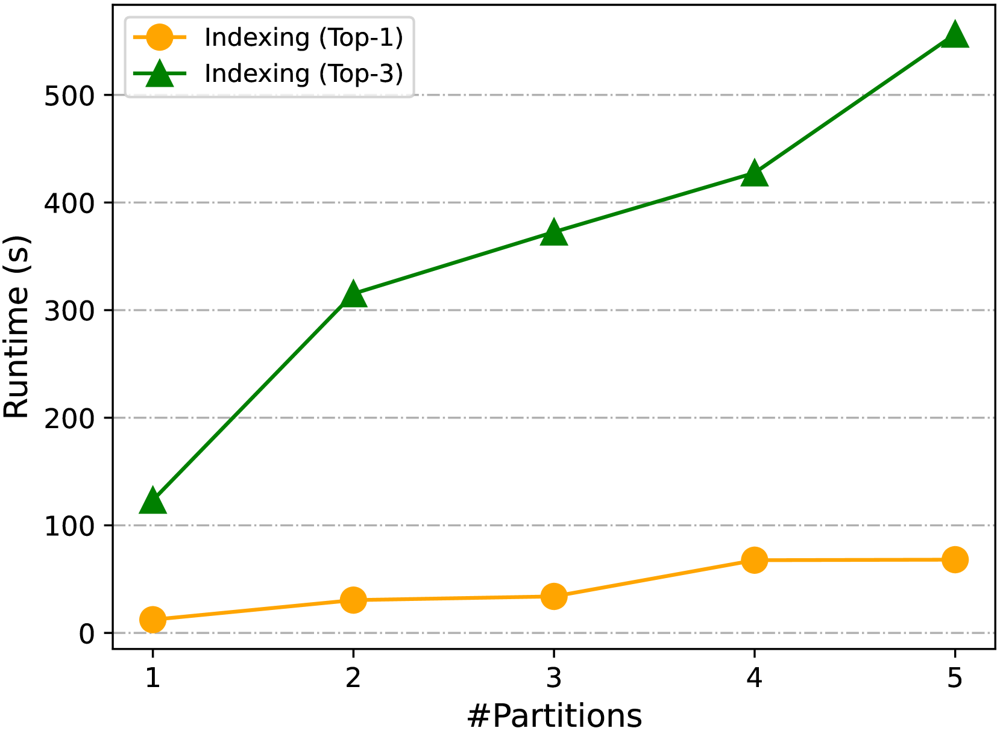
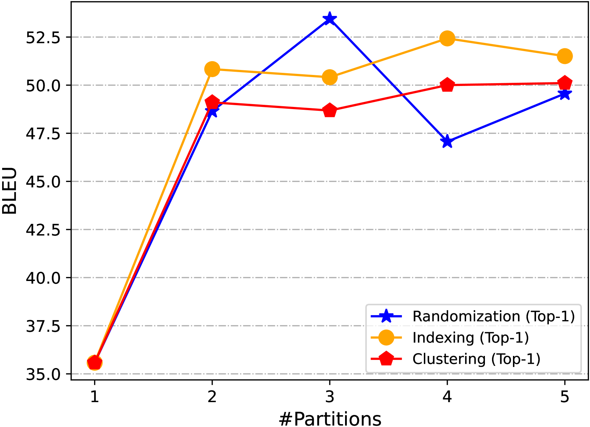
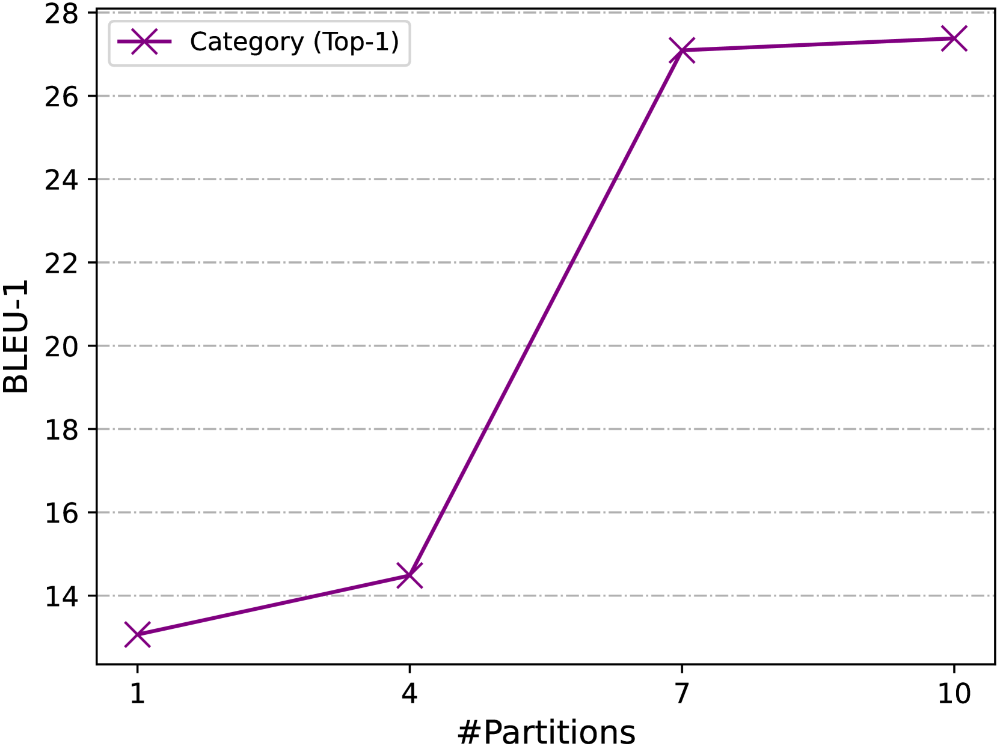
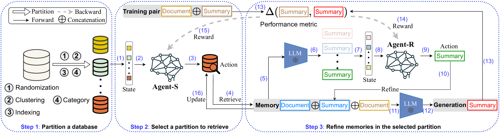

# M-RAG：借助多分区检索增强技术，提升大型语言模型的生成性能

发布时间：2024年05月26日

`RAG

理由：这篇论文主要讨论了Retrieval-Augmented Generation (RAG) 的改进方法，即M-RAG，并通过多智能体强化学习来优化语言生成任务。虽然涉及到了多智能体强化学习，但主要焦点是RAG方法的改进和应用，因此更适合归类为RAG。` `机器翻译`

> M-RAG: Reinforcing Large Language Model Performance through Retrieval-Augmented Generation with Multiple Partitions

# 摘要

> Retrieval-Augmented Generation (RAG) 通过从外部数据库中提取相关记忆来提升大型语言模型 (LLMs) 的性能。然而，现有 RAG 方法往往将所有记忆集中存储，可能导致关键信息的忽视和噪声的增加。本文提出了一种名为 M-RAG 的多分区方法，每个分区作为 RAG 操作的基本单元。我们开发了一个新框架，结合多智能体强化学习，专门优化语言生成任务。实验覆盖七个数据集，涉及三种语言生成任务和三种模型架构，结果显示 M-RAG 在文本摘要、机器翻译和对话生成上分别提升了 11%、8% 和 12%，显著超越了其他方法。

> Retrieval-Augmented Generation (RAG) enhances Large Language Models (LLMs) by retrieving relevant memories from an external database. However, existing RAG methods typically organize all memories in a whole database, potentially limiting focus on crucial memories and introducing noise. In this paper, we introduce a multiple partition paradigm for RAG (called M-RAG), where each database partition serves as a basic unit for RAG execution. Based on this paradigm, we propose a novel framework that leverages LLMs with Multi-Agent Reinforcement Learning to optimize different language generation tasks explicitly. Through comprehensive experiments conducted on seven datasets, spanning three language generation tasks and involving three distinct language model architectures, we confirm that M-RAG consistently outperforms various baseline methods, achieving improvements of 11%, 8%, and 12% for text summarization, machine translation, and dialogue generation, respectively.

[Arxiv](https://arxiv.org/abs/2405.16420)