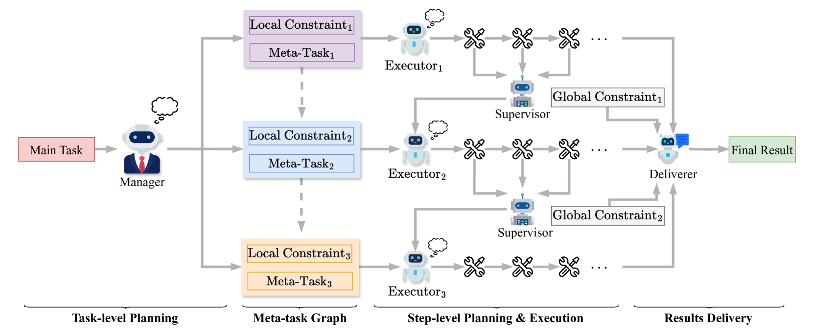
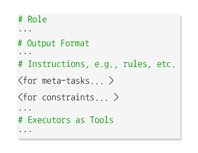
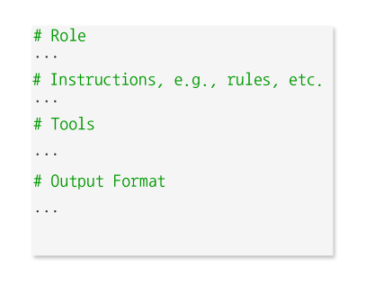
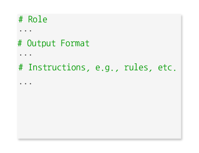
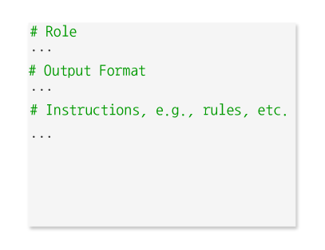
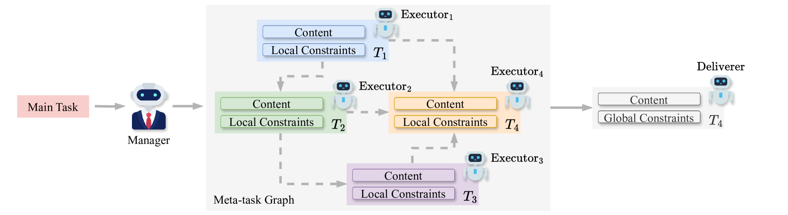
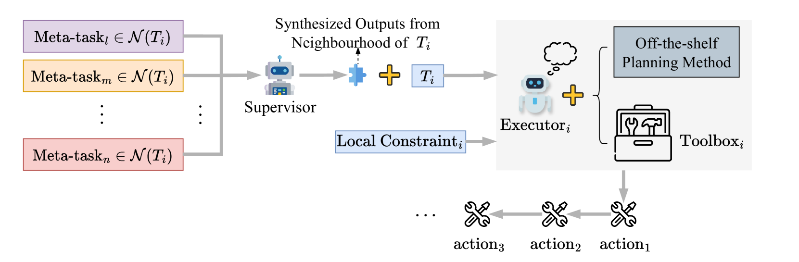

# 语言代理的元任务规划策略

发布时间：2024年05月26日

`Agent

这篇论文主要探讨了基于大型语言模型的智能代理（LLM代理）在现实世界任务中的规划方法，特别是通过提出的元任务规划（MTP）方法来解决复杂任务的规划问题。这种方法是专为基于LLM的协作多代理系统设计的，通过将任务分解为层次化的从属任务或元任务，并映射到可执行动作，从而简化了任务规划。论文在两个基准测试上的评估结果显示了这种方法的有效性，强调了LLM与多代理系统结合的潜力。因此，这篇论文更符合Agent分类，因为它主要关注的是智能代理的设计和应用。` `人工智能` `多代理系统`

> Meta-Task Planning for Language Agents

# 摘要

> 神经语言模型的飞速进步，催生了智能代理研究的新浪潮。不同于传统代理，基于大型语言模型的代理（LLM代理）凭借其卓越的推理与泛化能力，成为实现人工通用智能（AGI）的希望之星。在现实世界任务中，LLM代理的成功离不开有效的规划，这一话题在社区中备受追捧。目前，规划方法多将任务转化为一系列可执行动作。然而，对于复杂任务，如何在细粒度上确定可行或最优的动作序列，尤其是需要组合长链异构动作时，仍是一大挑战。本文提出的元任务规划（MTP），是一种零-shot方法，专为基于LLM的协作多代理系统设计，通过将复杂任务分解为一系列层次化的从属任务或元任务，简化了任务规划。每个元任务随后被映射至可执行动作。在TravelPlanner和API-Bank两个严格基准上的评估显示，MTP在TravelPlanner上的平均成功率约为40%，远超最先进（SOTA）基准的2.92%，并在API-Bank上超越了$LLM_{api}$-4与ReAct约14%，彰显了LLM与多代理系统结合的巨大潜力。

> The rapid advancement of neural language models has sparked a new surge of intelligent agent research. Unlike traditional agents, large language model-based agents (LLM agents) have emerged as a promising paradigm for achieving artificial general intelligence (AGI) due to their superior reasoning and generalization capabilities. Effective planning is crucial for the success of LLM agents in real-world tasks, making it a highly pursued topic in the community. Current planning methods typically translate tasks into executable action sequences. However, determining a feasible or optimal sequence for complex tasks at fine granularity, which often requires compositing long chains of heterogeneous actions, remains challenging. This paper introduces Meta-Task Planning (MTP), a zero-shot methodology for collaborative LLM-based multi-agent systems that simplifies complex task planning by decomposing it into a hierarchy of subordinate tasks, or meta-tasks. Each meta-task is then mapped into executable actions. MTP was assessed on two rigorous benchmarks, TravelPlanner and API-Bank. Notably, MTP achieved an average $\sim40\%$ success rate on TravelPlanner, significantly higher than the state-of-the-art (SOTA) baseline ($2.92\%$), and outperforming $LLM_{api}$-4 with ReAct on API-Bank by $\sim14\%$, showing the immense potential of integrating LLM with multi-agent systems.

[Arxiv](https://arxiv.org/abs/2405.16510)