# NoteLLM-2：融合多模态的大型推荐模型

发布时间：2024年05月26日

`LLM应用

理由：这篇论文主要探讨了如何利用大型语言模型（LLMs）来提升多模态表示任务，特别是在多模态项到项（I2I）推荐系统中的应用。论文提出了一种端到端训练方法，旨在将现有的LLMs与视觉编码器集成，以构建定制化的多模态表示模型。这种方法涉及微调LLMs以更好地处理视觉信息，并通过特定的框架（NoteLLM-2）来优化多模态表示。这些内容主要关注于LLMs的实际应用，特别是在多模态数据处理和推荐系统中的应用，因此属于LLM应用分类。` `多模态推荐系统` `人工智能`

> NoteLLM-2: Multimodal Large Representation Models for Recommendation

# 摘要

> 大型语言模型（LLMs）在文本理解上表现卓越，但其在多模态表示任务中的应用尚未充分探索。本研究聚焦于如何利用LLMs提升多模态项到项（I2I）推荐系统的表示能力。尽管转移多模态大型语言模型（MLLMs）是一种策略，但其预训练依赖于大量高质量多模态数据，导致训练复杂且成本高。这使得社区过度依赖开源MLLMs，限制了特定场景的定制化训练。为此，我们提出了一种端到端训练方法，旨在将现有LLMs与视觉编码器高效集成，构建定制化的多模态表示模型。初步实验发现，微调后的LLMs在此方法中常忽视图像内容。针对这一问题，我们开发了NoteLLM-2框架，专门优化多模态表示。该框架通过两种策略增强视觉信息的处理：一是通过提示视角区分视觉与文本内容，采用多模态内容学习方法，使LLMs同时关注并整合两种模态的关键信息；二是通过模型架构的晚期融合机制，直接融合视觉信息至文本信息。通过广泛实验，我们验证了这一方法的有效性。

> Large Language Models (LLMs) have demonstrated exceptional text understanding. Existing works explore their application in text embedding tasks. However, there are few works utilizing LLMs to assist multimodal representation tasks. In this work, we investigate the potential of LLMs to enhance multimodal representation in multimodal item-to-item (I2I) recommendations. One feasible method is the transfer of Multimodal Large Language Models (MLLMs) for representation tasks. However, pre-training MLLMs usually requires collecting high-quality, web-scale multimodal data, resulting in complex training procedures and high costs. This leads the community to rely heavily on open-source MLLMs, hindering customized training for representation scenarios. Therefore, we aim to design an end-to-end training method that customizes the integration of any existing LLMs and vision encoders to construct efficient multimodal representation models. Preliminary experiments show that fine-tuned LLMs in this end-to-end method tend to overlook image content. To overcome this challenge, we propose a novel training framework, NoteLLM-2, specifically designed for multimodal representation. We propose two ways to enhance the focus on visual information. The first method is based on the prompt viewpoint, which separates multimodal content into visual content and textual content. NoteLLM-2 adopts the multimodal In-Content Learning method to teach LLMs to focus on both modalities and aggregate key information. The second method is from the model architecture, utilizing a late fusion mechanism to directly fuse visual information into textual information. Extensive experiments have been conducted to validate the effectiveness of our method.

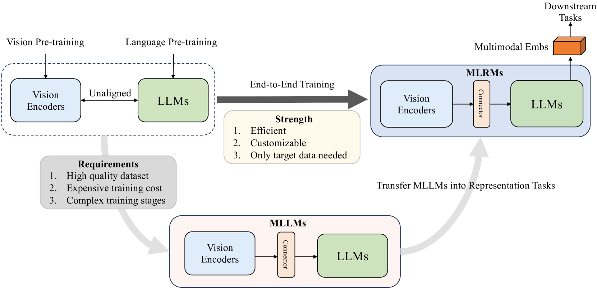

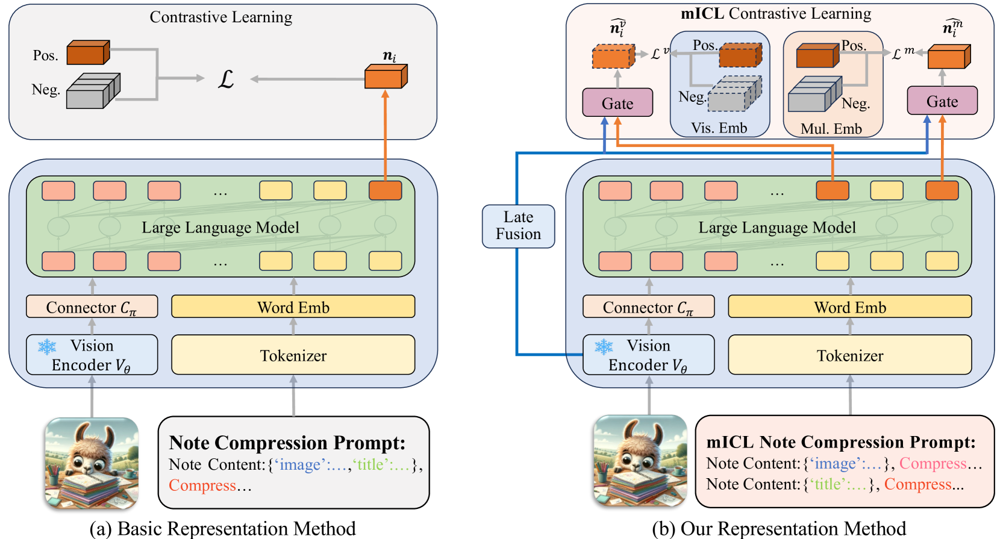

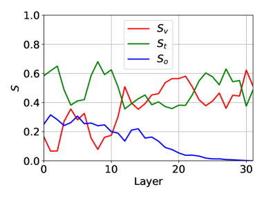

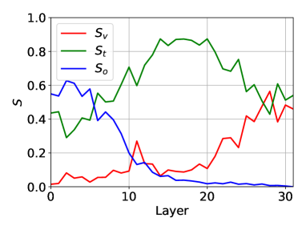

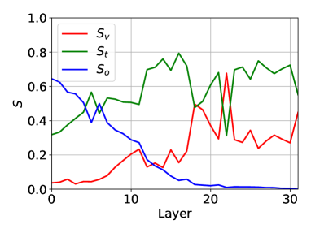

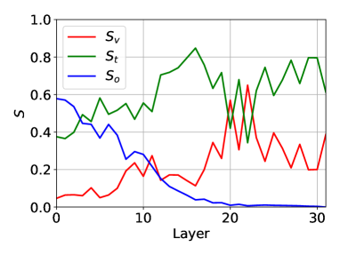

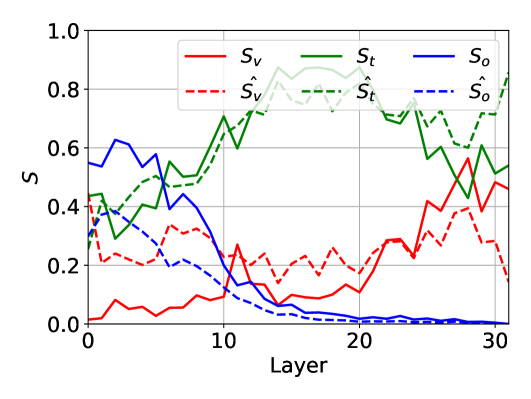

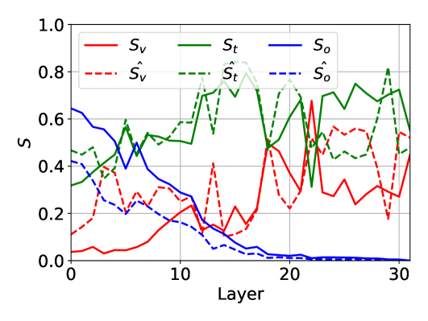

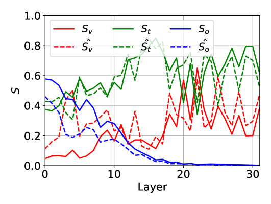

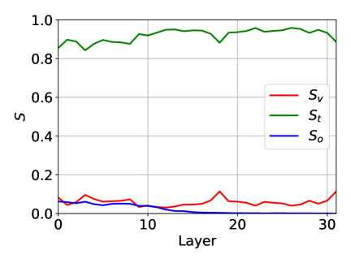

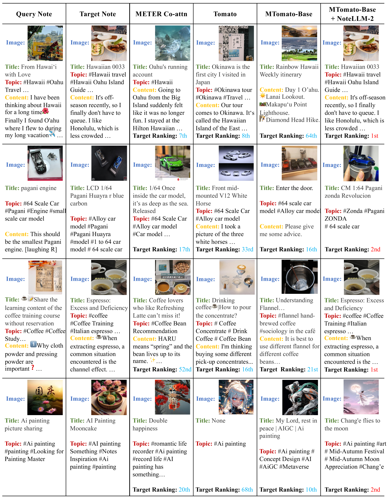

[Arxiv](https://arxiv.org/abs/2405.16789)