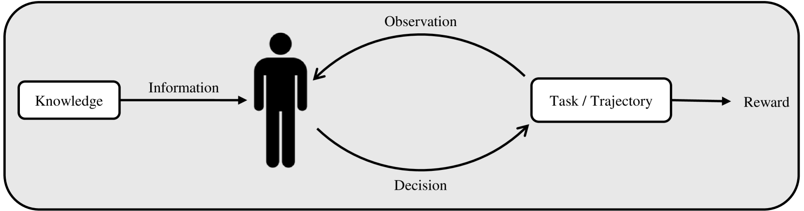
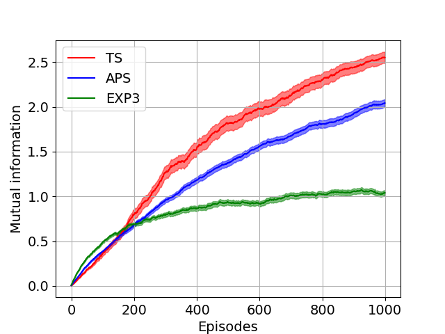

# 比特与强盗之间：探索后悔与信息间的微妙平衡

发布时间：2024年05月26日

`Agent

这篇论文主要研究了在交互式决策任务中，信息获取途径的多样性以及信息积累与遗憾之间的权衡。通过信息论方法，作者确定了遗憾的下界，并重新推导了多个已知的下界。此外，论文还将涉及外部信息的交互决策任务扩展至新情境，并提出了依赖于信息积累的贝叶斯遗憾下界。最后，通过大型语言模型的问题回答任务，展示了这些界限的实际应用价值。这些内容更符合Agent分类，因为它们关注的是智能体在交互决策中的信息处理和性能优化。` `决策支持系统` `人工智能`

> On Bits and Bandits: Quantifying the Regret-Information Trade-off

# 摘要

> 在交互式决策任务中，信息获取途径多样，包括直接互动、间接反馈和外部知识源。我们研究了信息积累与遗憾之间的权衡，发现外部信息（以比特计量）可与遗憾（以奖励计量）相抵。通过信息论方法，我们不仅确定了遗憾的下界，还重新推导了多个已知的下界。我们将多种涉及外部信息的交互决策任务扩展至新情境，首次提出了依赖于信息积累的贝叶斯遗憾下界，证实了汤普森采样在贝叶斯问题中的近似最优性。最后，我们通过大型语言模型的问题回答任务，展示了这些界限的实际应用价值，为我们带来了深刻的洞察。

> In interactive decision-making tasks, information can be acquired by direct interactions, through receiving indirect feedback, and from external knowledgeable sources. We examine the trade-off between the information an agent accumulates and the regret it suffers. We show that information from external sources, measured in bits, can be traded off for regret, measured in reward. We invoke information-theoretic methods for obtaining regret lower bounds, that also allow us to easily re-derive several known lower bounds. We then generalize a variety of interactive decision-making tasks with external information to a new setting. Using this setting, we introduce the first Bayesian regret lower bounds that depend on the information an agent accumulates. These lower bounds also prove the near-optimality of Thompson sampling for Bayesian problems. Finally, we demonstrate the utility of these bounds in improving the performance of a question-answering task with large language models, allowing us to obtain valuable insights.

[Arxiv](https://arxiv.org/abs/2405.16581)