# 大型语言模型与RLHF对齐中的算法偏差：偏好崩溃与匹配正则化探讨

发布时间：2024年05月26日

`LLM理论

这篇论文主要探讨了大型语言模型（LLMs）与人类偏好的对齐问题，并提出了一种新的方法——偏好匹配（PM）RLHF，以解决现有基于人类反馈的强化学习（RLHF）方法中存在的偏差问题。该研究通过理论分析和实验验证，展示了新方法在提高模型与人类偏好对齐度方面的有效性。因此，这篇论文属于LLM理论分类，因为它深入研究了LLMs的理论优化和改进，特别是关于如何更精确地对齐模型与人类偏好的理论问题。` `人工智能`

> On the Algorithmic Bias of Aligning Large Language Models with RLHF: Preference Collapse and Matching Regularization

# 摘要

> 将大型语言模型（LLMs）与人类偏好精准对齐，对于确保决策过程的公平性、经济性和统计效率至关重要。然而，我们认为，主流的基于人类反馈的强化学习（RLHF）方法，在通过奖励模型使LLMs与人类偏好对齐时，因其在优化中采用的Kullback-Leibler正则化而存在固有偏差。这种偏差在极端情况下可能导致“偏好崩溃”，即少数派偏好被忽视。为此，我们提出了偏好匹配（PM）RLHF，这是一种创新方法，确保在Bradley-Terry-Luce/Plackett-Luce模型下，LLMs与奖励模型的偏好分布保持一致。我们的方法核心在于一个PM正则化器，它通过LLM对响应的政策概率分布的负对数形式，帮助LLM在响应多样性与奖励最大化之间取得平衡。我们通过解决一个关键的普通微分方程来实现这一正则化器，以确保PM特性。针对实际应用，我们开发了一个条件变体PM RLHF，专为自然语言生成优化。通过在OPT-1.3B和Llama-2-7B模型上的实验，我们验证了条件PM RLHF的有效性，结果显示，与标准RLHF相比，在特定度量上，人类偏好的对齐度提高了29%至41%。

> Accurately aligning large language models (LLMs) with human preferences is crucial for informing fair, economically sound, and statistically efficient decision-making processes. However, we argue that reinforcement learning from human feedback (RLHF) -- the predominant approach for aligning LLMs with human preferences through a reward model -- suffers from an inherent algorithmic bias due to its Kullback--Leibler-based regularization in optimization. In extreme cases, this bias could lead to a phenomenon we term preference collapse, where minority preferences are virtually disregarded. To mitigate this algorithmic bias, we introduce preference matching (PM) RLHF, a novel approach that provably aligns LLMs with the preference distribution of the reward model under the Bradley--Terry--Luce/Plackett--Luce model. Central to our approach is a PM regularizer that takes the form of the negative logarithm of the LLM's policy probability distribution over responses, which helps the LLM balance response diversification and reward maximization. Notably, we obtain this regularizer by solving an ordinary differential equation that is necessary for the PM property. For practical implementation, we introduce a conditional variant of PM RLHF that is tailored to natural language generation. Finally, we empirically validate the effectiveness of conditional PM RLHF through experiments on the OPT-1.3B and Llama-2-7B models, demonstrating a 29% to 41% improvement in alignment with human preferences, as measured by a certain metric, compared to standard RLHF.

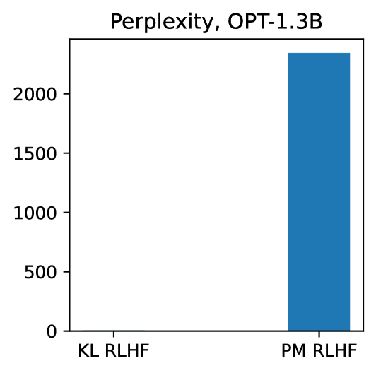

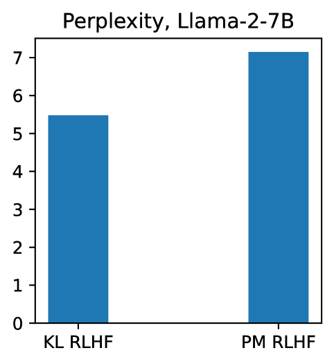

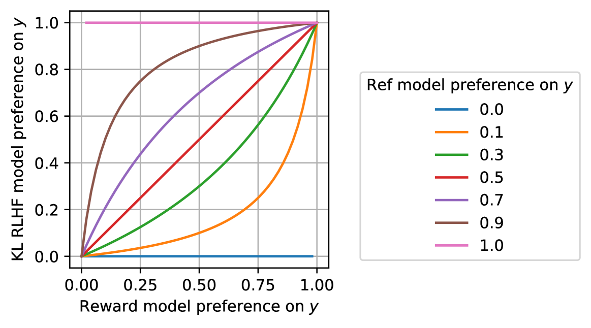

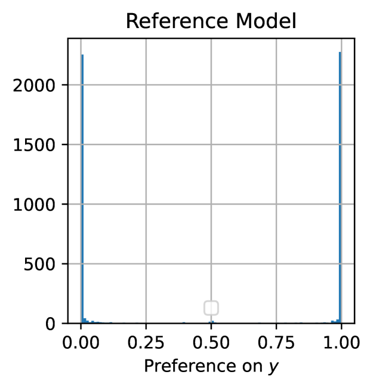

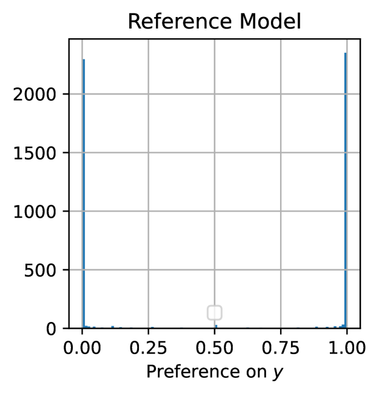

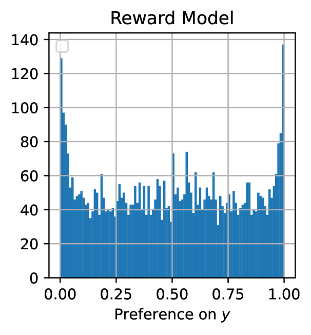

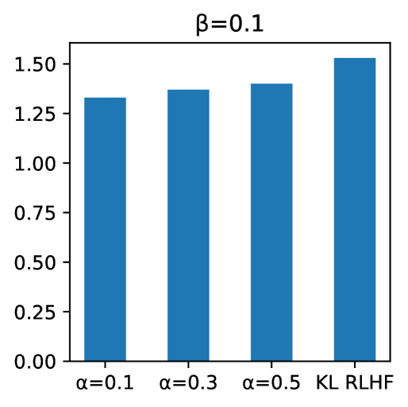

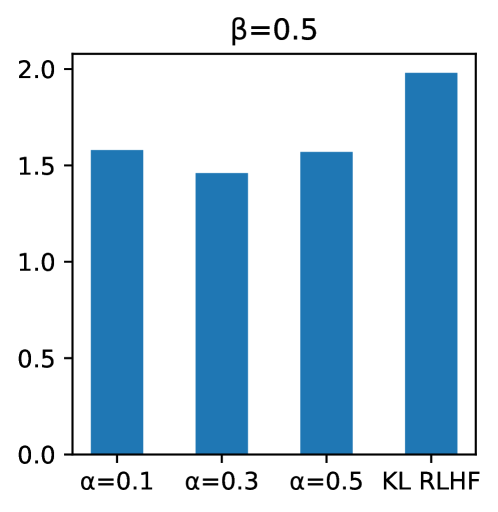

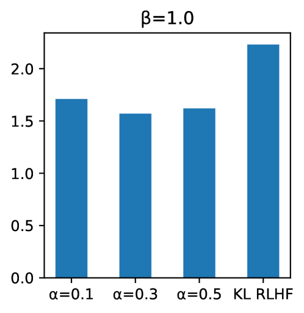

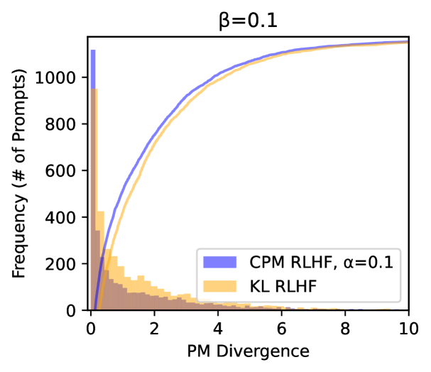

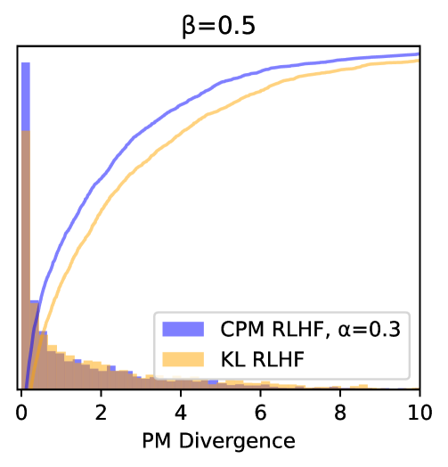

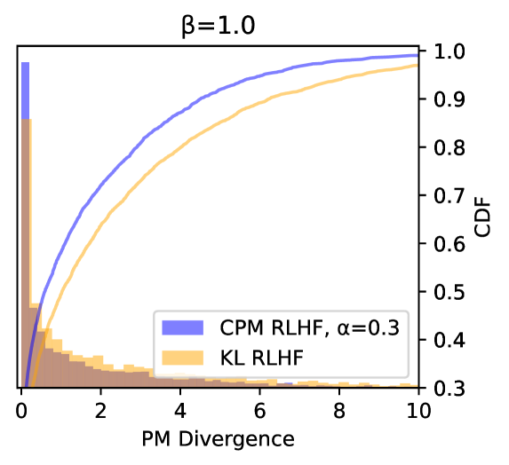

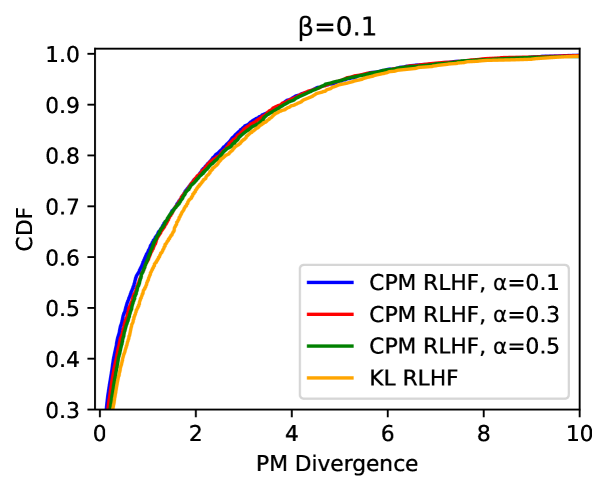

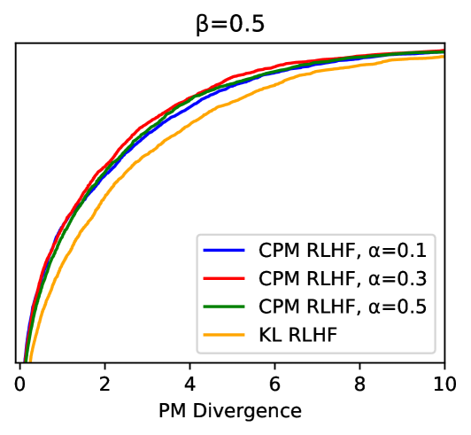

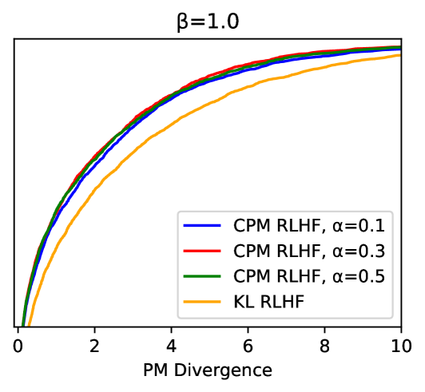

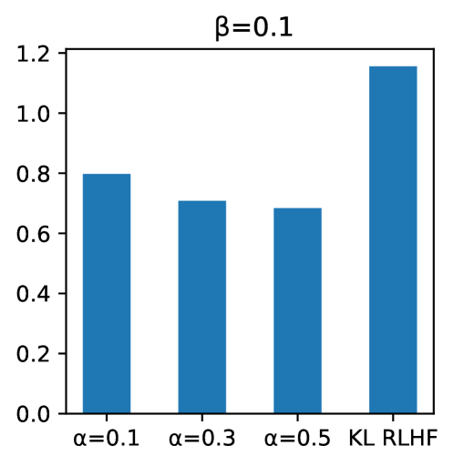

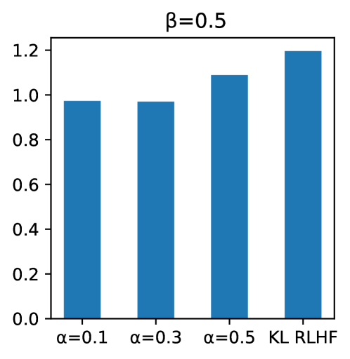

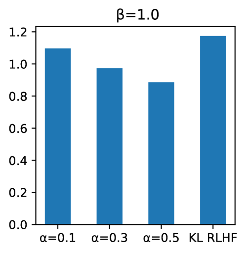

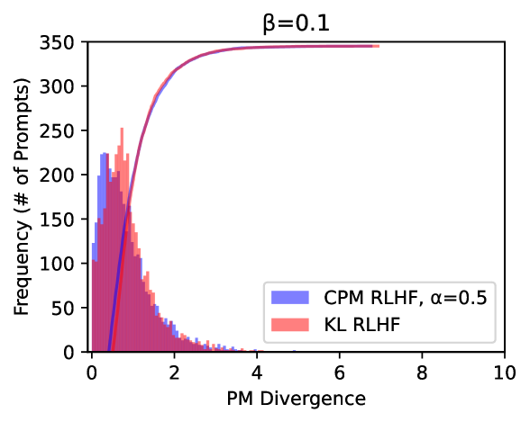

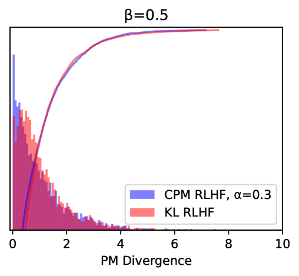

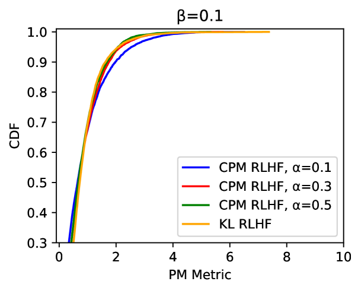

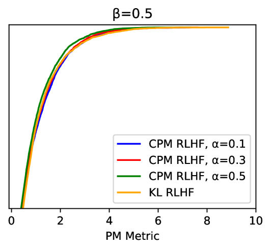

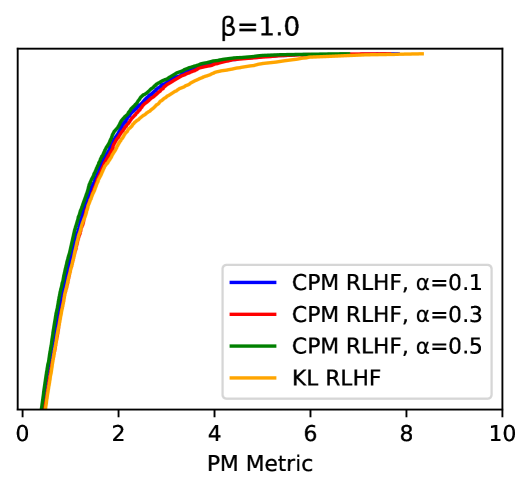

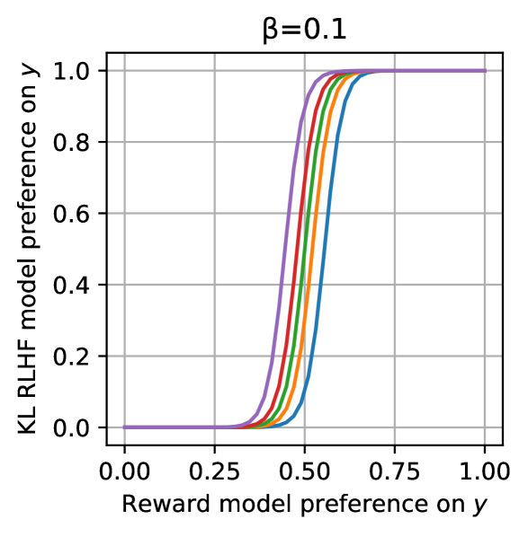

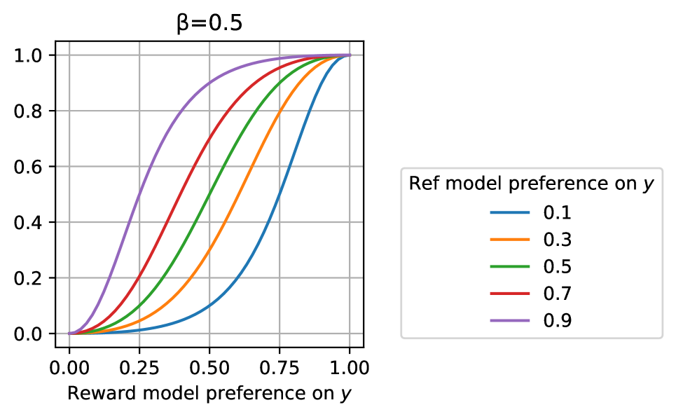

[Arxiv](https://arxiv.org/abs/2405.16455)