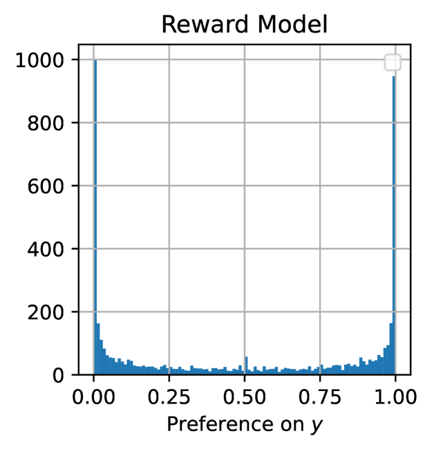
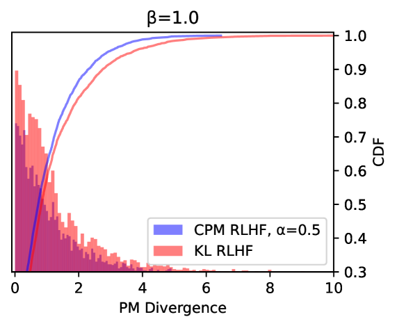

# 大型语言模型与RLHF对齐中的算法偏差：偏好崩溃与匹配正则化之探析

发布时间：2024年05月26日

`LLM理论

这篇论文主要探讨了大型语言模型（LLMs）与人类偏好的对齐问题，并提出了一种新的基于偏好匹配的强化学习方法（PM RLHF）。这种方法通过引入新的正则化器来优化模型，以确保模型输出与人类偏好的一致性。论文的核心贡献在于理论上的创新，即通过解决一个常微分方程来实现新的正则化器，以及在模型优化中平衡响应多样性与奖励最大化。因此，这篇论文更偏向于LLM的理论研究，而不是具体的应用、Agent设计或RAG（Retrieval-Augmented Generation）技术。` `人工智能`

> On the Algorithmic Bias of Aligning Large Language Models with RLHF: Preference Collapse and Matching Regularization

# 摘要

> 确保大型语言模型（LLMs）与人类偏好精准对齐，对于推动公平、经济高效且统计上合理的决策过程至关重要。然而，我们发现主流的基于人类反馈的强化学习（RLHF）方法，在优化过程中因采用Kullback-Leibler正则化而存在固有偏差，极端情况下可能导致少数派偏好被忽视的“偏好崩溃”现象。为此，我们提出了一种创新的偏好匹配（PM）RLHF方法，确保LLMs在Bradley-Terry-Luce/Plackett-Luce模型下与奖励模型的偏好分布保持一致。该方法的核心是一个PM正则化器，它通过LLM对响应的政策概率分布的负对数形式，巧妙平衡了响应多样性与奖励最大化。我们通过解决一个关键的常微分方程来实现这一正则化器，确保了PM特性的满足。针对实际应用，我们开发了一种条件变体PM RLHF，专为自然语言生成优化。实验结果显示，在OPT-1.3B和Llama-2-7B模型上，与标准RLHF相比，条件PM RLHF在特定度量下，人类偏好的对齐度提升了29%至41%。

> Accurately aligning large language models (LLMs) with human preferences is crucial for informing fair, economically sound, and statistically efficient decision-making processes. However, we argue that reinforcement learning from human feedback (RLHF) -- the predominant approach for aligning LLMs with human preferences through a reward model -- suffers from an inherent algorithmic bias due to its Kullback--Leibler-based regularization in optimization. In extreme cases, this bias could lead to a phenomenon we term preference collapse, where minority preferences are virtually disregarded. To mitigate this algorithmic bias, we introduce preference matching (PM) RLHF, a novel approach that provably aligns LLMs with the preference distribution of the reward model under the Bradley--Terry--Luce/Plackett--Luce model. Central to our approach is a PM regularizer that takes the form of the negative logarithm of the LLM's policy probability distribution over responses, which helps the LLM balance response diversification and reward maximization. Notably, we obtain this regularizer by solving an ordinary differential equation that is necessary for the PM property. For practical implementation, we introduce a conditional variant of PM RLHF that is tailored to natural language generation. Finally, we empirically validate the effectiveness of conditional PM RLHF through experiments on the OPT-1.3B and Llama-2-7B models, demonstrating a 29% to 41% improvement in alignment with human preferences, as measured by a certain metric, compared to standard RLHF.

[Arxiv](https://arxiv.org/abs/2405.16455)