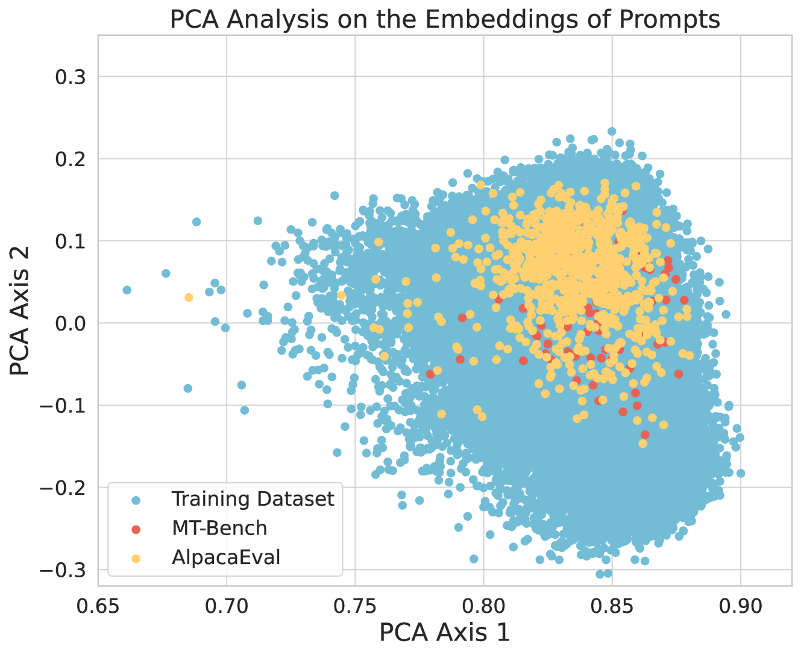

# 在RLHF中，我们通过证明性地减轻过度优化，揭示了SFT损失实际上扮演着一种隐式的对抗性正则化器的角色。

发布时间：2024年05月26日

`LLM理论

理由：这篇论文主要探讨了在大型语言模型（LLM）对齐过程中遇到的问题，即过度优化问题，并提出了一种新的理论算法（正则化偏好优化，RPO）来解决这一问题。该算法涉及理论分析和优化策略，旨在改进奖励模型和策略选择，以更好地对齐人类偏好。因此，这篇论文的内容更偏向于LLM的理论研究和算法开发，而不是具体的应用、Agent设计或RAG（Retrieval-Augmented Generation）技术。` `人工智能` `语言模型`

> Provably Mitigating Overoptimization in RLHF: Your SFT Loss is Implicitly an Adversarial Regularizer

# 摘要

> 在通过RLHF对齐生成模型与人类偏好时，常遇到过度优化问题，即不完善的奖励模型可能导致生成模型产生不理想的输出。我们系统地探讨了这一问题，指出其根源在于人类偏好学习中的分布偏移和不确定性。为此，我们提出了一种理论算法，旨在为对抗性选择的奖励模型找到最佳策略，该策略能同时最小化损失的最大似然估计和奖励惩罚项，后者旨在防止策略选择具有误导性高奖励的动作，从而在部分覆盖条件下提高了算法的样本效率。该算法不仅理论严谨，其实现也出乎意料地简单。它利用奖励模型与最优策略之间的等价性，构建了一个简洁的目标，该目标融合了直接对齐策略与人类偏好的偏好优化损失，以及模仿策略与基线分布的监督学习损失。在大型语言模型（LLM）对齐的实践中，这一目标结合了直接偏好优化（DPO）损失与监督微调（SFT）损失，有效缓解了对不理想输出的过度优化，我们称之为正则化偏好优化（RPO）。实验证明，RPO在LLM对齐任务中优于DPO基线。我们的研究不仅提供了理论支撑，也通过实证展示了偏好优化与SFT在LLM调整中的协同效应。

> Aligning generative models with human preference via RLHF typically suffers from overoptimization, where an imperfectly learned reward model can misguide the generative model to output undesired responses. We investigate this problem in a principled manner by identifying the source of the misalignment as a form of distributional shift and uncertainty in learning human preferences. To mitigate overoptimization, we first propose a theoretical algorithm that chooses the best policy for an adversarially chosen reward model; one that simultaneously minimizes the maximum likelihood estimation of the loss and a reward penalty term. Here, the reward penalty term is introduced to prevent the policy from choosing actions with spurious high proxy rewards, resulting in provable sample efficiency of the algorithm under a partial coverage style condition. Moving from theory to practice, the proposed algorithm further enjoys an equivalent but surprisingly easy-to-implement reformulation. Using the equivalence between reward models and the corresponding optimal policy, the algorithm features a simple objective that combines: (i) a preference optimization loss that directly aligns the policy with human preference, and (ii) a supervised learning loss that explicitly imitates the policy with a (suitable) baseline distribution. In the context of aligning large language models (LLM), this objective fuses the direct preference optimization (DPO) loss with the supervised fune-tuning (SFT) loss to help mitigate the overoptimization towards undesired responses, for which we name the algorithm Regularized Preference Optimization (RPO). Experiments of aligning LLMs demonstrate the improved performance of RPO compared with DPO baselines. Our work sheds light on the interplay between preference optimization and SFT in tuning LLMs with both theoretical guarantees and empirical evidence.

[Arxiv](https://arxiv.org/abs/2405.16436)