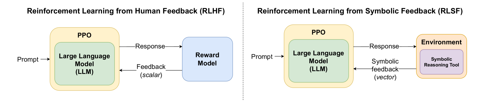
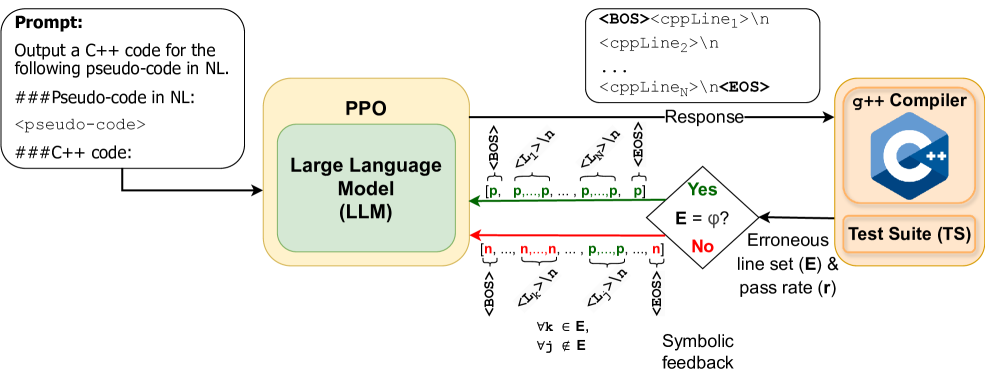
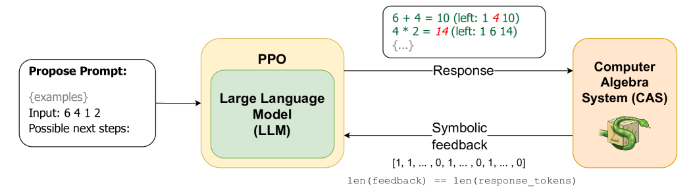

# 符号反馈强化学习（RLSF）

发布时间：2024年05月26日

`Agent

理由：这篇论文主要介绍了一种新的训练/微调模式——通过符号反馈的强化学习（RLSF），其中LLM被视为强化学习中的代理（Agent）。这种方法利用符号工具提供的反馈来提升LLMs的推理能力，这与Agent的定义和功能相符，即在特定环境中通过接收反馈来学习和执行任务。因此，这篇论文应归类于Agent。` `人工智能`

> RLSF: Reinforcement Learning via Symbolic Feedback

# 摘要

> 大型语言模型（LLMs）近年来在AI的多个子领域，尤其是自然语言理解任务上，展现了显著的影响力。尽管如此，业界普遍认为，这些模型的逻辑推理能力至多只是零星有效，时而表现出色，时而又严重失效。传统的LLM微调方法，如依赖人类反馈的策略，虽在一定程度上缓解了这一问题，但仍面临诸多挑战，包括不稳定的黑盒奖励模型、偏好数据收集的困难以及奖励信号的稀疏性。为此，我们提出了一种创新的训练/微调模式——通过符号反馈的强化学习（RLSF），旨在提升LLMs的推理能力。在RLSF框架下，LLM被视为强化学习中的代理，而环境则能够利用推理或特定领域的知识工具（例如求解器、代数系统）。关键在于，RLSF允许这些工具通过多尺寸证书（如证明）向LLMs提供反馈，精确指出LLM输出与正确性标准之间的偏差。这种基于RLSF的训练/微调方法能够有效利用生成证书的符号工具，为LLMs提供精确且细致的奖励信号，从而克服了传统奖励模型的不足。经过详尽的评估，我们证实了基于RLSF的LLM微调在两个不同应用——从自然语言伪代码到编程语言（C++）的程序合成和解决24点游戏中，均优于传统方法。

> In recent years, large language models (LLMs) have had a dramatic impact on various sub-fields of AI, most notably on natural language understanding tasks. However, there is widespread agreement that the logical reasoning capabilities of contemporary LLMs are, at best, fragmentary (i.e., may work well on some problem instances but fail dramatically on others). While traditional LLM fine-tuning approaches (e.g., those that use human feedback) do address this problem to some degree, they suffer from many issues, including unsound black-box reward models, difficulties in collecting preference data, and sparse scalar reward values.
  To address these challenges, we propose a new training/fine-tuning paradigm we refer to as Reinforcement Learning via Symbolic Feedback (RLSF), which is aimed at enhancing the reasoning capabilities of LLMs. In the RLSF setting, the LLM that is being trained/fine-tuned is considered as the RL agent, while the environment is allowed access to reasoning or domain knowledge tools (e.g., solvers, algebra systems). Crucially, in RLSF, these reasoning tools can provide feedback to the LLMs via poly-sized certificates (e.g., proofs), that characterize errors in the LLM-generated object with respect to some correctness specification. The ability of RLSF-based training/fine-tuning to leverage certificate-generating symbolic tools enables sound fine-grained (token-level) reward signals to LLMs, and thus addresses the limitations of traditional reward models mentioned above. Via extensive evaluations, we show that our RLSF-based fine-tuning of LLMs outperforms traditional approaches on two different applications, namely, program synthesis from natural language pseudo-code to programming language (C++) and solving the Game of 24.

[Arxiv](https://arxiv.org/abs/2405.16661)