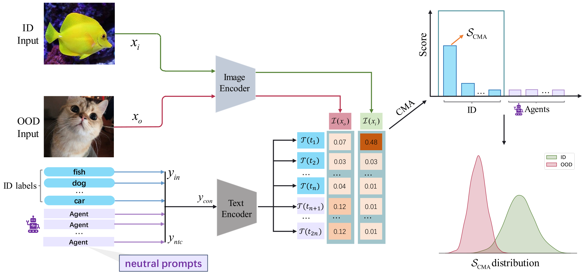
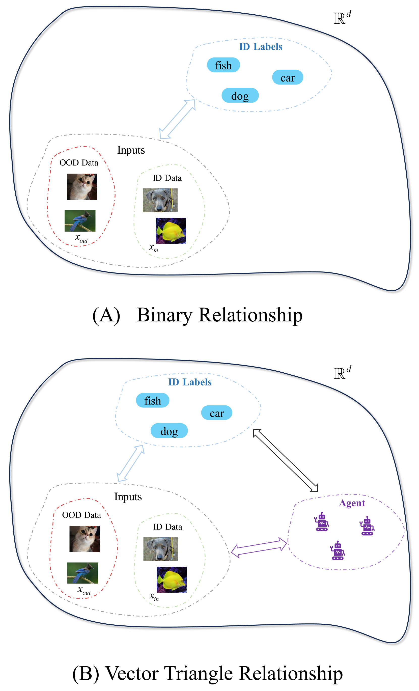
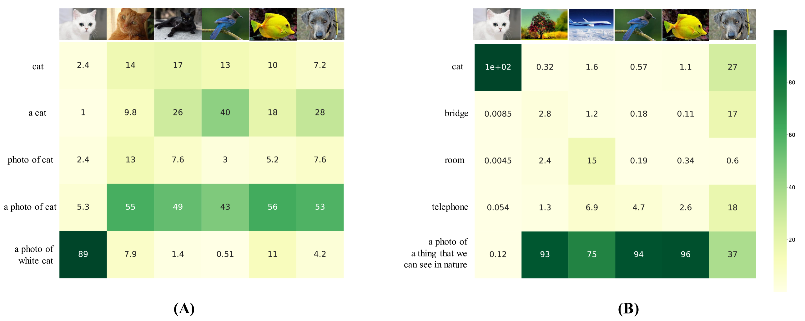
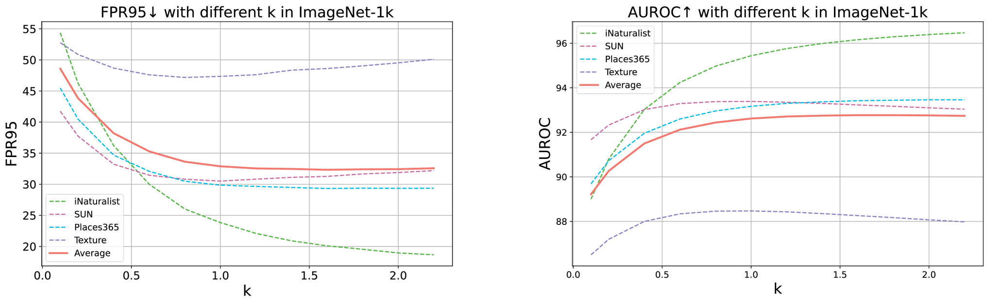
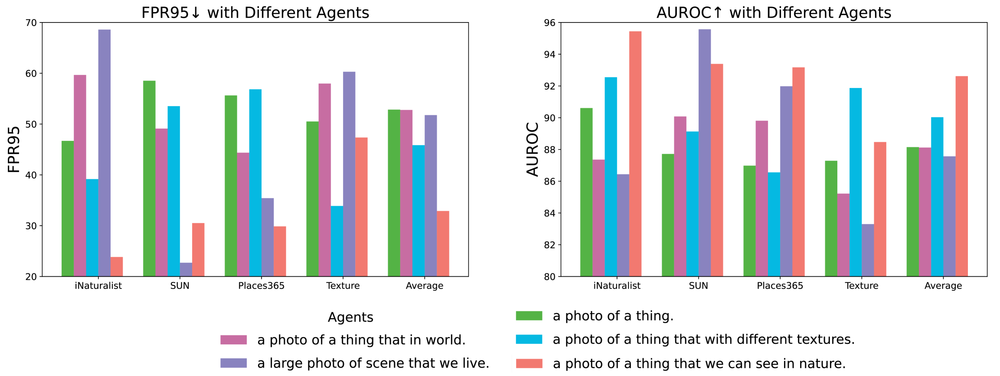

# 重塑分布外检测中的关系纽带

发布时间：2024年05月26日

`Agent

这篇论文介绍了一种名为“概念匹配与代理（CMA）”的创新方法，用于提升分布外（OOD）检测任务的鲁棒性与适应性。CMA方法利用中性提示作为代理，与分布内（ID）标签及数据输入互动，构建起向量三角关系，以更精细的方式分析和区分ID与OOD输入。这种方法的核心在于使用代理（Agent）来增强OOD检测过程，因此将其归类为Agent。` `人工智能` `异常检测`

> Reframing the Relationship in Out-of-Distribution Detection

# 摘要

> 大型语言模型（LLMs）的卓越成就不仅在学术界引起轰动，也在工业界掀起波澜，其应用已远超最初的对话生成领域。作为多种任务的中介，LLMs展现出巨大潜力，推动了人工智能的创新浪潮。在此基础上，我们提出了一种创新方法——概念匹配与代理（CMA），旨在提升分布外（OOD）检测任务的鲁棒性与适应性。CMA利用中性提示作为代理，强化了基于CLIP的OOD检测过程。这些代理如同动态观察者和信息枢纽，与分布内（ID）标签及数据输入互动，构建起向量三角关系。相较于传统的二元关系，这一三角框架提供了更为精细的分析方法，有效区分和识别ID与OOD输入。实验结果表明，CMA在多种实际场景中均优于零-shot和需要训练的方法，展现出其卓越性能。

> The remarkable achievements of Large Language Models (LLMs) have captivated the attention of both academia and industry, transcending their initial role in dialogue generation. The utilization of LLMs as intermediary agents in various tasks has yielded promising results, sparking a wave of innovation in artificial intelligence. Building on these breakthroughs, we introduce a novel approach that integrates the agent paradigm into the Out-of-distribution (OOD) detection task, aiming to enhance its robustness and adaptability. Our proposed method, Concept Matching with Agent (CMA), employs neutral prompts as agents to augment the CLIP-based OOD detection process. These agents function as dynamic observers and communication hubs, interacting with both In-distribution (ID) labels and data inputs to form vector triangle relationships. This triangular framework offers a more nuanced approach than the traditional binary relationship, allowing for better separation and identification of ID and OOD inputs. Our extensive experimental results showcase the superior performance of CMA over both zero-shot and training-required methods in a diverse array of real-world scenarios.

[Arxiv](https://arxiv.org/abs/2405.16766)