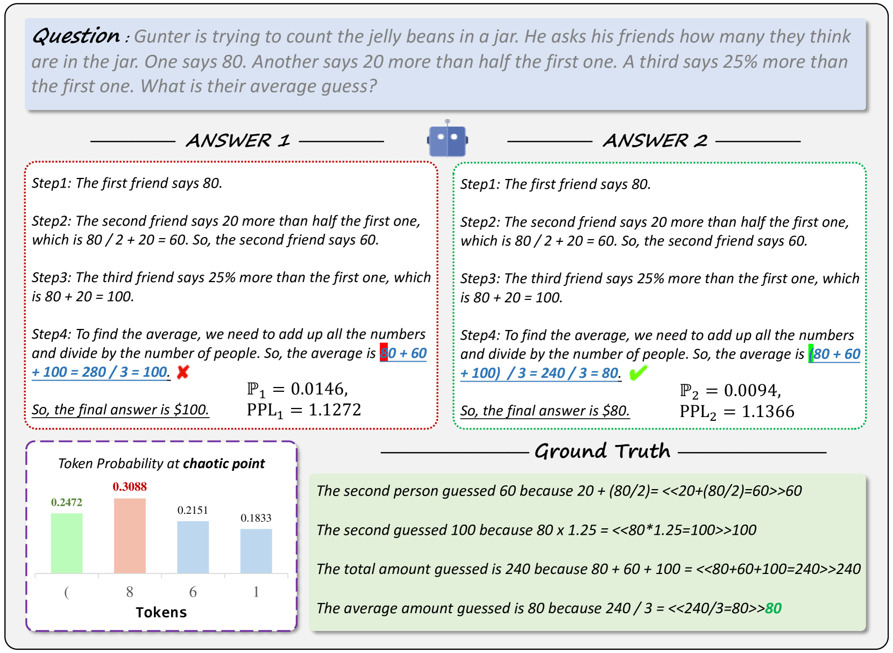
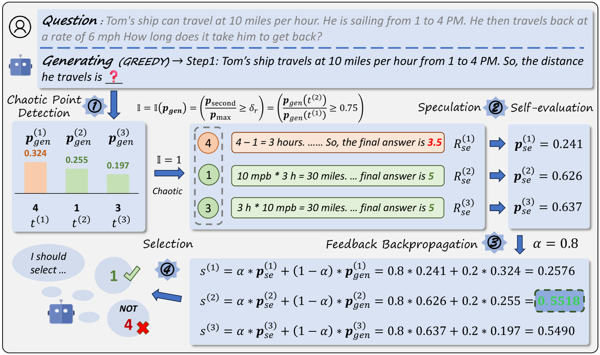

# SED：自评估解码技术提升大型语言模型，助力更优质的生成效果

发布时间：2024年05月26日

`LLM理论

这篇论文主要探讨了大型语言模型（LLMs）在文本生成过程中的解码技术问题，并提出了一种新的解码方法——自评估解码（SED）。该方法旨在改进模型在面对“混沌点”时的决策过程，以提高文本生成的质量。由于论文的核心内容是关于LLMs解码技术的理论改进，因此它属于LLM理论分类。` `人工智能`

> SED: Self-Evaluation Decoding Enhances Large Language Models for Better Generation

# 摘要

> 大型语言模型（LLMs）采用单向自回归解码技术生成文本，以应对多样化的用户查询。然而，这种解码方式往往简单地按顺序选择令牌，一旦遇到不确定的令牌（我们称之为“混沌点”），便容易陷入次优选择。这些混沌点在LLMs生成的文本中屡见不鲜，且常常严重影响后续令牌的质量，进而干扰模型的生成效果。为此，本文提出了一种名为自评估解码（SED）的新型解码方法，旨在提升模型生成质量。SED模仿人类的决策过程，将推测与评估融入解码环节，使LLMs在面对混沌点时能做出更为审慎的选择，从而优化令牌的选取。实验结果显示，SED在多种任务和不同LLMs上的应用均表现出色。

> Existing Large Language Models (LLMs) generate text through unidirectional autoregressive decoding methods to respond to various user queries. These methods tend to consider token selection in a simple sequential manner, making it easy to fall into suboptimal options when encountering uncertain tokens, referred to as chaotic points in our work. Many chaotic points exist in texts generated by LLMs, and they often significantly affect the quality of subsequently generated tokens, which can interfere with LLMs' generation. This paper proposes Self-Evaluation Decoding, SED, a decoding method for enhancing model generation. Analogous to the human decision-making process, SED integrates speculation and evaluation steps into the decoding process, allowing LLMs to make more careful decisions and thus optimize token selection at chaotic points. Experimental results across various tasks using different LLMs demonstrate SED's effectiveness.

[Arxiv](https://arxiv.org/abs/2405.16552)