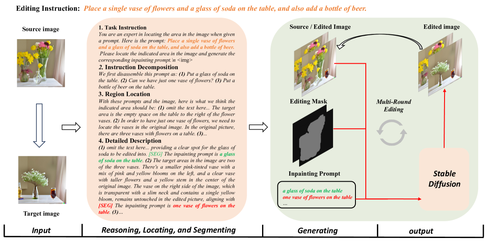
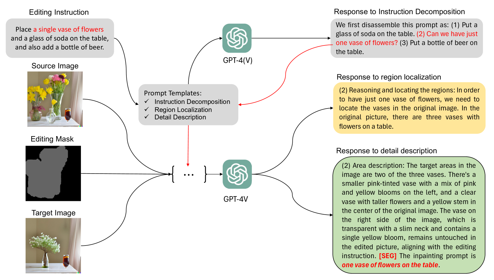
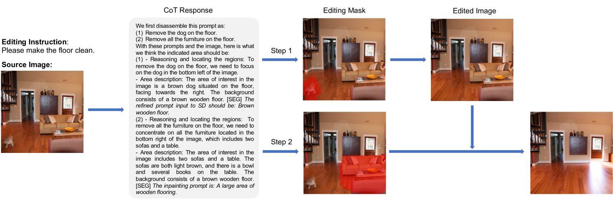
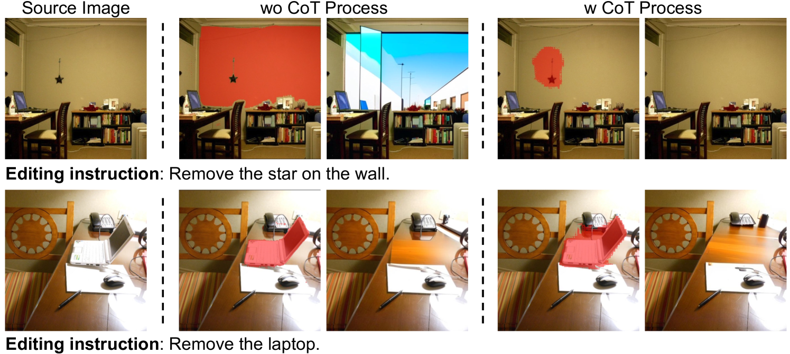
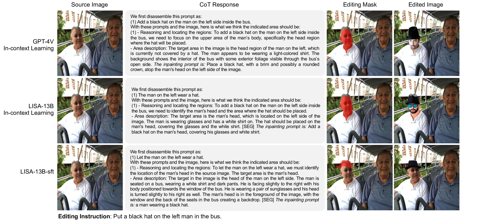

# TIE：引领文本驱动图像编辑革命，精准响应复杂指令，实现高保真视觉创作

发布时间：2024年05月26日

`LLM应用

这篇论文介绍了一种创新的图像编辑框架，该框架利用多模态大型语言模型（LLMs）的链式思维（CoT）推理与定位功能来增强扩散模型的图像生成能力。论文中提到的技术涉及对轻量级多模态LLM——LISA模型的微调，以及结合编辑图像的掩码，以提高图像生成的质量和一致性。这种方法直接应用于实际的图像生成任务中，因此属于LLM应用类别。` `图像处理` `人工智能`

> TIE: Revolutionizing Text-based Image Editing for Complex-Prompt Following and High-Fidelity Editing

# 摘要

> 随着图像生成技术的飞速进步，传统扩散模型及结合多模态大型语言模型（LLMs）的模型在处理复杂提示和维持编辑前后图像一致性上仍显不足。为此，我们创新性地开发了一种图像编辑框架，该框架借助多模态LLMs的强大链式思维（CoT）推理与定位功能，助力扩散模型精炼图像生成。我们精心构建了一个CoT流程，涵盖指令分解、区域定位及细节描述，并以此对轻量级多模态LLM——LISA模型进行微调，结合编辑图像的掩码。通过赋予扩散模型对生成提示及图像掩码的深刻理解，我们的模型在图像生成上展现出卓越的理解力。经过大量实验验证，我们的模型不仅在性能上超越了现有顶尖模型，更在处理复杂提示、生成高保真且一致的图像方面表现出色。

> As the field of image generation rapidly advances, traditional diffusion models and those integrated with multimodal large language models (LLMs) still encounter limitations in interpreting complex prompts and preserving image consistency pre and post-editing. To tackle these challenges, we present an innovative image editing framework that employs the robust Chain-of-Thought (CoT) reasoning and localizing capabilities of multimodal LLMs to aid diffusion models in generating more refined images. We first meticulously design a CoT process comprising instruction decomposition, region localization, and detailed description. Subsequently, we fine-tune the LISA model, a lightweight multimodal LLM, using the CoT process of Multimodal LLMs and the mask of the edited image. By providing the diffusion models with knowledge of the generated prompt and image mask, our models generate images with a superior understanding of instructions. Through extensive experiments, our model has demonstrated superior performance in image generation, surpassing existing state-of-the-art models. Notably, our model exhibits an enhanced ability to understand complex prompts and generate corresponding images, while maintaining high fidelity and consistency in images before and after generation.

[Arxiv](https://arxiv.org/abs/2405.16803)