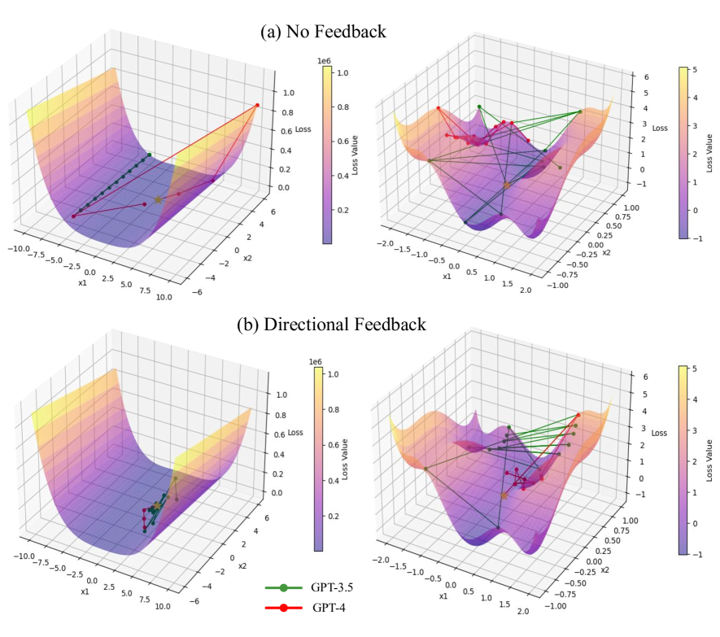
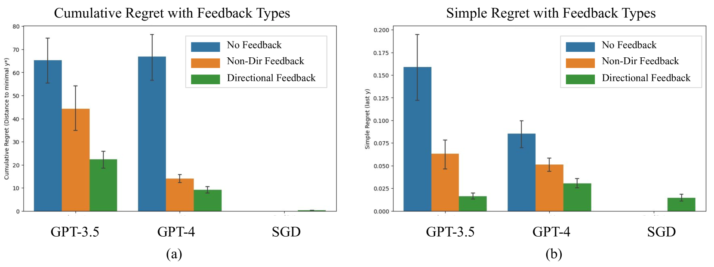
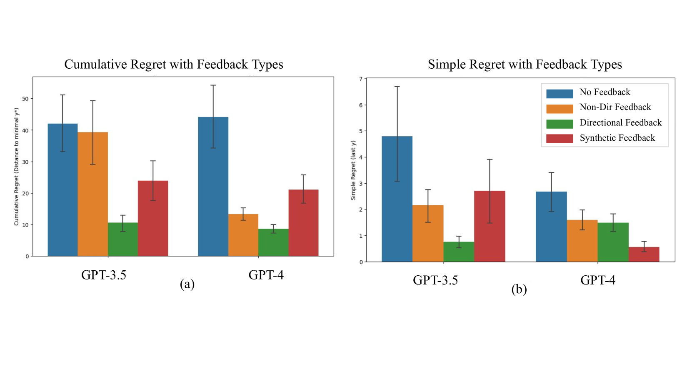
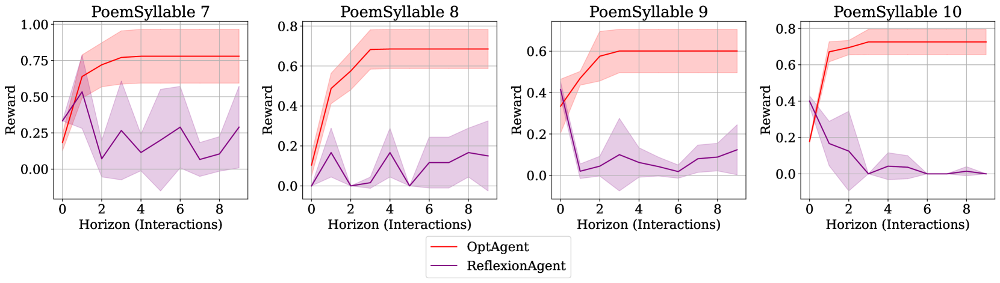

# 在基于LLM的优化器中，方向性反馈的重要性不容忽视。

发布时间：2024年05月26日

`Agent

这篇论文探讨了大型语言模型（LLMs）作为交互式优化器的应用，特别是在文本空间中解决最大化问题。它提出了一种新型的LLM优化器，该优化器利用方向性反馈来提高优化过程的效率和稳定性。这种应用涉及到模型与环境的交互，以及模型根据反馈进行自我调整的能力，这些都是Agent概念的核心要素。因此，这篇论文更适合归类到Agent分类中。` `优化算法`

> The Importance of Directional Feedback for LLM-based Optimizers

# 摘要

> 我们探索了大型语言模型（LLMs）作为交互式优化器的潜力，通过自然语言和数值反馈在文本空间中解决最大化问题。借鉴经典优化理论，我们将反馈分为方向性和非方向性，其中方向性反馈是自然语言空间中一阶反馈的扩展。我们发现，当获得方向性反馈时，LLMs展现出卓越的优化能力。基于此，我们开发了一种新型LLM优化器，它从过往优化记录中提取方向性反馈，以确保迭代过程中的稳定提升。实证研究显示，相比现有方法，我们的优化器在处理各类优化任务，如数学函数最大化或诗歌创作提示优化时，表现更为稳健和高效。

> We study the potential of using large language models (LLMs) as an interactive optimizer for solving maximization problems in a text space using natural language and numerical feedback. Inspired by the classical optimization literature, we classify the natural language feedback into directional and non-directional, where the former is a generalization of the first-order feedback to the natural language space. We find that LLMs are especially capable of optimization when they are provided with {directional feedback}. Based on this insight, we design a new LLM-based optimizer that synthesizes directional feedback from the historical optimization trace to achieve reliable improvement over iterations. Empirically, we show our LLM-based optimizer is more stable and efficient in solving optimization problems, from maximizing mathematical functions to optimizing prompts for writing poems, compared with existing techniques.

[Arxiv](https://arxiv.org/abs/2405.16434)