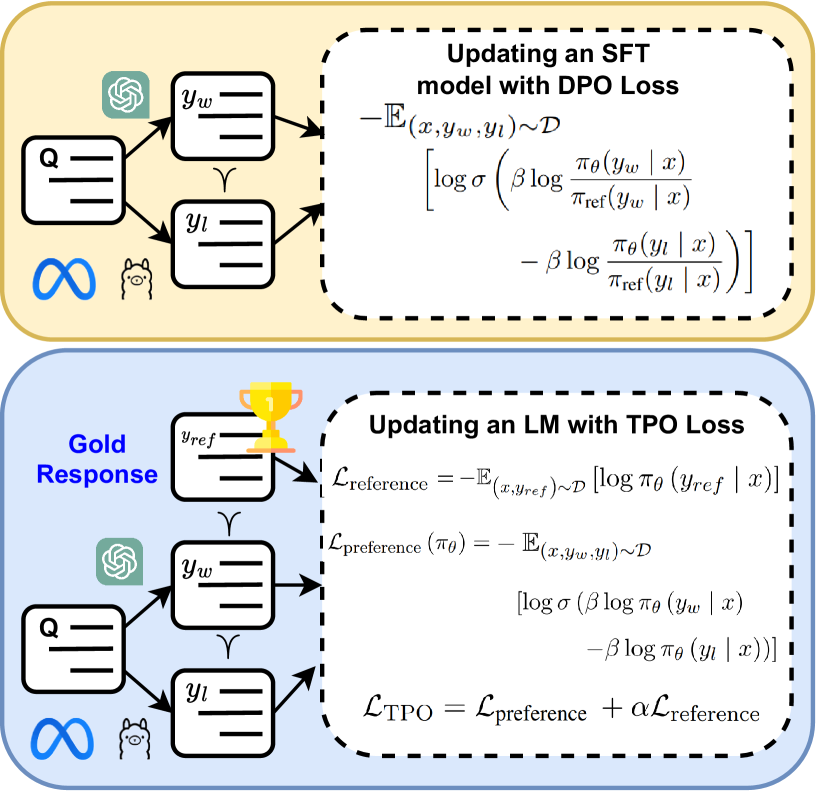
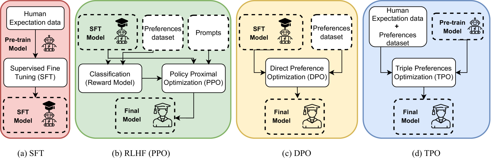
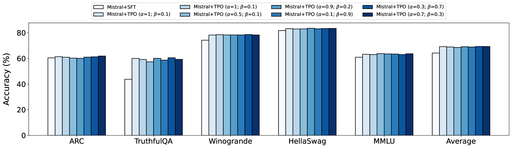
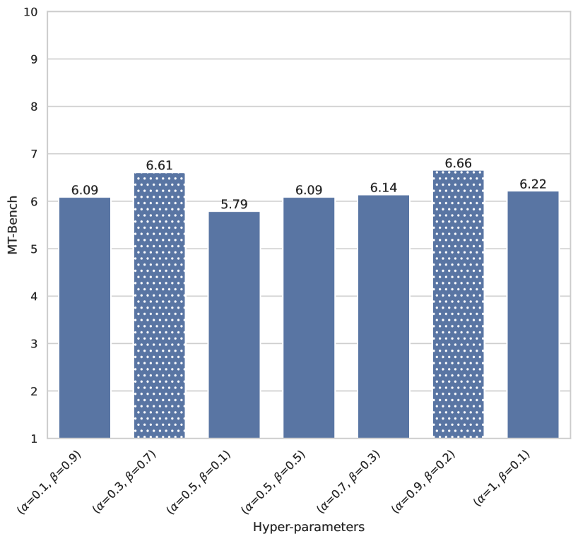

# 三重偏好优化：一步到位，以更少数据实现精准对齐

发布时间：2024年05月26日

`LLM应用

这篇论文介绍了一种新型的偏好学习方法——三重偏好优化（TPO），旨在通过较少的数据使大型语言模型（LLMs）与三种偏好对齐，而无需独立的监督微调（SFT）步骤。这种方法直接应用于数据集上进行微调，并在多个评估指标上显示出优于其他方法（如SFT、DPO等）的性能。因此，这项工作属于LLM应用类别，因为它专注于改进和优化LLM的实际应用性能。` `人工智能`

> Triple Preference Optimization: Achieving Better Alignment with Less Data in a Single Step Optimization

# 摘要

> 大型语言模型（LLMs）在多任务中表现卓越，但与人类示范对齐颇具挑战。近期，无需强化学习（RL）的方法如直接偏好优化（DPO）崭露头角，不仅稳定性与可扩展性更佳，且性能与基于RL的方法不相上下。尽管如此，这些无需RL的方法虽表现出色，却需大量数据构建稳健的监督微调（SFT）模型，并额外进行偏好数据集上的微调，限制了其应用与扩展性。本文提出三重偏好优化（TPO），一种新型偏好学习法，旨在无需独立SFT步骤，以较少数据使LLM与三种偏好对齐。通过实验与理论分析，我们验证了TPO作为一步对齐策略的高效性。我们直接在UltraFeedback数据集上应用TPO微调Phi-2（2.7B）与Mistral（7B）模型，结果优于其他方法（如SFT、DPO等）对齐的模型。此外，TPO在MT-Bench分数上无SFT组件时显著提升，分别超越SFT与DPO 1.27与0.63分。在Open LLM Leaderboard上，TPO平均准确性更胜一筹，分别领先DPO与SFT 4.2%与4.97%。我们的代码已公开，详情见https://github.com/sahsaeedi/triple-preference-optimization。

> Large Language Models (LLMs) perform well across diverse tasks, but aligning them with human demonstrations is challenging. Recently, Reinforcement Learning (RL)-free methods like Direct Preference Optimization (DPO) have emerged, offering improved stability and scalability while retaining competitive performance relative to RL-based methods. However, while RL-free methods deliver satisfactory performance, they require significant data to develop a robust Supervised Fine-Tuned (SFT) model and an additional step to fine-tune this model on a preference dataset, which constrains their utility and scalability. In this paper, we introduce Triple Preference Optimization (TPO), a new preference learning method designed to align an LLM with three preferences without requiring a separate SFT step and using considerably less data. Through a combination of practical experiments and theoretical analysis, we show the efficacy of TPO as a single-step alignment strategy. Specifically, we fine-tuned the Phi-2 (2.7B) and Mistral (7B) models using TPO directly on the UltraFeedback dataset, achieving superior results compared to models aligned through other methods such as SFT, DPO, KTO, IPO, CPO, and ORPO. Moreover, the performance of TPO without the SFT component led to notable improvements in the MT-Bench score, with increases of +1.27 and +0.63 over SFT and DPO, respectively. Additionally, TPO showed higher average accuracy, surpassing DPO and SFT by 4.2% and 4.97% on the Open LLM Leaderboard benchmarks. Our code is publicly available at https://github.com/sahsaeedi/triple-preference-optimization .

[Arxiv](https://arxiv.org/abs/2405.16681)