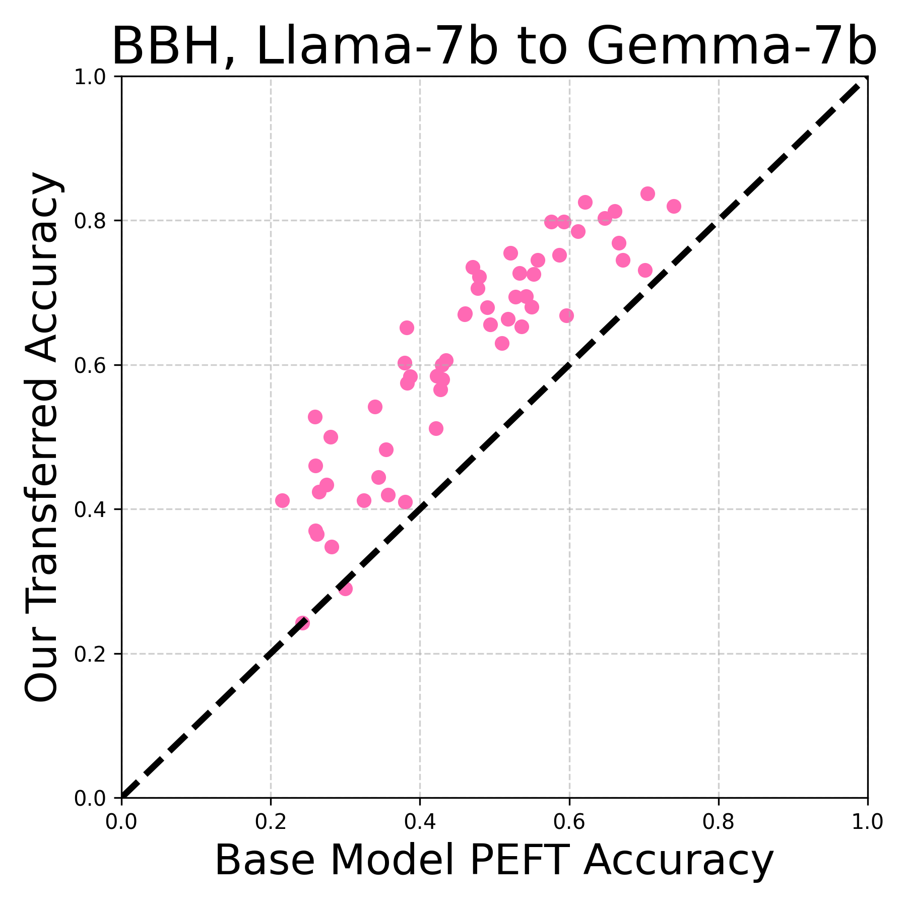

# 《Trans-LoRA》：探索无需数据支持的高效参数转移微调方法

发布时间：2024年05月27日

`LLM应用

理由：这篇论文主要探讨了如何通过使用大型语言模型生成合成数据来实现低秩适配器（LoRA）模块在不同基础模型之间的转移，这是一种具体的应用技术，旨在解决模型更新换代时LoRA模块需要重新训练的问题。这种方法利用了LLM的能力来生成数据，以支持LoRA模块的跨模型转移，属于LLM在特定技术问题上的应用，而非理论研究或Agent、RAG相关的研究。因此，将其归类为LLM应用是合适的。` `云计算` `人工智能`

> $\textit{Trans-LoRA}$: towards data-free Transferable Parameter Efficient Finetuning

# 摘要

> 低秩适配器（LoRA）及其变种因其参数高效微调（PEFT）的特性而广受欢迎，它们在保持少量额外参数的同时，几乎达到了全模型微调的性能。这些LoRA参数专为特定基础模型定制。然而，当基础模型更新换代时，所有相关的LoRA模块必须重新训练，这需要原始训练数据的支持。在商业云服务中，这一问题尤为突出，因为服务提供商可能无法访问客户的专有数据。为此，我们提出了Trans-LoRA——一种创新的无损、近数据自由的LoRA跨模型转移技术。我们利用大型语言模型生成合成数据，以此来转移LoRA模块。通过在合成数据集上训练，LoRA模块得以无缝迁移至新模型。我们通过LLama和Gemma模型家族验证了这一方法的有效性，展示了它在不同模型间、不同基础模型家族间乃至不同PEFT方法间的广泛适用性和优越性能。

> Low-rank adapters (LoRA) and their variants are popular parameter-efficient fine-tuning (PEFT) techniques that closely match full model fine-tune performance while requiring only a small number of additional parameters. These additional LoRA parameters are specific to the base model being adapted. When the base model needs to be deprecated and replaced with a new one, all the associated LoRA modules need to be re-trained. Such re-training requires access to the data used to train the LoRA for the original base model. This is especially problematic for commercial cloud applications where the LoRA modules and the base models are hosted by service providers who may not be allowed to host proprietary client task data. To address this challenge, we propose $\textit{Trans-LoRA}$ -- a novel method for lossless, nearly data-free transfer of LoRAs across base models. Our approach relies on synthetic data to transfer LoRA modules. Using large language models, we design a synthetic data generator to approximate the data-generating process of the $\textit{observed}$ task data subset. Training on the resulting synthetic dataset transfers LoRA modules to new models. We show the effectiveness of our approach using both LLama and Gemma model families. Our approach achieves lossless (mostly improved) LoRA transfer between models within and across different base model families, and even between different PEFT methods, on a wide variety of tasks.

[Arxiv](https://arxiv.org/abs/2405.17258)