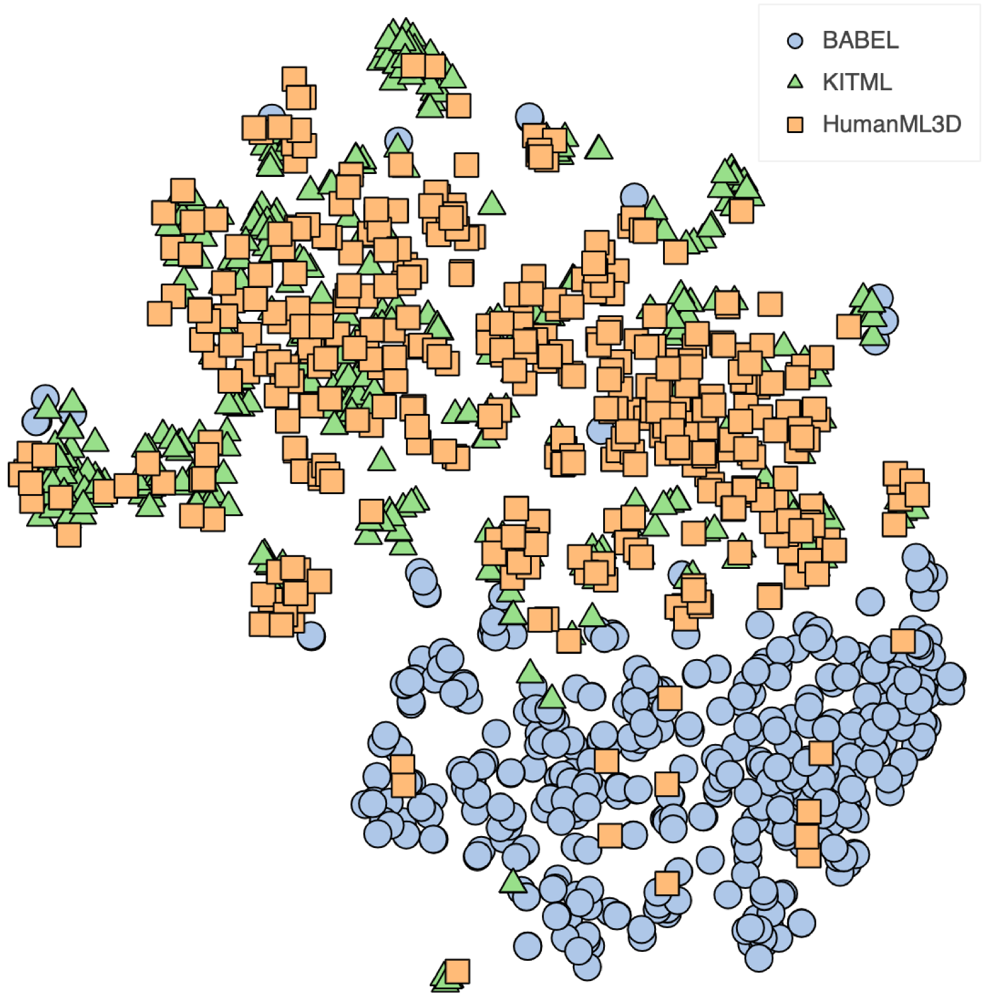
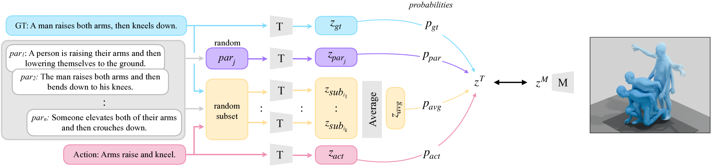
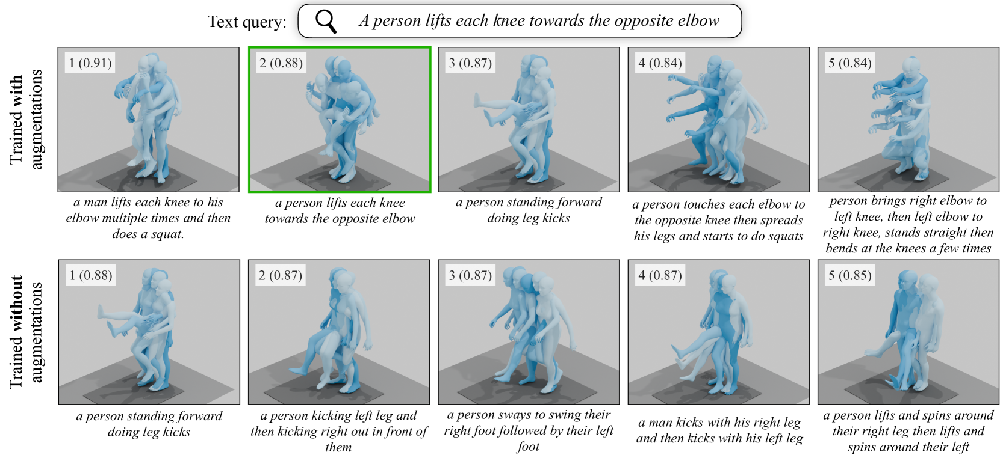
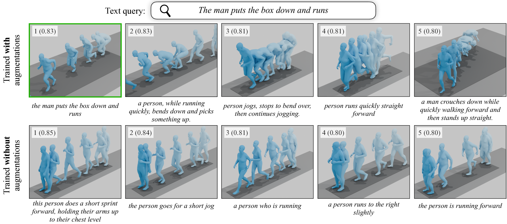
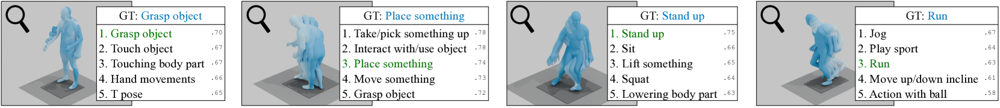
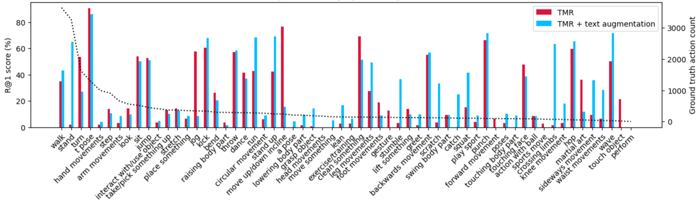
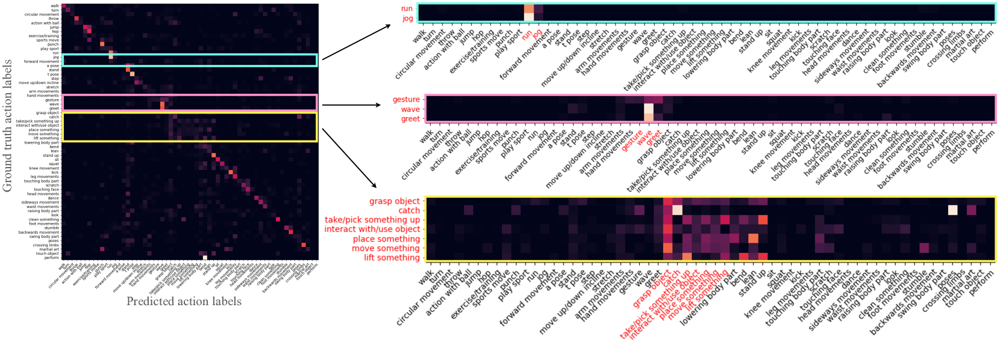

# 跨数据集视角下的文本驱动3D人体运动检索研究

发布时间：2024年05月27日

`Agent

理由：这篇论文主要关注的是基于文本的3D人体运动检索的跨数据集泛化问题，以及在BABEL数据集上实现的零-shot动作识别。这些研究内容涉及到跨数据集的学习和泛化能力，以及在没有类别标签的情况下进行动作识别的能力，这些都是Agent领域中智能体（Agent）需要具备的关键能力，即在不同环境和条件下进行有效学习和决策的能力。因此，这篇论文更适合归类到Agent分类中。` `人体运动` `动作识别`

> A Cross-Dataset Study for Text-based 3D Human Motion Retrieval

# 摘要

> 我们的研究聚焦于基于文本的3D人体运动检索的跨数据集泛化，采用统一的SMPL身体格式，打破了数据集间的壁垒。研究揭示了HumanML3D、KIT Motion-Language和BABEL等基准中存在的数据集偏差，并发现文本增强虽能缓解部分领域差异，但挑战依旧。此外，我们首次在BABEL上实现了零-shot动作识别，未依赖训练中的类别标签，为研究领域带来了新的探索方向。

> We provide results of our study on text-based 3D human motion retrieval and particularly focus on cross-dataset generalization. Due to practical reasons such as dataset-specific human body representations, existing works typically benchmarkby training and testing on partitions from the same dataset. Here, we employ a unified SMPL body format for all datasets, which allows us to perform training on one dataset, testing on the other, as well as training on a combination of datasets. Our results suggest that there exist dataset biases in standard text-motion benchmarks such as HumanML3D, KIT Motion-Language, and BABEL. We show that text augmentations help close the domain gap to some extent, but the gap remains. We further provide the first zero-shot action recognition results on BABEL, without using categorical action labels during training, opening up a new avenue for future research.

[Arxiv](https://arxiv.org/abs/2405.16909)