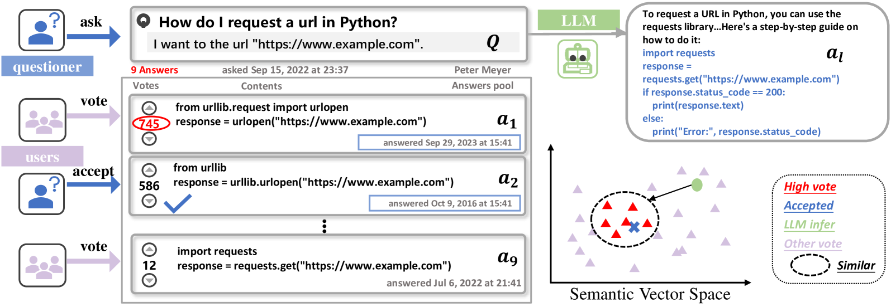
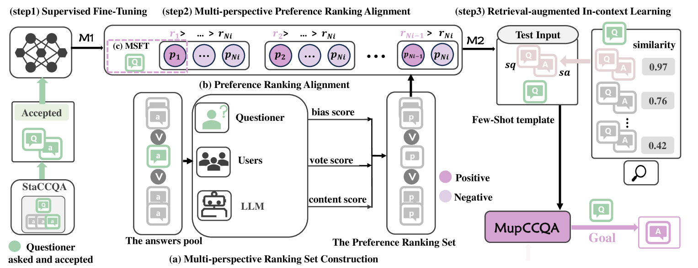
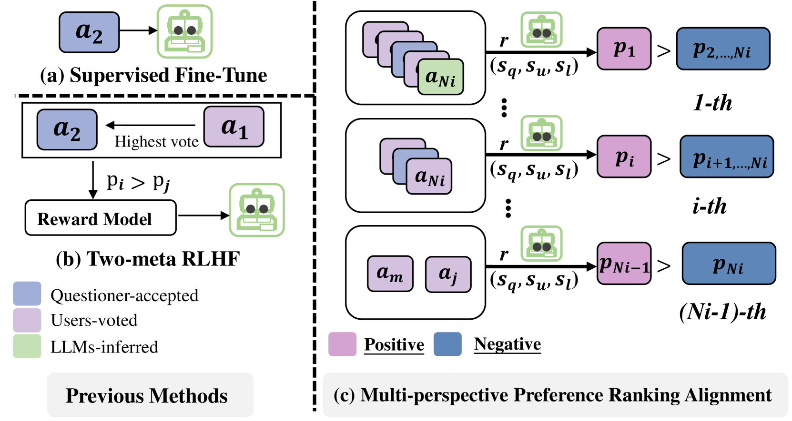
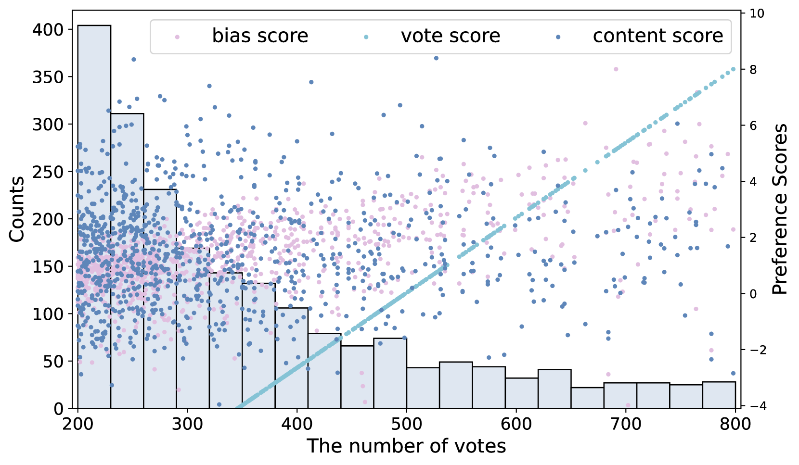
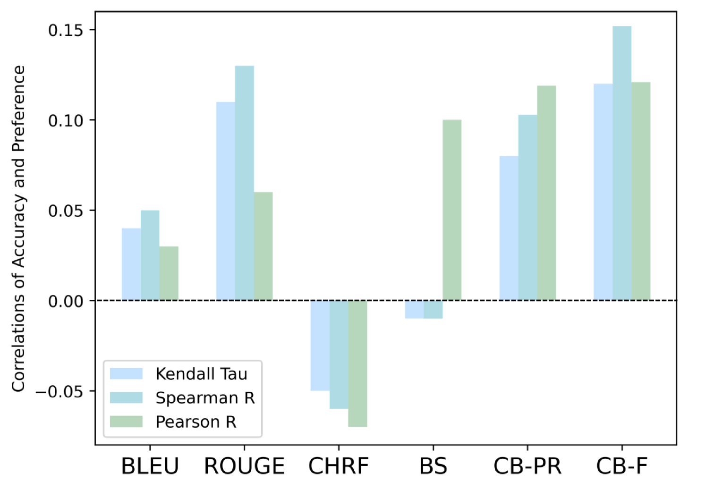
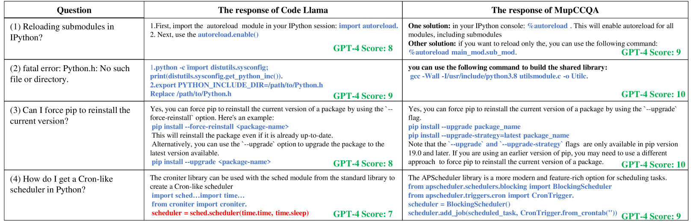

# 基于多视角用户偏好排名的反馈，优化大型语言模型以精准解答编程问题

发布时间：2024年05月27日

`LLM应用

这篇论文主要讨论了如何通过结合人类反馈的强化学习（RLHF）技术来微调大型语言模型（LLMs），以提升其在代码社区问答（CCQA）应用中的性能。论文提出了一个名为“多视角用户偏好排序反馈对齐的大型语言模型编程问答”（ALMupQA）的框架，并创建了一个新的数据集StaCCQA来支持这一研究。这些内容主要集中在LLM的具体应用上，特别是在编程问答领域的应用，因此将其归类为LLM应用。` `软件工程` `问答系统`

> Aligning LLMs through Multi-perspective User Preference Ranking-based Feedback for Programming Question Answering

# 摘要

> 代码社区问答（CCQA）致力于解决编程难题，提升软件工程与学术研究的生产效率。近期，基于人类反馈的强化学习（RLHF）技术革新了大型语言模型（LLMs）的微调方法，使其回答更贴近人类行为。结合RLHF的LLMs在CCQA应用中展现出巨大潜力。不同于传统代码问答，CCQA需应对多种答案及用户偏好差异，且社区偏好新API。这些难题限制了LLMs在CCQA中满足用户多样需求的能力。为此，我们推出了“多视角用户偏好排序反馈对齐的大型语言模型编程问答”（ALMupQA）框架，旨在打造用户定制化回答。首先，通过多视角偏好排序对齐（MPRA）整合不同用户偏好。接着，引入检索增强的上下文学习（RIL）模块，从问题库中提取类似问题答案，以解决答案过时问题。鉴于高质量多答案CCQA数据集的匮乏，我们创建了来自真实代码社区的StaCCQA数据集。实验结果显示，ALMupQA在准确性与用户满意度上均有显著提升，相较于基础模型，BLEU提升11%，BERTScore和CodeBERTScore分别提升20%和17.5%。

> Code Community Question Answering (CCQA) seeks to tackle programming-related issues, thereby boosting productivity in both software engineering and academic research. Recent advancements in Reinforcement Learning from Human Feedback (RLHF) have transformed the fine-tuning process of Large Language Models (LLMs) to produce responses that closely mimic human behavior. Leveraging LLMs with RLHF for practical CCQA applications has thus emerged as a promising area of study. Unlike standard code question-answering tasks, CCQA involves multiple possible answers, with varying user preferences for each response. Additionally, code communities often show a preference for new APIs. These challenges prevent LLMs from generating responses that cater to the diverse preferences of users in CCQA tasks. To address these issues, we propose a novel framework called Aligning LLMs through Multi-perspective User Preference Ranking-based Feedback for Programming Question Answering (ALMupQA) to create user-focused responses. Our approach starts with Multi-perspective Preference Ranking Alignment (MPRA), which synthesizes varied user preferences based on the characteristics of answers from code communities. We then introduce a Retrieval-augmented In-context Learning (RIL) module to mitigate the problem of outdated answers by retrieving responses to similar questions from a question bank. Due to the limited availability of high-quality, multi-answer CCQA datasets, we also developed a dataset named StaCCQA from real code communities. Extensive experiments demonstrated the effectiveness of the ALMupQA framework in terms of accuracy and user preference. Compared to the base model, ALMupQA showed nearly an 11% improvement in BLEU, with increases of 20% and 17.5% in BERTScore and CodeBERTScore, respectively.

[Arxiv](https://arxiv.org/abs/2406.00037)