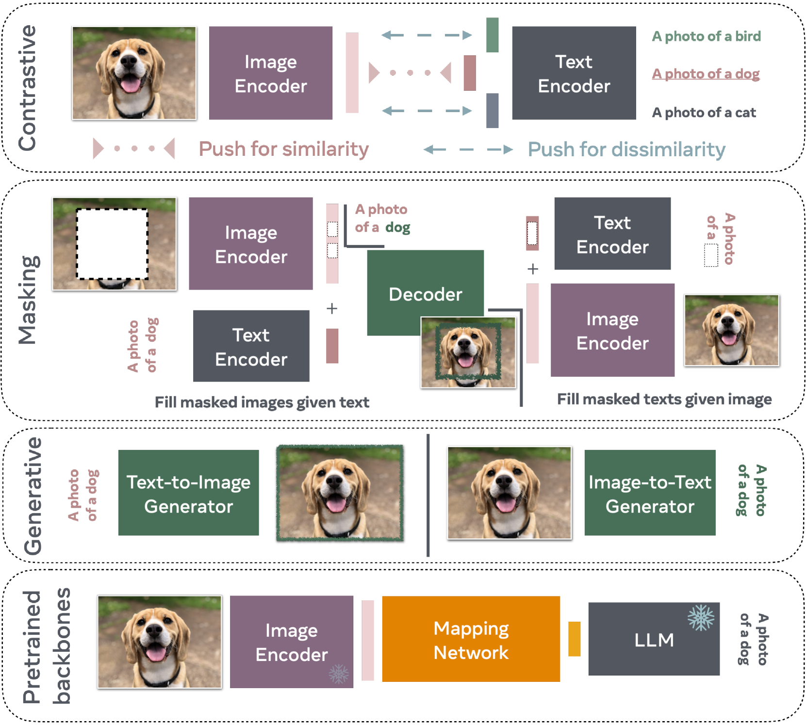
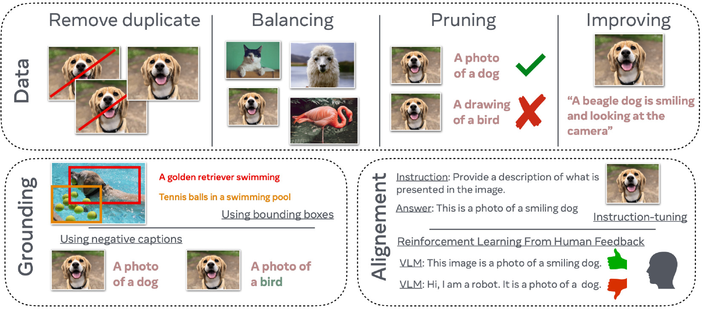

# 视觉与语言建模入门

发布时间：2024年05月27日

`LLM应用

这篇论文摘要主要讨论了大型语言模型（LLMs）在视觉领域的应用，包括视觉助手和图像生成模型等。它探讨了视觉-语言模型（VLM）的工作原理、训练方法以及评估策略，并扩展到视频领域的应用。这些内容主要集中在LLM的实际应用层面，而不是理论研究或Agent的设计与实现，也不是关于RAG（Retrieval-Augmented Generation）的具体讨论。因此，最合适的分类是LLM应用。` `视觉技术` `人工智能`

> An Introduction to Vision-Language Modeling

# 摘要

> 随着大型语言模型（LLMs）的兴起，人们开始探索其在视觉领域的应用。无论是帮助我们在陌生环境中导航的视觉助手，还是仅凭文本描述就能生成图像的模型，视觉-语言模型（VLM）正深刻改变我们与技术的互动。然而，要提升这些模型的可靠性，仍需克服众多挑战。语言的离散性与视觉的高维连续性之间的差异，是理解视觉与语言映射机制的关键。本文旨在为有志于涉足VLM领域的人提供入门指南，首先介绍VLM的定义、工作原理及训练方法，随后探讨其评估策略，并扩展讨论至视频领域的应用。

> Following the recent popularity of Large Language Models (LLMs), several attempts have been made to extend them to the visual domain. From having a visual assistant that could guide us through unfamiliar environments to generative models that produce images using only a high-level text description, the vision-language model (VLM) applications will significantly impact our relationship with technology. However, there are many challenges that need to be addressed to improve the reliability of those models. While language is discrete, vision evolves in a much higher dimensional space in which concepts cannot always be easily discretized. To better understand the mechanics behind mapping vision to language, we present this introduction to VLMs which we hope will help anyone who would like to enter the field. First, we introduce what VLMs are, how they work, and how to train them. Then, we present and discuss approaches to evaluate VLMs. Although this work primarily focuses on mapping images to language, we also discuss extending VLMs to videos.

[Arxiv](https://arxiv.org/abs/2405.17247)