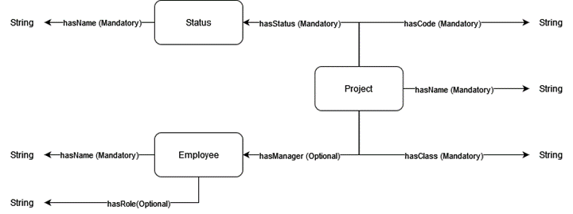

# 探究大型语言模型在知识图谱补全任务中的适用性

发布时间：2024年05月27日

`LLM应用

这篇论文摘要讨论了大型语言模型（LLMs）在处理知识图谱任务中的应用，特别是在知识图谱补全方面的能力。它提到了即使在零样本或少样本环境下，LLMs也能展现出卓越的能力，但也指出了可能出现的不切实际的答案和推理错误。通过实验，论文探讨了如何通过设计合适的提示来提高LLMs在面向任务的对话系统中的性能。因此，这篇论文属于LLM应用分类，因为它主要关注LLMs在特定任务（知识图谱补全）中的实际应用和性能优化。` `知识图谱` `对话系统`

> Assessing LLMs Suitability for Knowledge Graph Completion

# 摘要

> 大型语言模型（LLMs）在处理知识图谱任务，如知识图谱补全时，即便在零样本或少样本环境下也展现出卓越能力。但它们有时会生成不切实际的答案，或以不可预测的方式输出结果，导致推理错误，尽管这些答案可能满足了用户需求。为了探讨知识图谱任务中的机遇与挑战，我们选取了Mixtral-8x7B-Instruct-v0.1和gpt-3.5-turbo-0125这两款特色LLMs，在面向任务的对话系统中，针对静态知识图谱进行知识图谱补全实验，采用遵循TELeR分类法的提示，在零样本和一样本情境下进行。实验结果显示，若提示设计得当，包含充足信息和相关示例，LLMs能够有效应对这类任务。

> Recent work shown the capability of Large Language Models (LLMs) to solve tasks related to Knowledge Graphs, such as Knowledge Graph Completion, even in Zero- or Few-Shot paradigms. However, they are known to hallucinate answers, or output results in a non-deterministic manner, thus leading to wrongly reasoned responses, even if they satisfy the user's demands. To highlight opportunities and challenges in knowledge graphs-related tasks, we experiment with two distinguished LLMs, namely Mixtral-8x7B-Instruct-v0.1, and gpt-3.5-turbo-0125, on Knowledge Graph Completion for static knowledge graphs, using prompts constructed following the TELeR taxonomy, in Zero- and One-Shot contexts, on a Task-Oriented Dialogue system use case. When evaluated using both strict and flexible metrics measurement manners, our results show that LLMs could be fit for such a task if prompts encapsulate sufficient information and relevant examples.

[Arxiv](https://arxiv.org/abs/2405.17249)