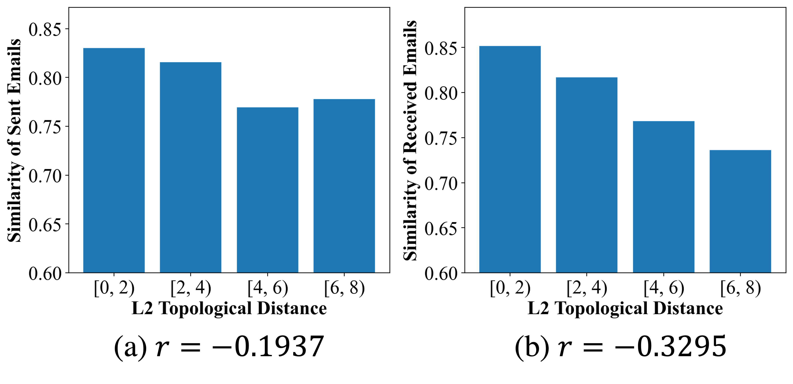
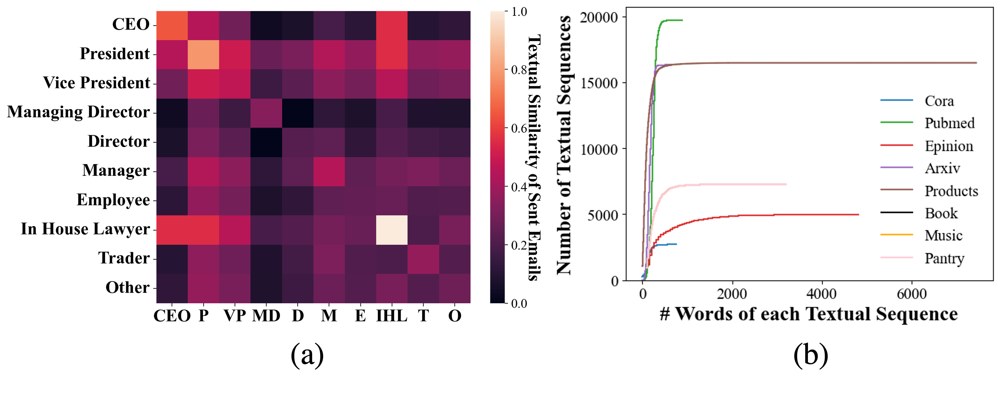

# 利用拓扑感知检索优化文本生成

发布时间：2024年05月27日

`RAG

这篇论文主要探讨了检索增强生成（RAG）策略在大型语言模型（LLMs）中的应用，特别是在优化检索过程以提高文本生成质量方面。论文通过深入分析文本间的拓扑关系，提出了一种拓扑感知的检索增强生成框架，旨在通过利用这些关系来改进LLMs的信息检索和文本生成过程。因此，这篇论文的内容与RAG策略的优化和应用紧密相关，属于RAG分类。` `学术研究` `社交网络`

> Augmenting Textual Generation via Topology Aware Retrieval

# 摘要

> 大型语言模型（LLMs）虽在文本生成上取得显著成就，却常因输入知识的局限而产生错误或虚构内容。为此，检索增强生成（RAG）策略应运而生，通过外部数据库补充信息，确保生成的文本贴近现实。在实际应用中，文本间通过图中的实体如学术引用或社交评论相互联系。本文深入挖掘这些拓扑关系，以优化RAG的检索过程，特别关注基于节点接近度和基于子图结构相似性的两种连接方式。实证研究表明，这些拓扑关系与文本生成紧密相关，进而催生了拓扑感知的检索增强生成框架。此框架通过检索模块依据拓扑关系精选文本，并通过聚合模块将这些文本融入提示，激发LLMs的文本创作。我们已构建并测试了这一框架，实验证明其在提升RAG的拓扑感知能力上的潜力。

> Despite the impressive advancements of Large Language Models (LLMs) in generating text, they are often limited by the knowledge contained in the input and prone to producing inaccurate or hallucinated content. To tackle these issues, Retrieval-augmented Generation (RAG) is employed as an effective strategy to enhance the available knowledge base and anchor the responses in reality by pulling additional texts from external databases. In real-world applications, texts are often linked through entities within a graph, such as citations in academic papers or comments in social networks. This paper exploits these topological relationships to guide the retrieval process in RAG. Specifically, we explore two kinds of topological connections: proximity-based, focusing on closely connected nodes, and role-based, which looks at nodes sharing similar subgraph structures. Our empirical research confirms their relevance to text relationships, leading us to develop a Topology-aware Retrieval-augmented Generation framework. This framework includes a retrieval module that selects texts based on their topological relationships and an aggregation module that integrates these texts into prompts to stimulate LLMs for text generation. We have curated established text-attributed networks and conducted comprehensive experiments to validate the effectiveness of this framework, demonstrating its potential to enhance RAG with topological awareness.

[Arxiv](https://arxiv.org/abs/2405.17602)