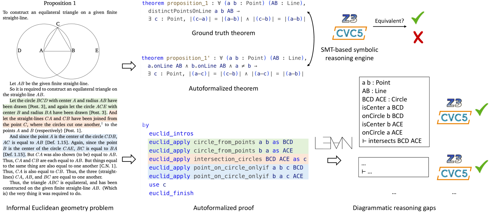
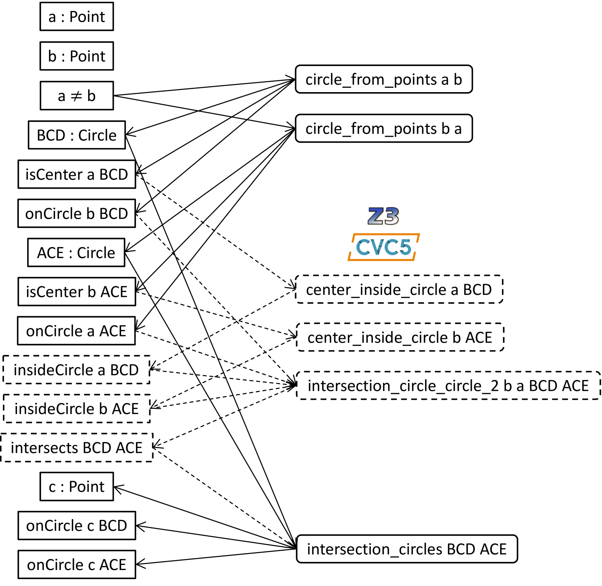
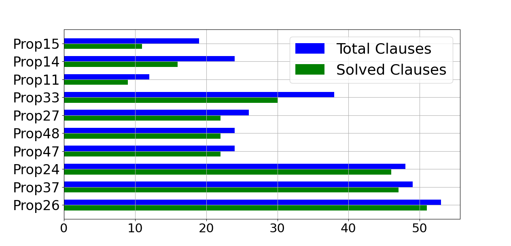
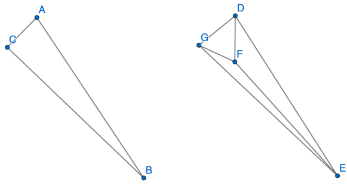
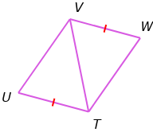
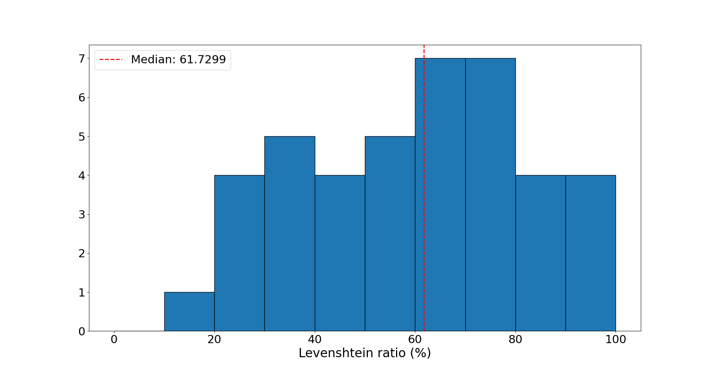
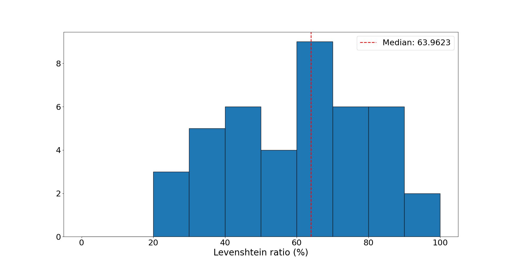
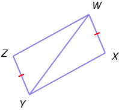
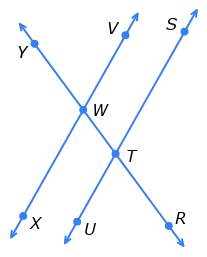

# 欧几里得几何的自动形式化

发布时间：2024年05月27日

`LLM应用

这篇论文探讨了如何利用大型语言模型（LLMs）结合领域知识、SMT求解器等技术，来实现欧几里得几何的自动形式化。这种方法涉及将非正式数学内容转化为机器可验证的形式定理和证明，特别关注于解决文本空白问题和开发自动语义评估工具。论文通过实验展示了LLMs在处理几何问题自动形式化方面的能力和局限，并提供了相关的数据和代码。因此，这篇论文属于LLM应用类别，因为它展示了LLMs在特定领域（数学形式化）的应用。`

> Autoformalizing Euclidean Geometry

# 摘要

> 自动形式化技术能将非正式数学内容转化为机器可验证的形式定理和证明。欧几里得几何因其可控性成为研究此技术的理想领域。本文提出了一种结合领域知识、SMT 求解器及大型语言模型（LLMs）的神经符号框架，专门用于欧几里得几何的自动形式化。面对非正式证明中依赖图表导致的文本空白难题，我们采用定理证明器自动填补这些信息，让 LLM 专注于文本步骤的形式化，简化模型任务。此外，我们还开发了自动语义评估工具，用于检验自动形式化后的定理陈述。LeanEuclid 基准测试集由此诞生，它整合了欧几里得元素和 UniGeo 数据集中的问题，并在 Lean 证明助手中得到形式化。通过 GPT-4 和 GPT-4V 的实验，我们揭示了当前 LLMs 在处理几何问题自动形式化方面的实际能力和局限。相关数据和代码已公开于 https://github.com/loganrjmurphy/LeanEuclid。

> Autoformalization involves automatically translating informal math into formal theorems and proofs that are machine-verifiable. Euclidean geometry provides an interesting and controllable domain for studying autoformalization. In this paper, we introduce a neuro-symbolic framework for autoformalizing Euclidean geometry, which combines domain knowledge, SMT solvers, and large language models (LLMs). One challenge in Euclidean geometry is that informal proofs rely on diagrams, leaving gaps in texts that are hard to formalize. To address this issue, we use theorem provers to fill in such diagrammatic information automatically, so that the LLM only needs to autoformalize the explicit textual steps, making it easier for the model. We also provide automatic semantic evaluation for autoformalized theorem statements. We construct LeanEuclid, an autoformalization benchmark consisting of problems from Euclid's Elements and the UniGeo dataset formalized in the Lean proof assistant. Experiments with GPT-4 and GPT-4V show the capability and limitations of state-of-the-art LLMs on autoformalizing geometry problems. The data and code are available at https://github.com/loganrjmurphy/LeanEuclid.

[Arxiv](https://arxiv.org/abs/2405.17216)