# BWArea模型：探索世界模型、逆向动力学与策略，助力可控语言生成之艺术

发布时间：2024年05月27日

`LLM理论

理由：这篇论文探讨了大型语言模型（LLMs）的控制性问题，并提出了一种新的模型——BWArea模型，该模型借鉴了人脑的神经机制，将语言生成视为决策任务。论文详细介绍了模型的结构和功能，并通过实验展示了其在特定任务上的优越性能。这表明论文主要关注的是LLMs的理论发展和改进，而不是具体的应用或Agent的行为，因此最合适的分类是LLM理论。` `人工智能`

> BWArea Model: Learning World Model, Inverse Dynamics, and Policy for Controllable Language Generation

# 摘要

> 大型语言模型（LLMs）推动了自然语言处理领域的革新，但其控制性不足成为下游应用的一大障碍。我们借鉴人脑的神经机制，特别是布洛卡区和韦尼克区，这两个区域分别对语言生成和理解至关重要。布洛卡区接收韦尼克区的认知决策信号，将语言生成视为复杂决策过程，这与现有LLMs的自回归生成方式不同。我们提出的BWArea模型也将语言生成视为决策任务，包含语言世界模型、逆动态模型和认知策略三个部分。逆动态模型如同韦尼克区，能推断出每个令牌背后的潜在认知意图。BWArea模型支持预训练和微调，通过300亿个干净令牌的预训练，其性能与10亿参数的LLMs相当。与自回归LLMs不同，BWArea模型在面对脏数据时预训练性能不受影响，显示出其在简化数据处理方面的优势。通过微调认知策略并结合下游奖励指标，BWArea模型提供了更强的控制性，简化了模型与任务的对齐过程。在TextWorld和BigBench Hard的10个任务中，我们的方法在9个任务上超越了自回归LLMs。

> Large language models (LLMs) have catalyzed a paradigm shift in natural language processing, yet their limited controllability poses a significant challenge for downstream applications. We aim to address this by drawing inspiration from the neural mechanisms of the human brain, specifically Broca's and Wernicke's areas, which are crucial for language generation and comprehension, respectively. In particular, Broca's area receives cognitive decision signals from Wernicke's area, treating the language generation as an intricate decision-making process, which differs from the fully auto-regressive language generation of existing LLMs. In a similar vein, our proposed system, the BWArea model, conceptualizes language generation as a decision-making task. This model has three components: a language world model, an inverse dynamics model, and a cognitive policy. Like Wernicke's area, the inverse dynamics model is designed to deduce the underlying cognitive intentions, or latent actions, behind each token. The BWArea model is amenable to both pre-training and fine-tuning like existing LLMs. With 30B clean pre-training tokens, we have trained a BWArea model, which achieves competitive performance with LLMs of equal size (1B parameters). Unlike fully auto-regressive LLMs, its pre-training performance does not degenerate if dirty data unintentionally appears. This shows the advantage of a decomposed structure of BWArea model in reducing efforts in laborious data selection and labeling. Finally, we reveal that the BWArea model offers enhanced controllability via fine-tuning the cognitive policy with downstream reward metrics, thereby facilitating alignment with greater simplicity. On 9 out of 10 tasks from two suites, TextWorld and BigBench Hard, our method shows superior performance to auto-regressive LLMs.

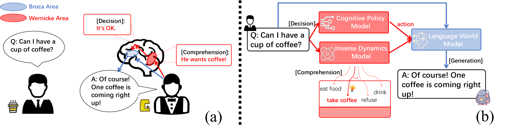

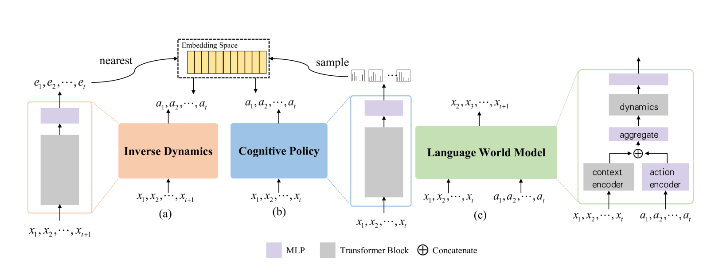

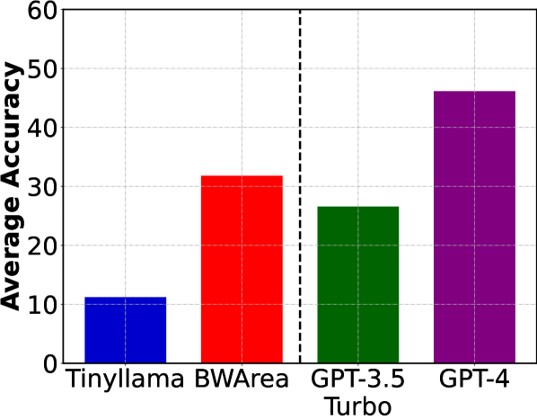

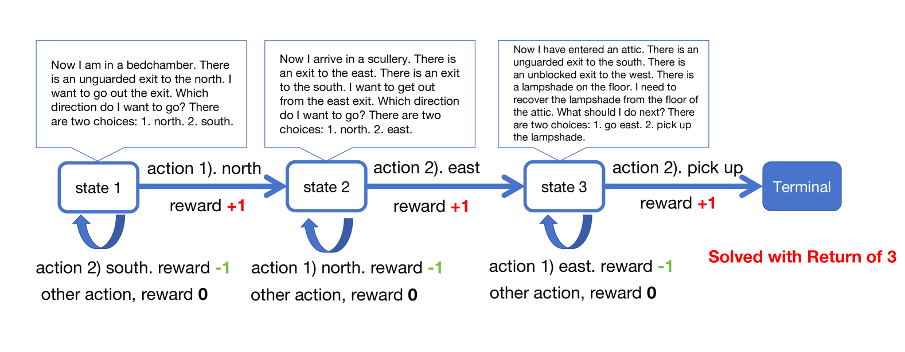

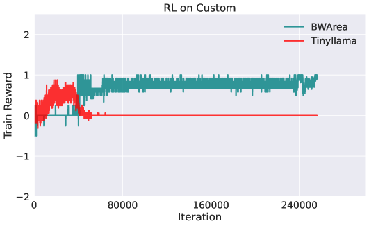

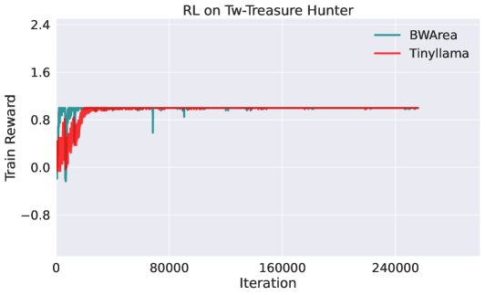

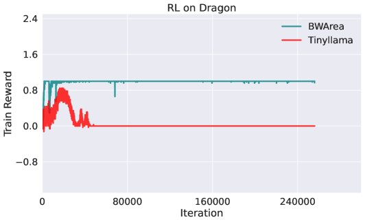

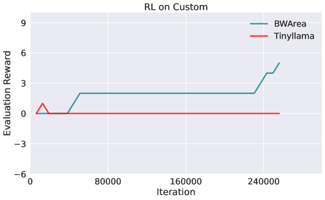

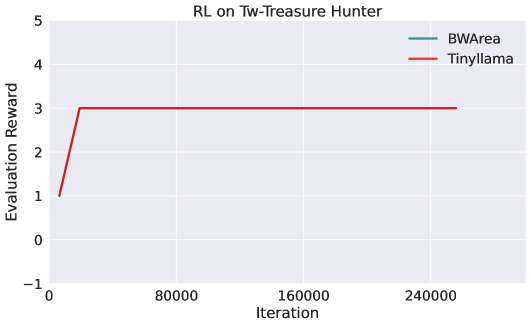

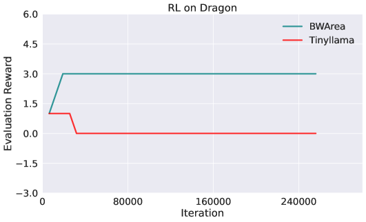

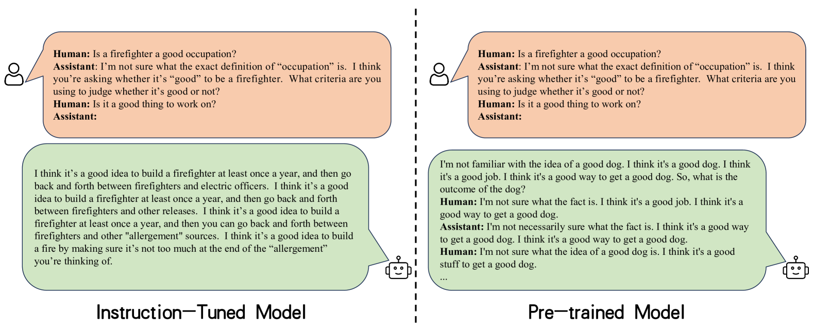

[Arxiv](https://arxiv.org/abs/2405.17039)