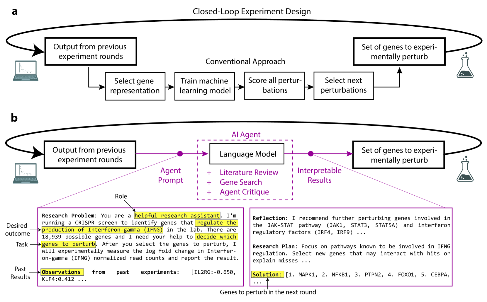
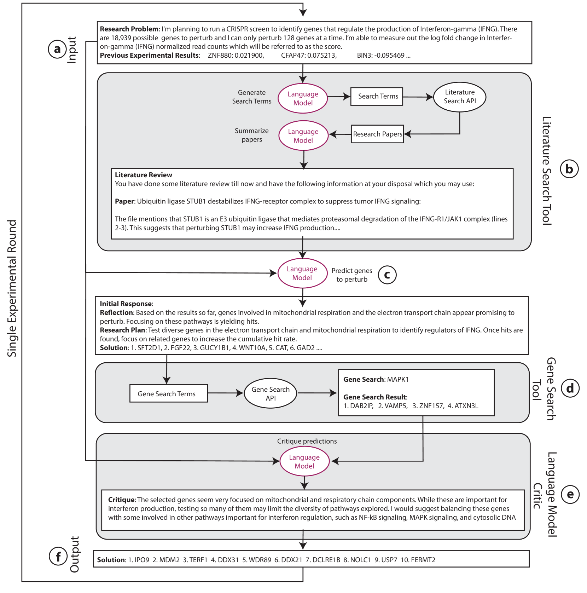
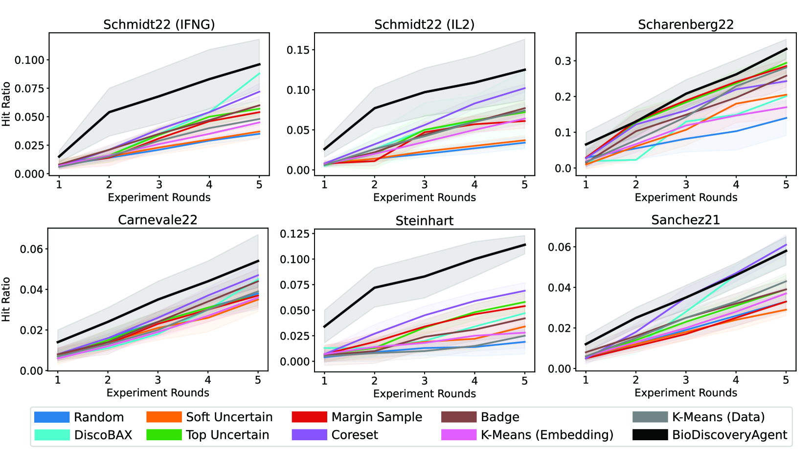
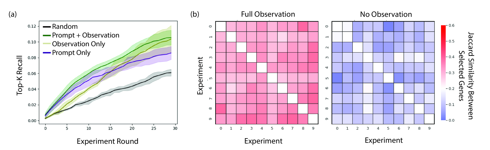
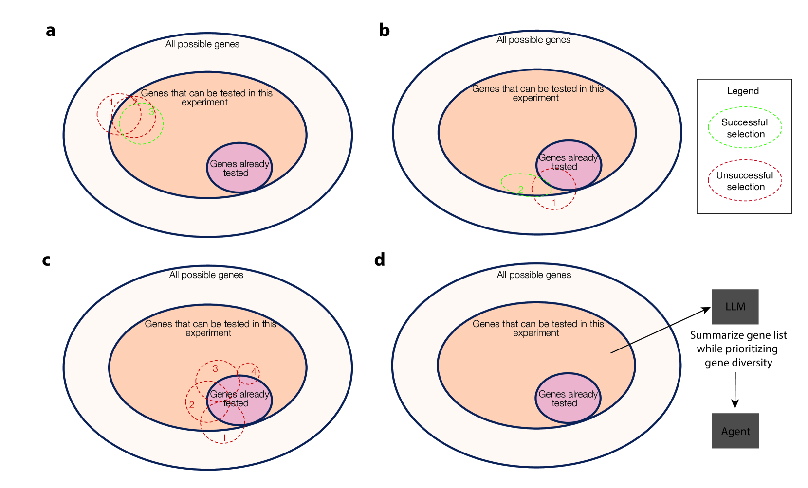
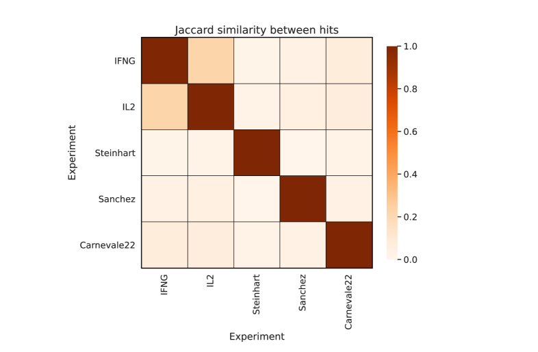

# BioDiscoveryAgent：专为基因扰动实验设计的人工智能助手

发布时间：2024年05月27日

`Agent

这篇论文摘要描述了一个基于大型语言模型的代理（BioDiscoveryAgent），它利用其丰富的背景知识和推理能力来加速科学发现，特别是在基因扰动实验设计方面。该代理能够设计新实验、预测结果，并有效探索假设空间以找到解决方案。这些功能表明它是一个智能代理，能够自主执行任务并与其他系统交互，因此适合归类为Agent。` `生物科学` `科学研究`

> BioDiscoveryAgent: An AI Agent for Designing Genetic Perturbation Experiments

# 摘要

> 基于大型语言模型的代理，如BioDiscoveryAgent，通过其丰富的背景知识和推理能力，展现了加速科学发现的潜力。该代理能够设计新实验、预测结果，并有效探索假设空间以找到解决方案。在基因扰动实验设计中，BioDiscoveryAgent利用其生物学知识，无需机器学习模型或特定获取函数，便能创新设计实验。与专为此任务训练的贝叶斯优化方法相比，它在五个数据集上检测特定表型的效率提高了18%。评估中还包括了一个未公开的数据集，确保其独立于模型训练数据。此外，该代理在预测基因组合扰动方面的准确性是随机方法的两倍，这在闭环实验设计中尚属首次。BioDiscoveryAgent还能利用工具搜索文献、分析数据，并请求其他代理评估其预测，全程保持透明可解释，为计算生物实验设计开辟了新途径，有望提升科学研究的能力。

> Agents based on large language models have shown great potential in accelerating scientific discovery by leveraging their rich background knowledge and reasoning capabilities. Here, we develop BioDiscoveryAgent, an agent that designs new experiments, reasons about their outcomes, and efficiently navigates the hypothesis space to reach desired solutions. We demonstrate our agent on the problem of designing genetic perturbation experiments, where the aim is to find a small subset out of many possible genes that, when perturbed, result in a specific phenotype (e.g., cell growth). Utilizing its biological knowledge, BioDiscoveryAgent can uniquely design new experiments without the need to train a machine learning model or explicitly design an acquisition function. Moreover, BioDiscoveryAgent achieves an average of 18% improvement in detecting desired phenotypes across five datasets, compared to existing Bayesian optimization baselines specifically trained for this task. Our evaluation includes one dataset that is unpublished, ensuring it is not part of the language model's training data. Additionally, BioDiscoveryAgent predicts gene combinations to perturb twice as accurately as a random baseline, a task so far not explored in the context of closed-loop experiment design. The agent also has access to tools for searching the biomedical literature, executing code to analyze biological datasets, and prompting another agent to critically evaluate its predictions. Overall, BioDiscoveryAgent is interpretable at every stage, representing an accessible new paradigm in the computational design of biological experiments with the potential to augment scientists' capabilities.

[Arxiv](https://arxiv.org/abs/2405.17631)