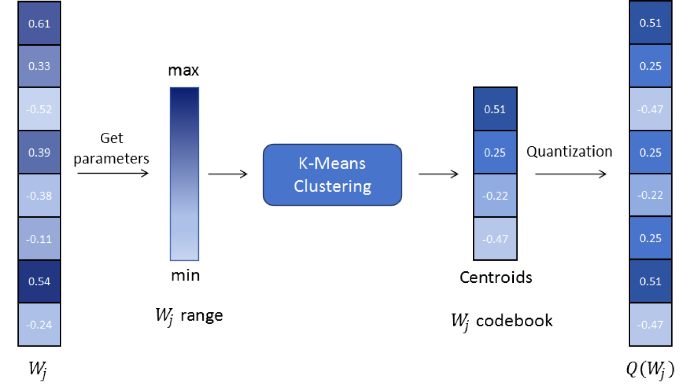
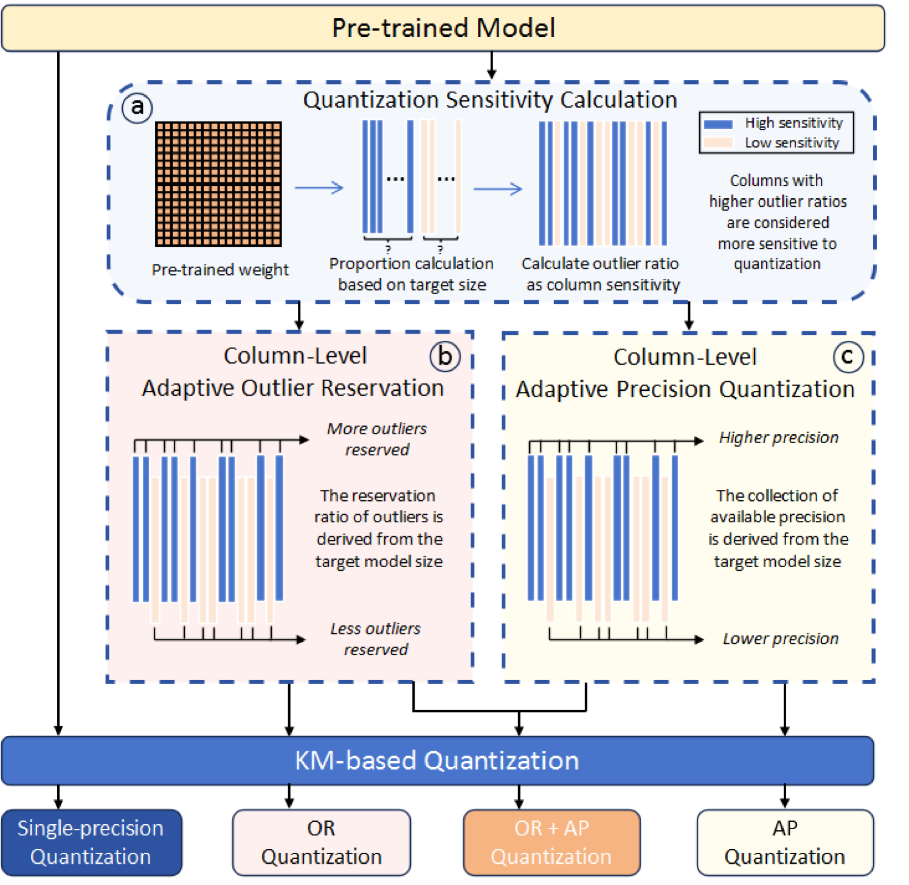
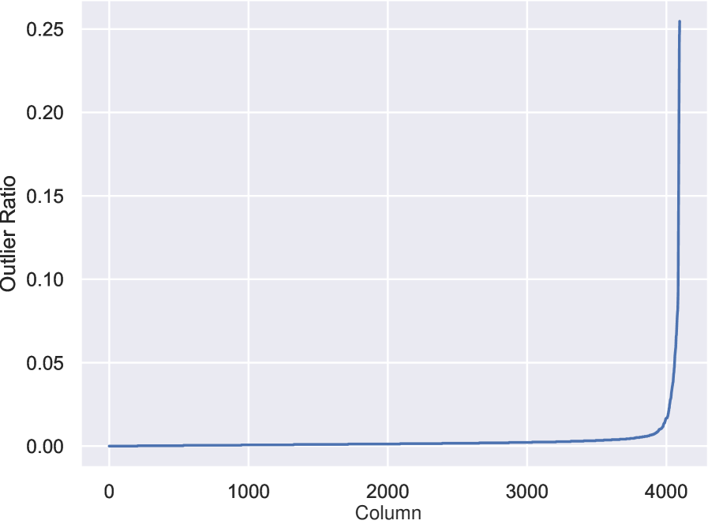
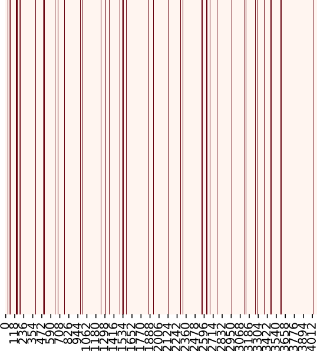
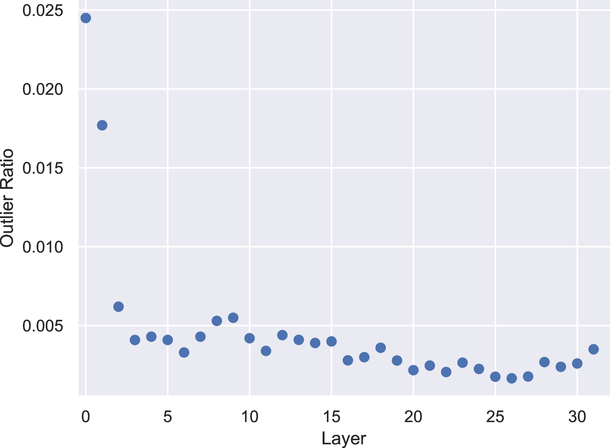

# CLAQ：突破大型语言模型后训练量化低比特的极限

发布时间：2024年05月27日

`LLM理论

理由：这篇论文主要探讨了大型语言模型（LLMs）的参数量化技术，特别是提出了一个新的量化框架（CLAQ），并详细介绍了其自适应策略。这些内容属于对LLM内部机制的理论性研究，旨在提高模型的计算效率和性能，而不是直接应用于特定的Agent或RAG系统，也不是关于LLM的具体应用案例。因此，它更符合LLM理论的分类。` `机器学习`

> CLAQ: Pushing the Limits of Low-Bit Post-Training Quantization for LLMs

# 摘要

> 近期，大型语言模型（LLMs）的参数量化因其能降低内存成本和提升计算效率而备受瞩目。尽管早期方法已被广泛应用，但在低比特（如2至3比特）环境下，现有方法表现欠佳。本文创新性地提出了列级自适应权重量化（CLAQ）框架，通过三种自适应策略优化LLM量化：首先，采用K-Means聚类算法，为参数矩阵的每一列动态设定量化中心；其次，设计异常值引导的自适应精度搜索策略，灵活调整各列的比特宽度；最后，实施动态异常值保留方案，保留部分参数的原始浮点精度，以换取模型性能的提升。实验证明，我们的方法在包括LLaMA-1、LLaMA-2和Yi在内的多个主流开源LLMs上，尤其是在极低比特设置下，取得了业界领先的结果。相关代码即将公开。

> Parameter quantization for Large Language Models (LLMs) has attracted increasing attentions recently in reducing memory costs and improving computational efficiency. Early approaches have been widely adopted. However, the existing methods suffer from poor performance in low-bit (such as 2 to 3 bits) scenarios. In this paper, we present a novel and effective Column-Level Adaptive weight Quantization (CLAQ) framework by introducing three different types of adaptive strategies for LLM quantization. Firstly, a K-Means clustering based algorithm is proposed that allows dynamic generation of quantization centroids for each column of a parameter matrix. Secondly, we design an outlier-guided adaptive precision search strategy which can dynamically assign varying bit-widths to different columns. Finally, a dynamic outlier reservation scheme is developed to retain some parameters in their original float point precision, in trade off of boosted model performance. Experiments on various mainstream open source LLMs including LLaMA-1, LLaMA-2 and Yi demonstrate that our methods achieve the state-of-the-art results across different bit settings, especially in extremely low-bit scenarios. Code will be released soon.

[Arxiv](https://arxiv.org/abs/2405.17233)